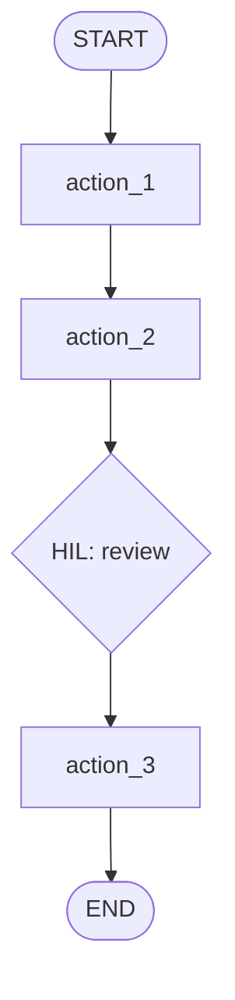

# Design Document Template

!!! info "Who fills this in"
    This template is for anyone designing an agent from a scope document — typically an engineer or technical lead. If you are a Business Analyst or workflow owner, your primary output is the [Scope Document](scope-document.md). Collaborate with whoever builds the agent on the flow (validating it matches your scope) and the HIL design (confirming the review points are right).

Output artifact for [Stage 4: Design](../stages/04-design.md).

Translate the scoped workflow into a platform-neutral agent design. This document is the contract between Stage 3 (scope) and Stage 5 (build). It should be specific enough that the builder knows *what* to implement without telling them which framework to implement it on.

---

## 1. Scope-to-Action Mapping

Record how each scope step maps to an agent action. One row per scope step. This table documents your consolidation decisions — the reasoning behind the flow that follows.

| Scope Step | Boundary | Action | Consolidation Rationale |
|---|---|---|---|
| *1. Step action* | *AUTOMATE / HIL / MANUAL* | *`action_name`* | *Why this step maps here* |
| | | | |
| | | | |

*Every scope step must appear in this table. Use "outside the agent" for MANUAL steps. For consolidated steps, the rationale column explains why they were grouped — shared tool/logic, related review, or an upstream checkpoint that makes a downstream HIL unnecessary.*

---

## 2. Agent Flow

Draw the flow showing actions and their connections. Use a Mermaid diagram or ASCII art.

*Replace the placeholder actions above with your actual workflow actions. Mark HIL checkpoints clearly.*

---

## 3. Memory Fields

Define the data structure that the agent remembers between actions. Every field should be named, typed (in plain language — your platform determines the concrete type system), and traceable to an action that writes it and one or more actions that read it.

| Field | Type | Purpose | Written by | Read by |
|---|---|---|---|---|
| *`field_name`* | *e.g., string / list / structured object with keys* | *What the field holds* | *Which action writes it (or "input")* | *Which actions read it* |
| | | | | |
| | | | | |

*Group fields logically — inputs, retrieved data, derived analysis outputs, human feedback, final outputs. Include a human-feedback field for each HIL checkpoint. Every field an action reads must be written by some earlier action.*

---

## 4. Action Specifications

Repeat this block for each action in the flow.

### Action: `action_name`

- **Purpose:** *What this action accomplishes — the result, not the activity. One sentence.*
- **Tools:** *Which tools (external data retrieval or utility calls) this action invokes. Name them by capability, not by vendor. The implementer wires each tool to the specific system your organisation uses.*
- **Logic:** *Step-by-step description of what the action does. Derive from the Decision Logic column of the scope steps this action consolidates.*
- **Prompt pattern:** *If the action uses a language model, describe the prompt structure — what context is provided, what output format is expected. Name the memory fields the prompt reads. Specify the JSON schema for structured outputs.*
- **Parallelism (if applicable):** *Whether this action's tool calls are independent and can run concurrently.*
- **Error handling:** *How this action handles failures. Reference your strategy from the Error Handling table below — error marker and continue, retry, escalate via HIL, or abort.*

---

### Action: `action_name`

- **Purpose:** ___
- **Tools:** ___
- **Logic:** ___
- **Prompt pattern:** ___
- **Error handling:** ___

---

## 5. Human-in-the-Loop Design

For each HIL checkpoint, specify what the agent surfaces and what input is expected from the human.

### HIL Checkpoint: `action_name`

- **What is surfaced:** *What information does the agent present to the reviewer? List the memory fields and their format.*
- **Expected human input:** *What can the reviewer do? (confirm, correct, add context, approve, reject with feedback) Use one of the two patterns from [Stage 4: Design](../stages/04-design.md#human-in-the-loop-checkpoint-design): feedback-as-context (freeform text stored to a memory field) or feedback-as-control-flow (structured decision that routes to different downstream actions).*
- **Resume behaviour:** *How does the action process the human's response? Which memory field does the feedback get written to?*
- **Routing after resume:** *Where does execution go next? Unconditional (back to the flow's default next action) or conditional (based on the reviewer's decision)?*

---

## 6. Error Handling

| Failure Mode | Detection | Response Strategy |
|---|---|---|
| *e.g., Data source tool failure* | *e.g., Error or timeout returned from the tool* | *e.g., Error marker and continue — downstream action checks for the marker and handles the gap gracefully* |
| *e.g., Model returns malformed output* | *e.g., JSON parse failure* | *e.g., Retry with stricter format instruction (up to 2 retries); on persistent failure, escalate via an ad-hoc HIL checkpoint* |
| *e.g., Required field missing from retrieved data* | *e.g., Null check on critical field* | *e.g., Note the gap explicitly, skip the dependent analysis, flag in final output* |
| | | |
| | | |

*One row per failure mode from your scope document's Error Path Register. Choose a response strategy for each: error marker and continue, retry, escalate via HIL, or abort. See [Stage 4: Design — Error Handling Design](../stages/04-design.md#error-handling-design).*
