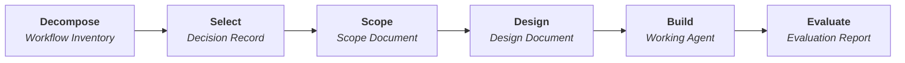

# Framework Overview

A structured, six-stage methodology for identifying, designing, and building AI-automated workflows. Built for knowledge workers who want to automate real work — not proof-of-concept experiments.

## What this framework does

You have a role full of repeatable workflows — gathering data, synthesising it, producing reports, making assessments. Some of that work follows the same pattern every time. This framework gives you a systematic process to:

1. Find the workflows worth automating
2. Scope them precisely (so you build the right thing)
3. Design the agent in a platform-neutral way (so it works on whatever framework your team chooses)
4. Build and validate that it actually works

The framework is **deliberately platform-agnostic**. It teaches you *what* to design and build, not *which framework* to use. See [Getting Started: Choose a Platform](getting-started/choose-a-platform.md) for pointers to current popular options.

## Who it's for

**Knowledge workers** (CSMs, Account Managers, Operations Leads) — you have workflows you repeat every week. The first three stages are pure thinking work: no code, no tools, no technical background. You map your own workflows, pick the best automation candidate, and produce a scope document detailed enough for an engineer to build from. If your team builds on a code-first framework, Stages 4-6 require engineering skills and you would hand off to an engineer. If your team uses a low-code builder, you can complete all six stages yourself — no coding required. Even if you stop after Stage 3, you leave with a clear automation spec.

**Business analysts** — you already think in processes and systems. Stages 1-3 give you a structured, defensible methodology for evaluating which business processes are good automation candidates and documenting them precisely. Hand the output to engineering, continue into the technical stages yourself, or use a low-code agent builder to build the agent without writing code.

**Software engineers** — Stages 4-6 translate scoped workflows into platform-neutral agent architecture, implementation principles, and evaluation. The framework teaches methodology that applies across code-first agent frameworks and low-code builders alike. Once you have a design, consult your chosen platform's documentation for implementation specifics (see [Choose a Platform](getting-started/choose-a-platform.md)). If a business stakeholder completes Stages 1-3, you pick up at Stage 4 with a clear spec.

## The six stages

Each stage produces a concrete artifact that feeds the next. The full pipeline:

| Stage | You do this | You produce this |
|---|---|---|
| **Decompose** | Break a role into discrete, repeatable workflows | Workflow Inventory Table |
| **Select** | Score candidates and pick the best automation target | Selection Decision Record |
| **Scope** | Map every step, draw the automation boundary | Workflow Scope Document |
| **Design** | Translate scope into an agent architecture | Agent architecture blueprint |
| **Build** | Implement the agent (code or configuration) | Working agent |
| **Evaluate** | Test against real data, compare to manual output | Evaluation Report |

## Get started

| | |
|---|---|
| **[Quick Start](getting-started/quick-start.md)** | A 30-minute hands-on exercise — a compressed version of Stage 1 |
| **[Prerequisites](getting-started/prerequisites.md)** | What you need before you begin. Stages 1-3: nothing. Stages 4-6: depends on your chosen platform |
| **[Choose a Platform](getting-started/choose-a-platform.md)** | Pointers to current popular agent frameworks and low-code builders |
| **[How to Use This Framework](getting-started/how-to-use.md)** | Understand the six stages and how to work through them |
| **[What is an Agentic Workflow?](getting-started/what-is-a-workflow.md)** | Plain-language explainer of how the agent actually works under the hood |
| **[Personalise for Your Org](personalise/index.md)** | Make this framework specific to your team, roles, and workflows |

## Worked examples

Three complete walkthroughs, one per audience:

| Role | Workflow | Pattern |
|---|---|---|
| [Customer Success Manager](worked-example/index.md) | Quarterly Account Health Review | Data gathering + synthesis + report generation |
| [Business Analyst](worked-example-ba/index.md) | New Feature Request Intake & Impact Assessment | Triage + analysis + recommendation |
| [Software Engineer](worked-example-se/index.md) | Release Notes Compilation & Publishing | Fetch + categorise + generate + publish |
