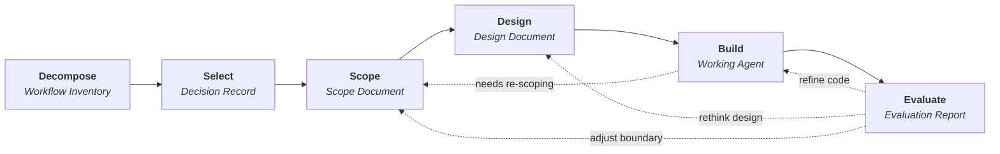

# How to Use This Framework

This framework has six stages. Each stage has a defined purpose, required inputs, a concrete output artifact, and a set of guiding questions. Work through them sequentially -- each stage's output feeds the next.

!!! tip "Want to jump in right away?"
    The [Quick Start](quick-start.md) guide walks you through a compressed version of Stage 1 in 30 minutes — no tools or technical background required.

## The six stages

### Stage 1: Decompose

Break a role into its constituent workflows. Most people can name their responsibilities but cannot enumerate the discrete, repeatable workflows within them. This stage forces that enumeration.

**Input:** Your role title, responsibilities, or job description.
**Output:** A Workflow Inventory Table -- every repeatable workflow annotated with trigger, frequency, time cost, systems touched, and automation potential.
**What it looks like:** A spreadsheet or table with one row per workflow and columns for trigger, frequency, time per occurrence, systems touched, output produced, and automation score.

[:octicons-arrow-right-24: Stage 1 details](../stages/01-decompose.md)

### Stage 2: Select

Choose the right workflow to automate. The goal is not to pick the most impressive target -- it is to pick the one most likely to succeed and deliver value given current constraints.

**Input:** Workflow Inventory Table from Stage 1.
**Output:** A Selection Decision Record with scores, justification, and known risks.
**What it looks like:** A one-page document with a scoring matrix comparing your top candidates and a written justification for your choice.

[:octicons-arrow-right-24: Stage 2 details](../stages/02-select.md)

### Stage 3: Scope

Map the chosen workflow in full detail and draw an explicit boundary between what the agent will do and what stays human. This is the most important stage -- a well-scoped workflow is straightforward to design and build; a poorly scoped one produces an agent that does too little to be useful or too much to be trustworthy.

**Input:** Selection Decision Record from Stage 2 and your knowledge of the workflow.
**Output:** A Workflow Scope Document containing a step-by-step workflow map, data inventory, decision point register, automation boundary tags, integration requirements, and constraints.
**What it looks like:** A multi-section document with a numbered step list, each step tagged AUTOMATE / Human-in-the-Loop (HIL) / MANUAL, plus tables for data sources, decision points, and integration requirements.

[:octicons-arrow-right-24: Stage 3 details](../stages/03-scope.md)

### Stage 4: Design

Translate the scoped workflow into an agent architecture. This is where the human workflow map becomes an agent architecture — specifying what the agent does at each step, what data flows between steps, and where it pauses for human review.

**Input:** Workflow Scope Document from Stage 3.
**Output:** A Design Document with agent structure, data tracking, step-by-step specifications, human review points, and error handling.
**What it looks like:** A technical document with an agent flow diagram, a data tracking definition, a spec for each step, and a table of error handling strategies.

[:octicons-arrow-right-24: Stage 4 details](../stages/04-design.md)

### Stage 5: Build

Implement the designed agent. How you build it depends on your platform — code-first frameworks use code, low-code builders use a UI, managed platforms bundle both. The framework teaches the principles that apply across all of them; the specifics come from your chosen platform's documentation.

**Input:** Design Document from Stage 4.
**Output:** Working agent with setup instructions.
**What it looks like:** Depends on your platform. For code-first frameworks: a project with agent definition, tool functions, configuration, and a README. For low-code builders: a configured agent in the builder's UI with connected data sources, tools, and approval steps.

[:octicons-arrow-right-24: Stage 5 details](../stages/05-build.md)

### Stage 6: Evaluate

Validate that the agent works correctly, handles edge cases, and produces output quality comparable to (or better than) the manual process. Establish a feedback loop for iterative improvement.

**Input:** Working agent from Stage 5 and historical examples of manual output.
**Output:** An Evaluation Report with test results, quality assessment, failure modes, and an iteration backlog.
**What it looks like:** A report comparing agent output to manual output across test cases, with a pass/fail summary, a list of failure modes, and a prioritised backlog of improvements.

[:octicons-arrow-right-24: Stage 6 details](../stages/06-evaluate.md)

## Inputs and outputs

Every stage follows the same structure:

| Component | Description |
|---|---|
| **Purpose** | Why this stage exists and what problem it solves |
| **Inputs** | What you need before starting (always the prior stage's output) |
| **Output artifact** | The concrete deliverable you produce |
| **Guiding questions** | Prompts to ensure thoroughness |
| **Worked example** | The Quarterly Account Health Review, threaded through all stages |

!!! warning "Do not skip stages"
    The most common failure mode in agent projects is jumping straight to code. Stages 1-3 (Decompose, Select, Scope) exist because the upfront analytical work prevents you from automating the wrong thing, at the wrong boundary, with the wrong expectations. If you skip them, you will likely build something that either does too little to save time or too much to be trustworthy.

## Working through the stages

### Go in order

The stages are sequential by design. Each output artifact contains exactly the information the next stage needs as input. Skipping ahead means you will be making assumptions that should be explicit decisions.

### Use the worked example as a reference

A complete worked example (Quarterly Account Health Review for a Customer Success Manager) is threaded through all six stages. Use it to calibrate the level of detail expected at each stage. Your own artifacts should be at a similar level of specificity.

[:octicons-arrow-right-24: Worked example](../worked-example/index.md)

### Start with your own role

The framework is most effective when you apply it to workflows you personally execute. You have the domain knowledge needed to decompose, scope, and evaluate. If you are building an agent for someone else's workflow, you will need to interview them to produce the artifacts for Stages 1-3.

### Expect iteration

The stages are sequential for the first pass, but you will loop back. Common loops:

- **Evaluate back to Build** -- test failures require code fixes
- **Evaluate back to Design** -- structural issues require rethinking the flow
- **Evaluate back to Scope** -- the automation boundary was drawn in the wrong place
- **Build back to Scope** -- during implementation you discover that a step you tagged as AUTOMATE actually requires human judgement

!!! tip "The automation boundary moves over time"
    Your first version should err toward more human involvement. As you build trust in the agent through evaluation cycles, you can push the boundary outward -- converting human review steps to fully automated, or bringing MANUAL steps into the agent as human review steps.

## Working alone vs. working with a team

Every stage can be completed solo, but some benefit significantly from collaboration.

| Stage | Solo | With collaboration |
|---|---|---|
| **1. Decompose** | You know your own workflows best | A colleague in the same role catches workflows you take for granted |
| **2. Select** | Works well solo — it is your time being saved | A manager can validate that the candidate aligns with team priorities |
| **3. Scope** | Effective if you do the workflow yourself | Essential to pair up if you are scoping someone else's workflow |
| **4. Design** | Works with experience in your chosen platform; easier with low-code tools that guide you through configuration | An engineer can translate your scope document into a stronger architecture on a code-first framework |
| **5. Build** | Requires technical skills for code-first frameworks; self-service on low-code builders | Hand your design document to a developer if you are non-technical and your team uses a code-first framework |
| **6. Evaluate** | You can test against your own past work | A second reviewer catches blind spots in quality assessment |

!!! tip "The handoff point"
    If you are a knowledge worker without engineering experience and your team uses a code-first agent framework, Stages 1-3 are entirely yours — complete them with a text editor and your domain knowledge, then hand the Scope Document to an engineer for Stages 4-6. If your team uses a low-code builder, you can complete all six stages yourself — no engineer required. Either way, the documents you produce in Stages 1-3 are the requirements spec — they are valuable whether or not you write the code yourself.

### The Stage 3-to-4 handoff

!!! note "Low-code builder users"
    If you are using a low-code builder and completing all six stages yourself, you can skip the formal handoff process below — it is designed for cases where a workflow owner passes the Scope Document to a separate engineer. You should still review the checklist questions, as they will sharpen your design thinking.

Sending the Scope Document over email and hoping for the best is how most cross-functional automation projects fail. The engineer misreads a boundary decision, discovers an ambiguity mid-build, or makes assumptions about data formats that do not match reality. A 60-minute handoff meeting prevents weeks of rework.

#### Handoff meeting agenda (60 minutes)

Run this meeting with the workflow owner and the engineer who will execute Stages 4-6. The workflow owner drives — they know the work.

| Time | Activity | Goal |
|---|---|---|
| 0–10 min | **Walk through the workflow map** | The engineer hears the workflow described in the owner's words, not just the document. They ask clarifying questions as you go step by step. |
| 10–25 min | **Review every automation boundary tag** | Go through each step tagged AUTOMATE, HIL, or MANUAL. For each one, the engineer confirms they understand *why* it was tagged that way. Flag any boundaries that feel uncertain — these are the highest-risk decisions in the entire project. |
| 25–40 min | **Data access and integration walkthrough** | Confirm that every data source listed in the data inventory is accessible. Identify credentials, API keys, rate limits, or access requests needed. Surface any data format assumptions (e.g. "the CSV always has these columns" or "the API returns dates in ISO format"). |
| 40–50 min | **Decision points and error scenarios** | Review the decision point register. For each decision the agent will make, agree on fallback behaviour when inputs are ambiguous or missing. |
| 50–60 min | **Set expectations and next steps** | Agree on build timeline, review cadence, and how scope questions will be handled during build (see below). |

!!! warning "Do not skip the boundary review"
    If you only do one thing in this meeting, walk through the automation boundary tags together. A misunderstood boundary — where the engineer automates a step that should have been human-in-the-loop, or leaves manual a step that should be automated — is the single most expensive mistake in the build.

#### Questions the engineer should ask

Use this as a checklist during or immediately after the handoff meeting. Every unanswered question is a risk that will surface later as a bug or a rework cycle.

**Data and inputs**

- [ ] What format does each input data source use? (CSV columns, JSON schema, API response structure)
- [ ] How often does the input data format change? Who changes it?
- [ ] Are there edge cases in the data that the workflow map does not cover? (empty fields, unexpected values, duplicate records)
- [ ] What credentials or access permissions are needed, and who grants them?

**Decisions and errors**

- [ ] For each decision point tagged AUTOMATE — what should the agent do when the input is ambiguous or missing?
- [ ] For each HIL step — what exactly does the human reviewer need to see to make their decision?
- [ ] What does "good enough" look like? Is there a threshold below which output should be flagged rather than delivered?
- [ ] What are the highest-stakes failure modes? (e.g. sending an incorrect number to a client vs. a formatting error in an internal report)

**Output and review**

- [ ] What format should the final output be in? (Document, spreadsheet, email, dashboard update)
- [ ] Who reviews the agent's output, and what are they checking for?
- [ ] How should the agent surface uncertainty or low-confidence results?

**Process**

- [ ] When I hit a scope question during build, who do I ask and how quickly do I need an answer?
- [ ] How often should I show you work-in-progress? (Every few days, weekly, only at milestones)

#### What to expect next (for the workflow owner)

After the handoff meeting, the engineer takes over for Stages 4-6. Here is what to expect so you are not left waiting in the dark:

**Realistic timeline.** A first working version of a well-scoped agent typically takes 1-3 weeks depending on complexity and data access. If the engineer needs credentials, API access, or approvals, that timeline extends by however long those take — surface access needs early.

**You will be needed again.** Expect the engineer to come back with questions, especially in the first few days. The most common questions are about edge cases the scope document did not cover and about what "correct" output looks like for ambiguous inputs. Respond quickly — a one-day delay on a scope question often means a one-week delay on the build.

**Review checkpoints.** You will review output during Stage 6 (Evaluate). Ask the engineer to show you a working demo before they invest time in polish. It is far cheaper to catch a misunderstood requirement on a rough prototype than on a finished agent.

**Scope changes happen.** During build, the engineer may discover that a step tagged AUTOMATE is harder than expected, or that a MANUAL step could easily be automated. These are not failures — they are the framework working as intended. The engineer should flag these, and you decide together whether to adjust the boundary.

## Next steps

- [Quick Start](quick-start.md) -- complete a compressed Stage 1 in 30 minutes, no setup required
- [Prerequisites](prerequisites.md) -- make sure your environment is ready
- [Stage 1: Decompose](../stages/01-decompose.md) -- begin the framework
- [Worked example](../worked-example/index.md) -- see a completed pass through all six stages
