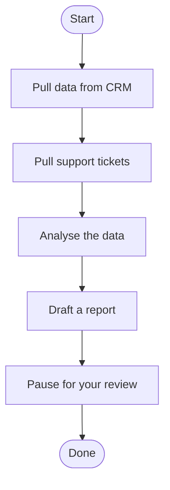
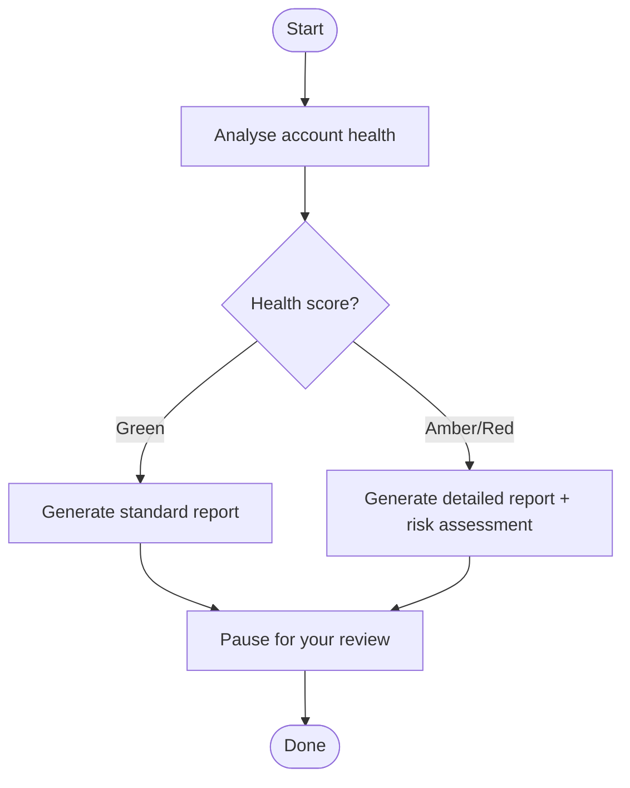
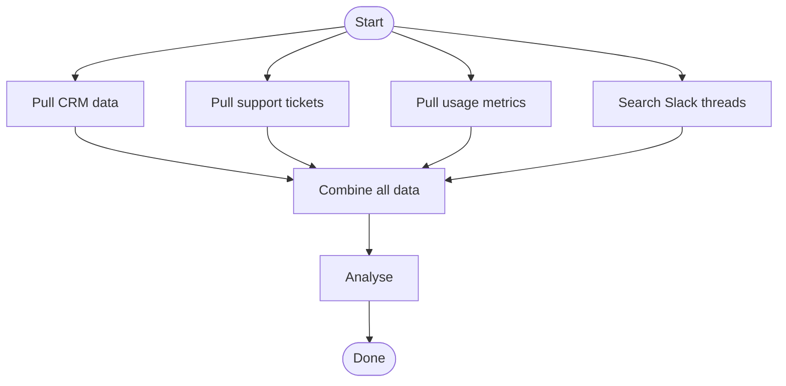

# What is an Agentic Workflow?

You already know what a workflow is -- it is a sequence of steps you follow to get something done. Pull data from three systems, compare it against some criteria, write up your findings, send it to someone. You do it the same way each time because the pattern works.

An **agentic workflow** is the same sequence of steps, but an AI agent does most of them for you. The agent follows your process -- the one you mapped out in Stage 3 -- and pauses at the moments where your judgement matters. You review what it produced, make corrections if needed, and tell it to continue.

That is the whole idea. The rest of this page explains what is actually happening under the hood, in plain language.

---

## The agent is a set of steps connected in order

Think of the agent as a flowchart. Each box in the flowchart is a **step** the agent performs. Each arrow between boxes tells the agent what to do next.

That is it. The agent starts at the top, works through each step, and finishes at the bottom. Some steps are things the agent does automatically (pulling data, running calculations). Some steps are places where it pauses and waits for you.

In technical terms, the boxes are called **nodes** and the arrows are called **edges**. You do not need to remember those terms -- they just mean "steps" and "connections between steps."

---

## Each step does one thing

Every step in the flowchart has a single job:

| What the step does | Example | Who does it |
|---|---|---|
| **Pull data** from a system | Query the CRM for account details | The agent (automatic) |
| **Analyse** data against criteria | Compare ticket volume to SLA targets | The agent (automatic) |
| **Synthesise** findings into an output | Draft a health report from the analysis | The agent (automatic) |
| **Pause for your review** | Show you the draft report and wait for edits | You (the agent pauses) |

The agent handles the repetitive parts -- the data gathering, the calculations, the first-draft writing. You handle the parts that need judgement -- reviewing the output, adding context the agent cannot see, deciding what to do with the results.

---

## The agent remembers what it has done

As the agent moves through the steps, it keeps a running record of everything it has gathered and produced. This record is called the **state** -- think of it as a shared notepad that every step can read from and write to.

- Step 1 pulls CRM data and writes it to the notepad
- Step 2 pulls ticket data and adds it to the notepad
- Step 3 reads the CRM and ticket data from the notepad, analyses it, and writes the analysis back
- Step 4 reads the analysis and writes a draft report
- Step 5 shows you the draft and waits

Every step can see what the previous steps produced. Nothing is lost between steps.

---

## Some steps pause for you

The most important feature: the agent can **pause** at any step and wait for your input. When it pauses, it shows you what it has done so far and asks for your review.

You might:

- **Approve** and let it continue ("Looks good, carry on")
- **Edit** what it produced ("Change the risk rating from Amber to Red -- I know something the data does not show")
- **Send it back** for another attempt ("The executive summary is too long, rewrite it in three sentences")

After you respond, the agent picks up where it left off. Your input becomes part of the notepad -- the next step sees your corrections and works from them.

These pause points are what the framework calls **human-in-the-loop checkpoints**. You decide where they go during Stage 3 (Scope) when you draw the automation boundary.

---

## Some steps can branch

Not every workflow is a straight line. Sometimes the next step depends on what happened in the current step.

The diamond shape is a **decision point** -- the agent checks the result and takes a different path depending on what it finds. Green accounts get a standard report. Amber and Red accounts get a detailed report with a risk assessment. Both paths end at the same review step.

You defined these decision points in Stage 3 when you mapped the decision logic for each step. The agent just follows the rules you wrote down.

---

## The agent can do several things at once

Some steps do not depend on each other. When that is the case, the agent can run them **in parallel** instead of one at a time.

Four data sources, pulled at the same time, then combined. This is faster than pulling them one by one. You do not need to design this -- the engineer handles it in Stage 4 (Design) based on the data sources you identified in Stage 3 (Scope).

---

## If something goes wrong, the agent handles it

Data sources fail. APIs go down. Sometimes the agent gets back empty results. The framework builds in error handling so the agent does not just crash:

- **If a data source is unavailable**, the agent notes the gap and continues with the data it has. Your report will include a note saying "Support ticket data was unavailable for this period."
- **If the AI produces a malformed result**, the agent retries with a clearer instruction. If it still fails after a few attempts, it pauses and asks you what to do.
- **If you reject the agent's output** at a review checkpoint, the agent goes back and tries again with your feedback.

The goal is graceful degradation -- the agent does the best it can with what it has, is honest about what it could not get, and escalates to you when it is stuck.

---

## How this connects to the six stages

| Stage | What it determines about the agent |
|---|---|
| **1. Decompose** | Which of your workflows is worth turning into an agent |
| **2. Select** | Which specific workflow you will build first |
| **3. Scope** | What steps the agent performs, where it pauses for you, and what stays manual |
| **4. Design** | The flowchart structure -- which steps connect to which, what data flows between them |
| **5. Build** | The actual code that makes the flowchart run |
| **6. Evaluate** | Testing the agent against real scenarios to make sure it works |

Stages 1-3 are your domain. You know the workflow, the data sources, and the decision points. Stages 4-6 translate your knowledge into a working agent -- either by you (if you are technical) or by an engineer working from your Stage 3 scope document.

---

## The technical terms, translated

If you encounter these terms elsewhere in the framework, here is what they mean:

| Technical term | Plain English |
|---|---|
| **Node** | A step in the flowchart |
| **Edge** | An arrow connecting two steps |
| **State** | The shared notepad that all steps read from and write to |
| **Flow** | The complete sequence of actions and connections — the agent's overall shape |
| **Checkpoint** | A saved snapshot of the notepad at a specific step (so the agent can pause and resume) |
| **HIL checkpoint** | A defined point where the agent pauses for your review and waits for a response |
| **Human-in-the-loop (HIL)** | The design pattern where the agent pauses for your review at predefined points |
| **Agent framework** | The tool or platform your team uses to actually run the agent (you do not need to know the specifics for Stages 1-3 — see [Choose a Platform](choose-a-platform.md) when you get to Stage 4) |
