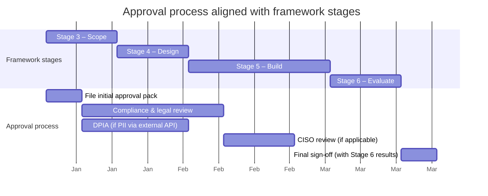

# Layer 1: Application Guide

!!! tip "One-file shortcut"
    Use `personalise/PERSONALISE-L1-APPLICATION-GUIDE.md` — one file to open, edit, and run with any AI CLI (Gemini, Claude, ChatGPT). [Quick start →](index.md#quick-start-one-file-one-command)

Generate a tailored application guide that shows exactly how this framework applies to your organisation — your roles, your systems, your constraints.

The output is a single markdown document containing an executive summary, rollout plan, role-specific playbooks, quick wins, data sensitivity analysis, guardrails, and a risk register. Everything names your actual systems, job titles, and workflows.

## What this costs

Personalisation uses LLM tokens, not consultants. Here is what to expect:

| Layer | Input tokens | Output tokens | Estimated cost (Claude Sonnet) | Estimated cost (Gemini Pro) |
|---|---|---|---|---|
| **Layer 1** (application guide) | ~50-100K | ~10-20K | $0.50-2.00 | $0.15-0.50 |
| **Layer 2** (per role) | ~30-50K | ~15-25K | $1.00-3.00 | $0.30-0.75 |
| **Layer 3** (full site fork) | ~200-400K | ~100-200K | $5.00-15.00 | $1.50-4.00 |

!!! info "Why a single-pass guide is the right default"
    Layer 1 is designed to produce 80% of the value of a bespoke consulting exercise in a single pass — one prompt, one run, one output file. You trade the last 20% of depth for ~99% of the cost and time.

---

## Step 1: Fill in your organisation config

Copy the config template, rename it, and fill in your details.

```bash
cp personalise/org-config-template.yaml personalise/org-config.yaml
```

Open `org-config.yaml` and fill in every section. Delete or leave blank any fields that don't apply. The more context you provide, the more specific the output.

??? example "Complete config template"

    ```yaml
    # === ORGANISATION CONTEXT ===
    # Fill in the sections below. Delete or leave blank any fields that don't apply.

    organisation:
      name: ""                    # e.g., "Acme Corp"
      description: ""             # 1-2 sentences about what the company does
      division: ""                # e.g., "Customer Operations", "Client Services"
      industry: ""                # e.g., "Financial services", "SaaS", "Healthcare"

    # === ROLES ===
    # List the roles in your team that will use the framework.
    # Add or remove roles as needed. Aim for 2-5 roles.
    roles:
      - name: ""                  # e.g., "Account Manager"
        description: ""           # 2-3 sentences: what this role does day-to-day

      - name: ""
        description: ""

    # === SYSTEMS AND TOOLS ===
    # List the systems your team uses regularly. Include internal tools.
    systems:
      - name: ""                  # e.g., "Salesforce"
        purpose: ""               # e.g., "CRM — account data, pipeline, contacts"
        api_available: true       # Does it have a REST/GraphQL API?

    # === CONSTRAINTS ===
    # What limits or requirements affect automation decisions?
    constraints:
      regulatory: ""              # e.g., "FCA regulated", "HIPAA", "SOX", "none"
      data_sensitivity: ""        # e.g., "Handles PII", "Financial data", "Internal only"
      client_facing: true         # Does your team produce outputs for external clients?
      approval_requirements: ""   # e.g., "Manager approval for client deliverables"

    # === WHAT YOU WANT TO ACHIEVE ===
    # Help the AI focus its recommendations.
    goals:
      primary_goal: ""            # e.g., "Reduce time spent on weekly reporting"
      target_workflows: []        # Optional: specific workflows you already know about
                                  # e.g., ["Weekly status report", "QBR preparation"]
      timeline: ""                # e.g., "First agent in 3 months"

    # === REGULATORY ENVIRONMENT ===
    regulatory_environment:
      jurisdictions: []          # e.g., ["FCA", "PRA", "MAS", "APRA"]
      data_residency: ""         # e.g., "EU only", "UK and US", "No restrictions"
      existing_ai_policy: false  # Does the org already have an AI usage policy?

    # === OPERATING MODEL ===
    operating_model:
      type: ""                   # "vendor", "principal", "platform", "marketplace"
      client_boundary: false     # Do outputs cross a client boundary?
      multi_tenant: false        # Multiple clients from shared infrastructure?

    # === TEAM CAPABILITY ===
    team_capability:
      can_build_stages_4_6: false
      engineering_support: ""    # "Dedicated team", "Shared platform team", "External"
      existing_automation: ""    # "None", "Scripts/cron", "Existing ML pipeline"
    ```

??? example "Completed example: Meridian Analytics Customer Operations (fictional)"

    **Meridian Analytics is a fictional organisation used here to illustrate a filled-in config.** Any resemblance to real companies is coincidental.

    ```yaml
    organisation:
      name: "Meridian Analytics"
      description: >
        Mid-sized B2B SaaS firm providing customer analytics dashboards
        and retention scoring to retail and e-commerce clients. Serves
        approximately 150 enterprise accounts across North America and
        Europe.
      division: "Customer Operations"
      industry: "B2B SaaS — customer analytics"

    roles:
      - name: "Customer Success Manager (CSM)"
        description: >
          Manages ongoing client relationships post-onboarding. Monitors
          dashboard adoption and client usage health, runs quarterly
          business reviews, coordinates support escalations, prepares
          renewal briefs, and identifies expansion opportunities across
          a portfolio of approximately 30 accounts.

      - name: "Business Analyst (BA)"
        description: >
          Requirements and process role. Gathers client requirements for
          new dashboard configurations and custom reports, maps client
          reporting workflows to Meridian's data model, produces functional
          specifications for engineering, manages requirement traceability,
          and supports user acceptance testing on new releases.

      - name: "Implementation Engineer"
        description: >
          Technical onboarding role. Configures Meridian dashboards for new
          clients, writes custom transformations in Meridian's config
          language, integrates with client data warehouses, troubleshoots
          production issues, and provides technical guidance during
          onboarding and steady-state operation.

    systems:
      - name: "Jira"
        purpose: "Project tracking — tickets, sprints, delivery milestones"
        api_available: true
      - name: "Confluence"
        purpose: "Documentation — specs, runbooks, client-facing docs"
        api_available: true
      - name: "Salesforce"
        purpose: "CRM — client accounts, contacts, opportunities, renewals"
        api_available: true
      - name: "Slack"
        purpose: "Communication — client channels, internal coordination"
        api_available: true
      - name: "Meridian Platform APIs"
        purpose: "Core product — dashboard config, usage metrics, audit logs"
        api_available: true

    constraints:
      regulatory: "SOC 2 Type II, GDPR for EU clients"
      data_sensitivity: "Client usage data, PII for client end-users"
      client_facing: true
      approval_requirements: "Client-facing deliverables require CSM sign-off"

    goals:
      primary_goal: "Reduce time spent on recurring QBR prep and status reporting"
      target_workflows:
        - "Quarterly business review prep"
        - "Weekly status report"
        - "Dashboard health assessment"
        - "Onboarding runbook preparation"
      timeline: "First agent in 3 months"

    regulatory_environment:
      jurisdictions: ["SOC 2", "GDPR"]
      data_residency: "EU client data stays in EU region"
      existing_ai_policy: false

    operating_model:
      type: "vendor"
      client_boundary: true
      multi_tenant: true

    team_capability:
      can_build_stages_4_6: true
      engineering_support: "Shared platform team"
      existing_automation: "Scripts/cron"
    ```

---

## Step 2: Run the application guide prompt

Choose whichever option matches your setup. All three produce the same output.

=== "Option A: Interactive (paste into AI chat)"

    1. Open your AI assistant (Claude, ChatGPT, or similar)
    2. Paste the contents of `personalise/prompts/application-guide.md`
    3. Paste the contents of your `org-config.yaml`
    4. Attach or paste the framework stage files from `docs/stages/`
    5. The AI produces your application guide

    !!! tip
        For best results, attach all six stage files (`01-decompose.md` through `06-evaluate.md`) plus `getting-started/index.md`. More context produces more specific output.

=== "Option B: CLI (Claude Code)"

    ```bash
    cd your-framework-clone/
    claude -p "$(cat personalise/prompts/application-guide.md)" \
      --allowedTools Read,Write,Glob,Grep,WebSearch \
      --max-turns 30
    ```

    The AI reads the framework docs and org config, then writes the guide to `personalise/output/APPLICATION-GUIDE.md`.

=== "Option C: Web-based (zero tooling)"

    1. Open Claude.ai or ChatGPT in your browser
    2. Paste the contents of `personalise/prompts/application-guide.md`
    3. Paste the contents of your `org-config.yaml`
    4. Paste the framework stage files (or upload them as attachments)
    5. The AI produces your application guide directly in the chat
    6. Copy the output into a markdown file and save it

    This path requires no CLI, no repo clone, and no local tooling. It works for anyone with browser access to an LLM.

---

## Step 3: Review and share

The output is a markdown file. What to do with it:

- [x] **Review for accuracy** — the AI's output is a strong first draft, but you know your org better than it does. Fix any inaccuracies in workflow descriptions or system details.

Then, in order:

1. **Share the executive summary with your manager** — run the [executive briefing prompt](../personalise/apply.md#generate-an-executive-briefing) to produce a 1-2 page summary for upward communication
2. **Share role playbooks with 1-2 people per role for accuracy validation** — domain experts will catch inaccuracies in workflow descriptions and system details
3. **Use the quick wins section to pick your first workflow** — choose the highest-scoring candidate that you can start on this week
4. **Schedule a 1-hour team walkthrough** — present the guide, walk through the role playbooks, and agree on the first workflow to automate
5. **Store in your team's shared drive as the reference document** — this is the living document your team refers to throughout the programme

---

## Generate an executive briefing

Once you have the application guide, run the executive briefing prompt to produce a 1-2 page summary suitable for upward communication:

=== "Interactive"

    1. Open your AI assistant
    2. Paste the contents of `personalise/prompts/executive-briefing.md`
    3. Paste the contents of your completed `APPLICATION-GUIDE.md`
    4. Paste the contents of your `org-config.yaml`

=== "CLI"

    ```bash
    claude -p "$(cat personalise/prompts/executive-briefing.md)" \
      --allowedTools Read,Write \
      --max-turns 10
    ```

The output is written to `personalise/output/EXECUTIVE-BRIEFING.md`.

---

## Build a business case

The executive briefing tells the story. The business case template below gives it numbers. Fill it in after Stage 2 — once you have a selected workflow with time estimates — so the financial justification is ready before you commit engineering resources to Stages 4–6.

Copy the template, fill in the values from your Stage 1 inventory and Stage 2 selection, and adjust the assumptions to match your context.

??? example "Business case template"

    ```markdown
    # Business Case: [Workflow Name]

    **Date:** [YYYY-MM-DD]
    **Author:** [Your name / role]
    **Status:** Draft | Under review | Approved

    ---

    ## 1. Time savings projection

    Source: Stage 1 workflow inventory.

    | Metric | Value |
    |---|---|
    | Current time per run | [e.g., 3.5 hours] |
    | Frequency | [e.g., weekly / 52× per year] |
    | Number of people performing this workflow | [e.g., 4] |
    | **Total annual hours spent** | [time × frequency × people] |
    | Estimated automation percentage | [default: 60% — conservative for first agent] |
    | **Projected annual hours saved** | [total hours × automation %] |
    | Hourly cost (fully loaded) | [e.g., £75 / $95] |
    | **Projected annual cost saving** | [hours saved × hourly cost] |

    > Adjust the automation percentage based on the workflow's human judgement
    > requirements from your Stage 2 scoring. Fully templated workflows
    > (score 5) can reach 80%+. Workflows requiring expert review (score 2-3)
    > should stay at 40-60%.

    ---

    ## 2. Cost model

    ### One-off costs (Stages 4–6 build)

    | Item | Estimate | Notes |
    |---|---|---|
    | Engineering time — Stage 4 (Design) | [e.g., 3 days] | Prompt design, architecture |
    | Engineering time — Stage 5 (Build) | [e.g., 5-10 days] | Implementation, integration, testing |
    | Engineering time — Stage 6 (Evaluate) | [e.g., 2-3 days] | Evaluation dataset, acceptance criteria |
    | Infrastructure setup | [e.g., £0-500] | CI/CD, secrets management, hosting |
    | **Total one-off cost** | [sum above] | |

    ### Recurring costs (per month, in production)

    | Item | Estimate | How to calculate |
    |---|---|---|
    | LLM API costs | [e.g., £50-200/mo] | Runs/month × tokens/run × price/token (use Stage 5 token budgets) |
    | Infrastructure | [e.g., £0-50/mo] | Hosting, logging, monitoring |
    | Prompt maintenance | [e.g., 2-4 hrs/mo] | Drift checks, prompt updates, failure triage |
    | **Total monthly recurring cost** | [sum above] | |
    | **Total annual recurring cost** | [monthly × 12] | |

    ---

    ## 3. Break-even analysis

    | Metric | Value |
    |---|---|
    | Total first-year cost | [one-off + (monthly recurring × 12)] |
    | Projected annual saving | [from Section 1] |
    | **Net first-year benefit** | [saving − first-year cost] |
    | **Break-even point** | [one-off cost ÷ (monthly saving − monthly recurring cost)] months |

    > If break-even exceeds 12 months, consider: (a) is the automation
    > percentage too conservative? (b) are there downstream workflows that
    > also benefit? (c) does the non-financial case justify the investment?

    ---

    ## 4. Non-financial benefits

    - [ ] **Consistency** — removes variation between individuals performing the same workflow
    - [ ] **Speed** — reduces turnaround from [current] to [projected]
    - [ ] **Scalability** — handles [N] additional runs without additional headcount
    - [ ] **Reduced key-person risk** — workflow no longer depends on [specific role/person]
    - [ ] **Auditability** — every run produces a logged, reviewable output
    - [ ] [Add any domain-specific benefits]

    ---

    ## 5. Recommendation

    [1-2 sentences: proceed / defer / investigate further, with rationale
    tied to the numbers above.]
    ```

!!! tip "When to use this"
    The executive briefing answers *"what could we do with AI?"* — this template answers *"what does it cost and what do we get back?"* Use both when seeking budget approval. The briefing gets attention; the business case gets sign-off.

---

## Regulatory and governance approval

In regulated environments (FCA, PRA, MAS, APRA, or similar), an agent that passes Stage 6 evaluation is *technically ready* but not *approved to operate*. There is a governance gate between those two states, and it can take 4–12 weeks if you start it at the wrong time. Start it at Stage 3.

!!! warning "Start the approval process at Stage 3, not Stage 6"
    Compliance needs to see the scope — what data the agent touches, what outputs it produces, who reviews them — before engineering begins. If you wait until the agent is built to engage compliance, you will either redesign under pressure or sit in a queue while momentum dies. File the initial approval request as part of Stage 3 scoping. The Stage 6 evaluation report completes the pack — it does not start it.

### Approval timeline

The approval process runs in parallel with engineering, not after it:



### Model risk management checklist

Adapted from SR 11-7 (Fed) and SS1/23 (PRA) principles, sized for AI agents rather than traditional quantitative models. Work through this checklist during Stages 3–6 — not all at once.

!!! example "Model risk management checklist for AI agents"

    **Stage 3 — Scope (complete before engineering begins)**

    - [ ] **Purpose and scope documented** — what decision or output the agent supports, what it does not do, and the boundary between agent output and human judgement
    - [ ] **Data inventory** — every data source the agent reads, every system it writes to, classification of each (PII, financial, internal-only, public)
    - [ ] **Client boundary assessment** — whether agent output crosses a client boundary, and if so, what review gate applies
    - [ ] **Materiality classification** — is the agent's output used in a decision that could cause financial loss, regulatory breach, or client harm? If yes, classify as material and apply enhanced controls
    - [ ] **Initial approval pack filed** — scope document, data flow diagram, and risk assessment submitted to compliance (see pre-approval documentation pack below)

    **Stage 4–5 — Design and Build**

    - [ ] **Input validation** — the agent validates that input data meets expected schema, format, and freshness requirements before processing
    - [ ] **Output constraints** — the agent's output is bounded (e.g., token limits, structured output schemas, allowed value ranges) to prevent unbounded or nonsensical outputs
    - [ ] **Human-in-the-loop checkpoints** — every material output has a defined review point where a qualified human approves, modifies, or rejects before the output proceeds
    - [ ] **Audit logging** — every run is logged with inputs, outputs, model version, prompt version, reviewer identity, and review decision
    - [ ] **Prompt version control** — prompts are versioned, and changes go through the same review process as code changes

    **Stage 6 — Evaluate (completes the approval pack)**

    - [ ] **Evaluation dataset** — representative test cases covering normal, edge, and adversarial inputs, with expected outputs defined by a domain expert
    - [ ] **Performance baseline** — measured accuracy, consistency, and failure rate against the evaluation dataset
    - [ ] **Ongoing monitoring plan** — how performance will be tracked in production (scheduled evaluation re-runs, drift detection, alert thresholds)
    - [ ] **Degradation and fallback procedures** — what happens when the agent fails, the LLM API is unavailable, or output quality drops below threshold
    - [ ] **Model documentation** — a single document describing purpose, design, limitations, assumptions, and known failure modes (this is your model card)

### RACI for the approval process

Who reviews, who approves, who is informed. Adapt the roles to your org chart — the functions matter more than the exact titles.

| Activity | Responsible | Accountable | Consulted | Informed |
|---|---|---|---|---|
| File initial approval pack (Stage 3) | Programme lead / workflow owner | Business owner (the person whose team uses the agent) | Head of Compliance, DPO | CISO, Engineering lead |
| Data protection impact assessment | DPO | Head of Compliance | Programme lead, Engineering lead | Business owner |
| Security review (data flows, API access, secrets management) | Engineering lead | CISO | Programme lead | Head of Compliance |
| Compliance review (regulatory implications, client impact) | Head of Compliance | Head of Compliance | Business owner, Legal | Programme lead, DPO |
| Stage 6 evaluation review | Programme lead | Business owner | Head of Compliance, Engineering lead | CISO, DPO |
| Final sign-off to operate in production | Business owner | Business owner | Head of Compliance, CISO | Programme lead, affected team managers |

!!! tip "The business owner is accountable, not the programme lead"
    In regulated environments, the person whose team uses the agent owns the risk. The programme lead facilitates the process and produces the documentation, but the business owner signs off on "this agent is appropriate for my team's work." This is not bureaucracy — it ensures the person closest to the domain judges whether the agent's output is fit for purpose.

### Data protection impact assessment (DPIA)

If your agent processes personal data via an external LLM API (any API where data leaves your infrastructure), you almost certainly need a DPIA. This is a legal requirement under UK GDPR and equivalent regimes, not an optional best practice.

**When a DPIA is required:**

- The agent sends PII (names, email addresses, account numbers, transaction data) to an external API
- The agent processes special category data (health, biometric, political opinions) in any form
- The agent profiles individuals or makes automated decisions that affect them
- The agent processes data about children or vulnerable individuals

**Key questions the DPIA must answer:**

1. **What personal data is processed?** — list every field, with classification
2. **What is the lawful basis?** — legitimate interest, contractual necessity, or consent (consent is rarely practical for internal tooling)
3. **Where does the data go?** — which API provider, which region, what are their data processing terms
4. **How long is data retained by the API provider?** — check the provider's data retention policy and DPA (e.g., Anthropic's zero-retention API, OpenAI's data usage policies)
5. **What are the risks to data subjects?** — unauthorised access, re-identification, inaccurate outputs used in decisions about them
6. **What mitigations are in place?** — anonymisation before sending, field-level redaction, synthetic data for testing, encryption in transit

!!! warning "Anonymisation is cheaper than a DPIA exception"
    If you can strip PII before sending data to the LLM and re-attach it to the output, do that. It reduces the DPIA scope, simplifies the compliance review, and often makes the agent more portable across jurisdictions. Build the anonymisation step into your Stage 5 architecture, not as an afterthought.

### Pre-approval documentation pack

Bundle these artefacts into a single pack for compliance review. The pack is assembled progressively — you do not need everything before filing the initial request.

??? example "Pre-approval documentation pack template"

    ```markdown
    # Agent Approval Pack: [Agent Name]

    **Workflow:** [Name from Stage 2 selection]
    **Business owner:** [Name, role]
    **Programme lead:** [Name, role]
    **Date filed:** [YYYY-MM-DD]
    **Target production date:** [YYYY-MM-DD]
    **Status:** Initial review | DPIA in progress | Compliance review | Approved | Rejected

    ---

    ## Section 1: Scope document (from Stage 3)

    **Attached:** [Link or filename of Stage 3 scope document]

    Summary:
    - Agent purpose: [1-2 sentences]
    - Input data sources: [list]
    - Output destinations: [list]
    - Human-in-the-loop checkpoints: [list]
    - What the agent does NOT do: [explicit exclusions]

    ---

    ## Section 2: Data flow diagram

    **Attached:** [Link or filename]

    The diagram must show:
    - Every data source the agent reads from
    - Every external API the agent calls (LLM provider, third-party services)
    - Every system the agent writes to
    - Where PII exists in the flow and where it is stripped/anonymised
    - Where data crosses organisational or jurisdictional boundaries

    ---

    ## Section 3: Risk assessment

    | Risk | Likelihood | Impact | Mitigation | Residual risk |
    |---|---|---|---|---|
    | Agent produces inaccurate output used in client deliverable | Medium | High | HIL checkpoint before client delivery; evaluation dataset covers edge cases | Low — human reviewer catches errors |
    | PII sent to external LLM API | [Assess] | High | [Anonymisation / field redaction / on-premise model] | [Assess after mitigation] |
    | LLM API unavailable | Medium | Low | Manual fallback procedure documented; agent failure triggers alert | Low — team reverts to manual process |
    | Prompt injection via untrusted input | [Assess] | [Assess] | Input validation; output schema constraints; no agent access to write-sensitive systems without approval | [Assess] |
    | Model drift — output quality degrades over time | Medium | Medium | Monthly evaluation re-run; override rate monitoring; alert on threshold breach | Low — detected within one evaluation cycle |

    ---

    ## Section 4: DPIA summary (if applicable)

    **Attached:** [Link to full DPIA]

    - DPIA required: Yes / No
    - Lawful basis: [e.g., legitimate interest]
    - PII categories processed: [list]
    - Data processor: [LLM provider name, DPA reference]
    - Key mitigations: [summary]

    ---

    ## Section 5: Evaluation report (from Stage 6)

    **Attached:** [Link or filename of Stage 6 evaluation report]

    - Evaluation dataset size: [N test cases]
    - Pass rate: [X%]
    - Known failure modes: [list]
    - Ongoing monitoring plan: [summary]

    ---

    ## Section 6: Approvals

    | Role | Name | Decision | Date | Notes |
    |---|---|---|---|---|
    | Business owner | | | | |
    | Head of Compliance | | | | |
    | DPO | | | | |
    | CISO | | | | |
    | Legal (if client-facing) | | | | |
    ```

### Avoiding the approval bottleneck

The 4–12 week estimate above is the worst case — when the pack lands on compliance's desk fully formed at the end of the build. To compress the timeline:

1. **File at Stage 3, not Stage 6.** Compliance reviews the scope and data flows while engineering builds the agent. The Stage 6 evaluation report is the final attachment, not the trigger for the review.
2. **Schedule a 30-minute walkthrough with compliance before filing.** An informal conversation ("here is what we are planning, what concerns would you flag?") surfaces blockers earlier than a formal submission.
3. **Use the RACI to parallelise reviews.** The DPO can run the DPIA while compliance reviews the scope. The CISO can review data flows while legal reviews client impact. Do not sequence these — run them concurrently.
4. **Reuse approved patterns.** If your first agent is approved with a specific architecture (e.g., anonymise-before-sending, HIL checkpoint before client output), document that pattern. The second agent using the same pattern gets a lighter review.
5. **Build the documentation as you go.** Every section of the approval pack maps to a framework stage output. If you produce the scope document at Stage 3, the data flow diagram at Stage 4, and the evaluation report at Stage 6, the pack assembles itself.

---

## Programme health dashboard

The [adoption tracker](learn.md#adoption-tracker) in Layer 2 measures whether individuals completed each stage. That is necessary but insufficient — a programme can show 80% Stage 1–3 completion while zero agents are in production use. The dashboard below adds two tiers of metrics that track whether the programme is actually delivering value.

### Metric tiers

#### Tier 1 — Activity (leading indicators)

What the adoption tracker already covers. Keep tracking these:

- Stages completed per person
- Workshops attended / facilitated
- Champions active (running sessions, answering questions, reviewing artifacts)

#### Tier 2 — Outcomes (value delivery)

These tell you whether activity is converting into results:

| Metric | How to measure | What it tells you |
|---|---|---|
| Agents in production use | Count of agents running on real data on a schedule or trigger (not demos, not prototypes) | Whether the programme is producing working software, not just training artifacts |
| Hours saved per month (actual) | Compare task duration before and after agent deployment — use time logs, not estimates | Whether projected savings from the business case are materialising |
| Teams past their second workflow | Count of teams that have completed Stages 1–6 for ≥2 workflows | Whether teams are self-sustaining or stalling after the first guided build |
| Repeat usage rate | Percentage of deployed agents still in active use after 30/60/90 days | Whether agents are solving real problems or were abandoned after launch |

!!! warning "Measure actual hours, not projected hours"
    The business case template uses projected savings. Once agents are in production, replace projections with actuals. If actual savings consistently fall below 50% of projections, the scoping assumptions need revisiting — not the programme.

#### Tier 3 — Quality (sustainability)

These tell you whether agent output is holding up over time:

| Metric | How to measure | What it tells you |
|---|---|---|
| Agent evaluation scores | Run Stage 6 evaluation sets monthly — track pass rate over time | Whether agent output quality is stable, improving, or degrading |
| Human override rate at HIL checkpoints | Percentage of runs where a human reviewer changes the agent's output before it proceeds | Decreasing = agent is learning from prompt refinements. Increasing = input data or requirements are drifting |
| Time to resolve agent failures | Median time from "agent produced bad output" to "prompt/config fix deployed" | Whether the team has operational maturity to maintain agents, not just build them |

### Realistic targets by programme stage

Set expectations at three checkpoints. These assume a division of 30–60 people with 2–3 champions:

| | 3 months | 6 months | 12 months |
|---|---|---|---|
| **Activity** | 60%+ of target roles have completed Stages 1–3. ≥2 champions active | 80%+ Stage 1–3 completion. ≥1 certified facilitator running workshops independently | Champions self-organising. New joiners onboarded through existing materials |
| **Outcomes** | 1–2 agents in production use. First actual time savings measured | 3–5 agents in production. ≥2 teams working on their second workflow. Actual savings within 30% of business case projections | 5–10 agents in production. Hours saved per month is a tracked team metric. New workflows entering the pipeline without programme team involvement |
| **Quality** | Evaluation baselines established for each production agent | Evaluation scores stable or improving. Override rates declining for mature agents | Median time-to-fix under 48 hours. Teams retiring underperforming agents proactively |

!!! tip "Start measuring outcomes from the first production deployment, not from programme launch"
    Tier 2 and 3 metrics are meaningless until at least one agent is live. Track Tier 1 only during the initial training phase — then shift reporting emphasis to outcomes and quality once the first agent ships.

### Monthly programme dashboard

The tiers above define what to measure. The template below assembles those metrics into a single page you can hand to your manager once a month. It takes 30 minutes to compile and replaces ad-hoc "how is the programme going?" Slack messages with a structured update that shows trajectory, not just snapshots.

??? example "Monthly programme dashboard template"

    ```markdown
    # Programme Dashboard: [Programme Name]

    **Month:** [e.g., March 2025]
    **Compiled by:** [Name, role]
    **Next update:** [YYYY-MM-DD]

    ---

    ## Adoption funnel

    Track how people move through the framework. Drop-off between stages
    tells you where the programme is losing momentum.

    | Stage | People started | People completed | Drop-off rate |
    |---|---|---|---|
    | Stage 1 — Decompose | [n] | [n] | [%] |
    | Stage 2 — Select | [n] | [n] | [%] |
    | Stage 3 — Scope | [n] | [n] | [%] |
    | Stages 4–6 — Build to Evaluate | [n] | [n] | [%] |
    | Agent in production | — | [n] | — |

    **Funnel summary:** [n] people entered Stage 1 → [n] completed Stage 3
    → [n] agents in production use.

    > A healthy programme shows ≥70% conversion from Stage 1 to Stage 3
    > (the non-technical stages) and ≥50% from Stage 3 to production.
    > If Stage 1→2 drop-off exceeds 40%, the problem is usually time
    > allocation — people attended the workshop but were never given time
    > to complete the inventory. If Stage 3→production drop-off exceeds
    > 60%, the bottleneck is usually engineering capacity or approval delays.

    ---

    ## Leading indicators (activity this month)

    These predict next month's outcomes. If leading indicators decline,
    outcome metrics will follow 4–8 weeks later.

    | Indicator | This month | Last month | Trend |
    |---|---|---|---|
    | Stage artifacts completed | [n] | [n] | ↑ / → / ↓ |
    | Workshop sessions held | [n] | [n] | ↑ / → / ↓ |
    | Champion check-ins completed | [n of n scheduled] | [n of n] | ↑ / → / ↓ |
    | New workflows entering pipeline | [n] | [n] | ↑ / → / ↓ |
    | Time-to-completion per stage (median days) | S1: [n] · S2: [n] · S3: [n] | S1: [n] · S2: [n] · S3: [n] | ↑ / → / ↓ |

    ---

    ## Lagging indicators (cumulative outcomes)

    These measure whether the programme is delivering value.

    | Indicator | Current | Last month | Target (this quarter) |
    |---|---|---|---|
    | Agents in production | [n] | [n] | [n] |
    | Aggregate hours saved this month (actual) | [n] | [n] | [n] |
    | Cumulative hours saved (programme to date) | [n] | [n] | — |
    | LLM cost per agent per month (average) | [£/$/€] | [£/$/€] | [budget] |
    | Total monthly LLM spend (all agents) | [£/$/€] | [£/$/€] | [budget] |
    | Cost per hour saved | [total LLM spend ÷ hours saved] | [prev] | — |

    > **Cost per hour saved** is the single number executives care about
    > most. If it exceeds the fully-loaded hourly cost of the person whose
    > time is being saved, the programme is not yet cost-effective — but
    > this is normal in the first 3 months while build costs amortise.

    ---

    ## Health indicators

    These flag whether the programme is sustainable or accumulating risk.

    | Indicator | Value | Status |
    |---|---|---|
    | Drop-off rate: Stage 1 → Stage 3 | [%] | 🟢 ≤30% · 🟡 31–50% · 🔴 >50% |
    | Drop-off rate: Stage 3 → production | [%] | 🟢 ≤50% · 🟡 51–70% · 🔴 >70% |
    | Median time from Stage 1 start to Stage 3 complete | [n] days | 🟢 ≤30d · 🟡 31–60d · 🔴 >60d |
    | Rework rate at Stage 3 handoff (scopes sent back for revision) | [%] | 🟢 ≤20% · 🟡 21–40% · 🔴 >40% |
    | Agent repeat usage rate (30-day) | [%] | 🟢 ≥80% · 🟡 60–79% · 🔴 <60% |
    | Human override rate (average across production agents) | [%] | 🟢 ≤20% · 🟡 21–40% · 🔴 >40% |
    | Active champions (ran a session or review this month) | [n of n] | 🟢 all active · 🟡 ≥50% · 🔴 <50% |

    ---

    ## Commentary (3–5 sentences)

    [What changed this month. What is working. What needs attention.
    One specific action for next month.]
    ```

!!! tip "Automate what you can"
    Most of these numbers come from artifacts that already exist — Stage completion dates from your adoption tracker, agent run counts from logs, LLM costs from your API provider's billing dashboard. If you track Stage completions in a spreadsheet or project tracker, the funnel and leading indicators are a pivot table away. Do not let the dashboard become a manual data-gathering exercise that takes half a day — that defeats the purpose.

---

## Programme governance

The health dashboard tells you whether the programme is working. Governance determines who makes decisions about it — especially when multiple teams are using the framework independently. Without explicit governance, you get divergent methodology interpretations, unmaintained org-configs, agents entering production without review, and a programme that collapses when the original champion moves on.

You do not need a governance committee. You need defined roles, clear decision rights, and a lightweight review cadence.

### Centre of Excellence (CoE) — the minimum viable version

A full CoE team is overkill for most organisations at this stage. What you need is a defined role — even part-time — that owns three things:

1. **Methodology standards** — the canonical interpretation of the framework stages for your organisation. When two teams disagree on whether a workflow scores a 3 or a 4 at Stage 2, the CoE role resolves it.
2. **Org-config ownership** — a single maintained `org-config.yaml` that reflects current systems, roles, and constraints. Without an owner, configs diverge across teams and application guides drift out of sync with reality.
3. **Agent production review** — every agent passes through a lightweight review before production deployment. The review is not a gate — it is a quality check that the agent followed Stages 3–6, has an evaluation baseline, and has a named owner.

| Programme size | CoE model | Time commitment |
|---|---|---|
| 1–2 teams (< 30 people) | Single champion owns all three responsibilities | 2–4 hours/week |
| 3–5 teams (30–100 people) | Named CoE lead (part-time) + 1 representative per team | 1 day/week for CoE lead, 2 hours/week per representative |
| 5+ teams (100+ people) | Dedicated CoE lead + rotating representatives + quarterly steering group | 2–3 days/week for CoE lead |

!!! warning "The CoE lead is not a bottleneck — they are a tiebreaker"
    The CoE lead does not approve every decision. Teams run Stages 1–6 independently. The CoE lead intervenes when teams need a ruling on methodology interpretation, when org-config changes affect multiple teams, or when an agent review surfaces a systemic issue. If the CoE lead is blocking delivery, the model is too heavy — scale it back.

### Decision rights matrix

Make it explicit who can change what. Post this where teams can find it — in the framework's shared documentation, not buried in a meeting note.

| Decision | Who decides | Who is consulted | Who is informed |
|---|---|---|---|
| Adjust scoring weights or selection criteria at Stage 2 | Team lead (for their team's workflows) | CoE lead | Other teams using the framework |
| Approve a new automation target (new workflow entering the pipeline) | Team lead + business owner | CoE lead, compliance (if regulated) | Programme steering group |
| Modify the org-config | CoE lead | All team representatives | All framework users |
| Approve an agent for production deployment | CoE lead + business owner | Engineering lead, compliance (if the agent handles PII or crosses a client boundary) | Programme steering group |
| Update methodology standards (change how a stage is interpreted or applied) | CoE lead + programme steering group | All team representatives | All framework users |
| Upgrade to a new framework version | CoE lead | All team representatives, engineering lead | All framework users, programme steering group |

!!! tip "Decision rights prevent both bottlenecks and chaos"
    Without a matrix, either everything escalates to the programme lead (bottleneck) or every team interprets the framework differently (chaos). The matrix makes most decisions local — teams own their own workflows — while keeping cross-cutting decisions centralised.

### Quarterly programme review

Run this once per quarter. It takes 60–90 minutes and replaces ad-hoc "how is the programme going?" conversations with a structured review that produces decisions, not just discussion.

??? example "Quarterly programme review template"

    ```markdown
    # Quarterly Programme Review: [Programme Name]

    **Quarter:** [e.g., Q2 2025]
    **Date:** [YYYY-MM-DD]
    **Attendees:** CoE lead, team representatives, business owner(s), programme sponsor

    ---

    ## 1. Dashboard review (15 min)

    Pull the current programme health dashboard metrics.

    | Metric | Target | Actual | Trend |
    |---|---|---|---|
    | Agents in production use | [target] | [actual] | ↑ / → / ↓ |
    | Hours saved per month (actual) | [target] | [actual] | ↑ / → / ↓ |
    | Teams past their second workflow | [target] | [actual] | ↑ / → / ↓ |
    | Repeat usage rate (30-day) | [target] | [actual] | ↑ / → / ↓ |
    | Average evaluation score (production agents) | [target] | [actual] | ↑ / → / ↓ |
    | Human override rate (average across agents) | [target] | [actual] | ↑ / → / ↓ |

    **Key takeaway:** [1-2 sentences — is the programme on track, ahead, or behind?]

    ---

    ## 2. Agent portfolio review (20 min)

    List every production agent. Decide: continue, improve, or retire.

    | Agent | Owner | Deployed | Eval score | Override rate | Usage (30d) | Decision |
    |---|---|---|---|---|---|---|
    | [name] | [team/person] | [date] | [%] | [%] | [runs] | Continue / Improve / Retire |

    **Agents to retire:** [list any agents where usage has dropped below threshold or override rate exceeds 50%]

    **Agents needing attention:** [list any agents with declining eval scores or increasing override rates]

    ---

    ## 3. Methodology and standards update (15 min)

    - Are any stage interpretations causing confusion or inconsistency across teams?
    - Has anything changed in the organisation (new systems, new roles, regulatory changes) that requires an org-config update?
    - Is a framework version upgrade available? If so, what is the migration impact?

    **Decisions:**
    - [ ] [e.g., Update org-config to add new CRM system]
    - [ ] [e.g., Clarify Stage 2 scoring for client-facing workflows]

    ---

    ## 4. Pipeline review (15 min)

    Workflows currently in the pipeline (Stages 1–6, not yet in production):

    | Workflow | Team | Current stage | Expected production date | Blockers |
    |---|---|---|---|---|
    | [name] | [team] | [stage] | [date] | [blocker or "none"] |

    ---

    ## 5. Actions and owners (10 min)

    | Action | Owner | Due date |
    |---|---|---|
    | [action] | [person] | [date] |
    ```

### Succession planning for champions

Champions leave, get promoted, or change teams. If the programme depends on a single person's knowledge and relationships, it has a single point of failure. Plan for this from the start — not when the champion hands in their notice.

**Build redundancy into the champion model:**

- [ ] **Two champions minimum** — even in a single-team programme. One primary, one shadow. The shadow attends workshops, has access to all programme materials, and can run a session independently.
- [ ] **Document tribal knowledge** — if the champion knows "compliance prefers to see the DPIA before the scope document" or "the CTO only reads the executive summary," that knowledge must be written down, not stored in their head. The stakeholder map and communication plan templates capture most of this — keep them updated.
- [ ] **Rotate facilitation** — do not let one person run every workshop. Layer 2's facilitator certification path exists for this reason. By month 6, at least two people should be able to facilitate independently.

**When a champion transitions:**

1. **30-day handover window** — the outgoing champion and their successor overlap for at least 30 days. During this period, the successor runs workshops and reviews with the outgoing champion observing, not the other way around.
2. **Transfer relationships, not just materials** — the successor needs introductions to the compliance contact, the executive sponsor, and the team leads who are active in the programme. A shared drive of documents is not a handover.
3. **Update the decision rights matrix** — replace names, not just roles. Everyone involved should know who the new point of contact is.
4. **Run a programme health check** — use the quarterly review template within two weeks of the transition. This surfaces any issues the outgoing champion was managing informally.

!!! warning "The Layer 3 handover document covers site ownership, not programme governance"
    If you have a Layer 3 fork, the handover document transfers ownership of the documentation site — who maintains pages, who approves content changes. Programme governance handover is separate. It covers decision rights, stakeholder relationships, agent portfolio ownership, and methodology authority. Transfer both, but do not confuse them.

---

## Change management playbook

The application guide and business case tell you *what* to do. This section covers *how to get the organisation to actually do it*. In regulated FinTech environments with 50–200 people, rollout success depends more on stakeholder management and political navigation than on the quality of the technical plan.

### Stakeholder mapping

Before you announce anything, map the people who will determine whether this succeeds or fails. Use an influence × attitude matrix:

??? example "Stakeholder mapping template"

    ```markdown
    # Stakeholder Map: [Programme Name]

    **Date:** [YYYY-MM-DD]
    **Last updated:** [YYYY-MM-DD]

    ## Influence × Attitude Matrix

    Plot each stakeholder into one of four quadrants:

    |  | **Supportive** | **Neutral** | **Resistant** |
    |---|---|---|---|
    | **High influence** | **Amplifiers** — activate these people early. Give them talking points and early wins to share. | **Swing votes** — your primary conversion targets. Invest time here. | **Blockers** — do not go around them. Address their concerns directly or the programme stalls. |
    | **Low influence** | **Cheerleaders** — useful for momentum but won't move decisions. Keep them informed. | **Bystanders** — minimal investment needed. Standard comms only. | **Grumblers** — monitor but don't over-invest. They become a problem only if a high-influence blocker amplifies them. |

    ## Stakeholder Register

    | Name / Role | Quadrant | Primary concern | Action | Owner | Status |
    |---|---|---|---|---|---|
    | [e.g., Head of Compliance] | High influence / Neutral | Regulatory risk of AI-generated outputs | Schedule 1:1 to walk through guardrails framework and HIL checkpoints | [You] | Pending |
    | [e.g., Operations Team Lead] | High influence / Resistant | Fears team reduction / role elimination | Share scope — automating reporting, not replacing analysts. Invite to pilot design | [Champion] | Pending |
    | [e.g., CTO] | High influence / Supportive | Wants measurable ROI | Provide business case + monthly outcome metrics | [You] | Active |
    | [e.g., Senior Analyst] | Low influence / Resistant | "We tried RPA and it failed" | Invite to first workshop. Let them see the difference firsthand | [Champion] | Pending |
    ```

**How to move stakeholders:**

- **Blocker → Neutral:** Identify their specific concern (it is almost never "AI is bad" — it is "this threatens my team / my compliance posture / my credibility"). Address that concern directly with evidence, not reassurance. A 1:1 conversation beats a group presentation. If the concern is job security, be honest about scope — "we are automating the weekly status report, not replacing the analyst role" — and back it up by involving them in pilot design.

- **Neutral → Supportive:** Give them a reason to care. Show them the application guide section relevant to their function. If they manage a team, show them the hours-saved projection for their team specifically. Neutral stakeholders move when they see personal relevance, not organisational benefit.

- **Resistant (low influence) → Contained:** Do not spend political capital converting every sceptic. Monitor grumblers through champions. If their resistance is based on a prior failed initiative ("we tried RPA and it didn't work"), acknowledge that directly and explain what is different — then move on.

!!! warning "Update the map monthly"
    Attitudes shift as the programme progresses. A neutral stakeholder who sees a successful pilot may become your strongest amplifier. A supportive executive who hears complaints from their team may turn neutral. Review and update the map at every programme checkpoint.

### Phased communication plan

Different audiences need different messages at different times. Do not send the same email to everyone.

??? example "Communication plan template"

    ```markdown
    # Communication Plan: [Programme Name]

    ## Phase 1: Pre-launch (Weeks 1–2)

    | Audience | Message | Format | Owner |
    |---|---|---|---|
    | **Executive sponsors** | "Here is the business case. We are running a pilot with [team]. Success criteria are [X]. We need your visible support." | 1:1 meeting + executive briefing doc | Programme lead |
    | **Middle managers (affected teams)** | "Your team is not being replaced. Here is what we are automating, here is what stays human, and here is how your team is involved in the design." | Small group briefing (≤8 people). No slides — walk through the application guide | Programme lead + champion |
    | **Individual contributors (pilot team)** | "You have been selected for the pilot because [specific reason]. Here is what you will do, here is the time commitment, and here is what success looks like." | Team meeting + written summary | Direct manager + champion |
    | **Individual contributors (non-pilot)** | "We are running a pilot to test AI-assisted workflows. You will hear more after the pilot concludes. Nothing changes for you right now." | Brief email or Slack message | Programme lead |

    ## Phase 2: During pilot (Weeks 3–8)

    | Audience | Cadence | Content |
    |---|---|---|
    | **Executive sponsors** | Bi-weekly, async | Pilot progress against success criteria. Blockers that need escalation. |
    | **Middle managers** | Weekly, 15-min standup | What the pilot team learned this week. Early results. Upcoming asks. |
    | **Pilot team** | Daily for first week, then 2× weekly | What worked, what didn't, what to adjust. Retrospective format. |
    | **Non-pilot teams** | End of pilot only | Summary of results. What happens next. |

    ## Phase 3: Post-pilot rollout (Weeks 9+)

    | Audience | Message | Format |
    |---|---|---|
    | **Executive sponsors** | Pilot results, actual vs projected savings, recommendation to proceed / adjust / stop | Written report + 30-min review |
    | **Middle managers** | Rollout plan for their team. Timeline, training schedule, support model | Team-specific briefing |
    | **Individual contributors** | Role-specific playbook from the application guide. "Here is what this means for your daily work." | Workshop (use the Layer 2 facilitation guide) |
    ```

!!! tip "The manager briefing is the most important communication"
    Middle managers make or break adoption. If they feel blindsided, threatened, or uninformed, they will passively resist — not by objecting, but by deprioritising, rescheduling, and "not having time." Brief them before their teams, give them the language to explain the programme, and make them co-owners of the rollout in their area.

### Resistance management

Objection handling scripts cover what people *say*. Resistance management covers what people *do* — and often the two are different. Here are the three most common resistance patterns in FinTech AI rollouts, with concrete actions for each.

#### "This will eliminate my role"

**What you will see:** Disengagement, missed workshops, passive agreement followed by no action, sudden enthusiasm for alternative projects.

**What is actually happening:** The person has concluded — correctly or incorrectly — that automating their workflows is a precursor to headcount reduction. No amount of reassurance changes this if their assessment is rational.

**What to do:**

1. Be honest about scope. If the programme *will* lead to role changes, say so. "We are not planning headcount reductions as a result of this programme" is only credible if it is true. If the answer is "we don't know yet," say that.
2. Reframe the value proposition for the individual, not the organisation. "You spend 12 hours a week on status reports. After automation, you spend 2. What would you do with the other 10?" — and make sure they have a credible answer.
3. Involve resistant individuals in pilot design and agent evaluation. People who help build the system are far less likely to resist its adoption.
4. If resistance persists after genuine engagement, escalate to their manager as a delivery risk — not as a performance issue.

#### "We are regulated — we cannot use AI for this"

**What you will see:** Compliance or risk teams blocking adoption, requests for lengthy review processes, demands for guarantees that no AI can provide.

**What is actually happening:** This is sometimes a legitimate regulatory concern and sometimes a convenient veto. You need to distinguish between the two.

**What to do:**

1. Engage compliance early — before the pilot, not after. Walk them through the guardrails framework, the human-in-the-loop checkpoints, and the data sensitivity analysis from the application guide.
2. Ask for specifics. "Which regulation prohibits this?" is a fair question. If the answer is vague ("general risk concerns"), offer to co-design the guardrails with compliance input.
3. Start with internal-only workflows. Automating an internal status report has a different risk profile than generating client-facing regulatory filings. Pick the pilot accordingly.
4. Offer a time-boxed review. "Can we run the pilot for 4 weeks with these guardrails, then review together?" is easier to approve than an open-ended programme.

#### "We tried automation before and it failed"

**What you will see:** Eye-rolling in workshops, references to previous RPA/ML/chatbot projects that were abandoned, "I'll believe it when I see it" energy.

**What is actually happening:** The organisation has scar tissue from a prior initiative that overpromised and underdelivered. This is rational scepticism, not irrational resistance.

**What to do:**

1. Acknowledge the history directly. "What happened with [previous initiative]? What went wrong?" — and listen. The answer tells you what failure mode to avoid.
2. Explain what is structurally different. LLM-based automation versus RPA is a different technology with different failure modes. Be specific: "RPA breaks when the UI changes. This approach reads documents and writes outputs — there is no screen scraping."
3. Set conservative expectations. The business case template already does this — use the conservative automation percentages, not the optimistic ones.
4. Let the pilot speak. Sceptics who see a working agent processing their actual data are more persuasive advocates than any presentation. Invite them to the pilot demo.

### Pilot design

The application guide produces a rollout plan. The pilot is how you validate that plan before committing the organisation. Do not skip this step — in regulated environments, a failed broad rollout is significantly harder to recover from than a failed pilot.

#### Selecting the pilot team

Choose a team that maximises your chance of a credible result:

- [ ] **Willing but not evangelical** — you want a team that is open to trying it, not a team of AI enthusiasts whose results won't be trusted by sceptics
- [ ] **Representative workflows** — the team should perform workflows that are common across the organisation, so results generalise
- [ ] **Supportive manager** — the team's manager must actively support the pilot, not merely tolerate it
- [ ] **4–8 people** — large enough to produce meaningful data, small enough to support closely
- [ ] **Not the most politically sensitive team** — do not pilot with the team whose executive sponsor is your biggest blocker

#### Defining success criteria

Set these before the pilot starts. Write them down. Share them with the executive sponsor.

??? example "Pilot success criteria template"

    ```markdown
    # Pilot Success Criteria: [Workflow Name]

    **Pilot team:** [Team name, size]
    **Duration:** [4–6 weeks]
    **Start date:** [YYYY-MM-DD]
    **Review date:** [YYYY-MM-DD]

    ## Must-hit criteria (all required to recommend broader rollout)

    - [ ] Agent produces usable output in ≥[X]% of runs without human rewrite
    - [ ] Time per run reduces from [current baseline] to [target] (measure actual, not estimated)
    - [ ] Zero compliance or data incidents during pilot period
    - [ ] Pilot team members rate the agent as "useful" or "very useful" (simple survey)

    ## Should-hit criteria (strengthen the case but not blockers)

    - [ ] At least one pilot team member independently uses the agent outside of scheduled pilot runs
    - [ ] Human override rate at HIL checkpoints decreases over the pilot period
    - [ ] Manager reports no increase in review burden (agent output quality is at or above manual baseline)

    ## Kill criteria (stop the pilot if any of these occur)

    - [ ] Agent produces output that would have caused a compliance violation if not caught by human review
    - [ ] Pilot team actively avoids using the agent after the first two weeks
    - [ ] Time spent fixing agent output exceeds time saved by using it
    ```

#### Running the pilot (4–6 weeks)

| Week | Focus | Key activities |
|---|---|---|
| **Week 1** | Baseline and setup | Measure current task duration for each pilot participant. Deploy agent. Run first supervised sessions with the full team present. |
| **Week 2** | Supervised use | Each team member runs the agent on their real work with champion support. Log every run: time taken, output quality (usable / needs edits / unusable), issues. |
| **Weeks 3–4** | Independent use | Team uses the agent independently. Champion available but not present. Continue logging. Run a mid-pilot retro at end of week 3. |
| **Weeks 5–6** *(if 6-week pilot)* | Refinement and measurement | Incorporate feedback from retro. Measure final time savings against baseline. Collect qualitative feedback. Prepare pilot report. |

!!! tip "Measure the baseline before you start"
    The single most common pilot mistake is not measuring current task duration before introducing the agent. Without a baseline, your results are anecdotal ("it feels faster") rather than quantitative ("it reduced report generation from 3.5 hours to 1.2 hours"). Have each pilot participant time themselves on the target workflow for one full cycle before the agent is introduced.

#### Using pilot results

The pilot report feeds three outputs:

1. **Executive decision:** proceed with broader rollout / adjust scope / stop. Use the success criteria — if all must-hit criteria are met, the recommendation is to proceed. If kill criteria were triggered, the recommendation is to stop or redesign.

2. **Refined business case:** replace projected savings with actual pilot data. Update the business case template with measured time savings, actual override rates, and real LLM costs from the pilot period.

3. **Rollout adjustments:** the pilot will surface issues the application guide did not anticipate — system integration problems, edge cases in the workflow, training gaps. Fold these into the Layer 2 training materials and the rollout plan before scaling.

---

## Post-graduation operations

The framework gets your first agent to production. This section covers what happens when you have five, ten, or twenty agents running — because an agent that was correct in January may be dangerously wrong by April if business rules, upstream systems, or regulatory requirements have changed.

### Agent portfolio registry

You need a single source of truth for every production agent. Without one, agents accumulate silently — nobody knows who owns the Jira summariser, when it was last evaluated, or that it breaks when the CRM API changes.

Maintain this registry alongside your programme health dashboard. The CoE lead owns it; agent owners update their rows.

??? example "Agent portfolio registry template"

    ```markdown
    # Agent Portfolio Registry

    **Last updated:** [YYYY-MM-DD]
    **Registry owner:** [CoE lead name]

    | Agent name | Owner | Team | Status | Deployed | Last evaluation | Eval score | Next evaluation due | Upstream dependencies | Notes |
    |---|---|---|---|---|---|---|---|---|---|
    | Weekly status report | J. Smith | Delivery | Active | 2025-02-10 | 2025-06-01 | 94% | 2025-09-01 | Jira API, Confluence API | — |
    | QBR deck generator | A. Patel | CS | Active | 2025-04-15 | 2025-07-01 | 88% | 2025-10-01 | Salesforce API, Meridian Platform API | Override rate trending up — review prompt |
    | Requirement tracer | M. Chen | BA | Under review | 2025-05-20 | 2025-08-01 | 71% | — | Confluence API, Jira API | Eval score dropped below 75% threshold — improvement cycle in progress |
    | Deployment runbook v1 | K. Jones | Delivery | Retired | 2025-01-05 | 2025-04-01 | 62% | — | Internal wiki (deprecated) | Retired — upstream wiki migrated to Confluence, replaced by v2 |

    ## Status definitions

    - **Active** — running in production on real data, meeting evaluation thresholds
    - **Under review** — evaluation score dropped below threshold or override rate exceeded limit; improvement cycle in progress
    - **Paused** — temporarily disabled due to upstream change, pending investigation
    - **Retired** — permanently decommissioned; entry kept for audit trail
    ```

### Prompt drift detection protocol

Agent output quality degrades silently. The LLM provider updates their model, upstream data formats shift, or business rules change while the prompt stays frozen. The Tier 3 metrics in the programme health dashboard tell you *what* to measure — this protocol tells you *when and how*.

**Monthly evaluation cycle:**

1. Run the agent's Stage 6 evaluation dataset against the current production prompt
2. Compare the pass rate to the baseline established at deployment
3. Log the result in the portfolio registry

**Alert thresholds:**

| Signal | Yellow (investigate) | Red (act immediately) |
|---|---|---|
| Evaluation score drop | >5 percentage points below baseline | >15 percentage points below baseline |
| Human override rate increase | >10 percentage points above 30-day average | >25 percentage points above 30-day average |
| Consecutive failed test cases | Same test case fails 2 months running | Same test case fails 3 months running |

**When an alert fires:**

- [ ] Identify what changed — model version, upstream data format, business rule, or prompt regression
- [ ] If the cause is a business rule change, update the prompt and evaluation dataset together (never one without the other)
- [ ] Re-run the full evaluation dataset after the fix
- [ ] If the score does not recover to within 5 points of baseline, escalate to the quarterly review as an "agent needing attention"

!!! warning "Update the evaluation dataset when business rules change"
    An evaluation dataset that tests January's rules will give a passing score to an agent that still follows January's rules — even when April's rules are different. When a business rule changes, update the expected outputs in your evaluation dataset *first*, then update the prompt to match. The failing tests confirm the prompt change actually took effect.

### Quarterly re-evaluation cadence

The quarterly programme review already includes an agent portfolio review table. This section adds a structured re-evaluation protocol so that review is not just a glance at metrics but a proper Stage 6 re-run on a rolling schedule.

**Rolling schedule:** Divide your production agents into three cohorts. Each cohort gets a full Stage 6 re-evaluation once per quarter, so every agent is re-evaluated at least once every three months. Stagger the cohorts across the quarter so re-evaluations do not cluster into a single week.

| Month | Cohort A re-evaluation | Cohort B re-evaluation | Cohort C re-evaluation |
|---|---|---|---|
| January | ✓ | | |
| February | | ✓ | |
| March | | | ✓ |
| April | ✓ | | |
| ... | ... | ... | ... |

**What a quarterly re-evaluation covers:**

- [ ] Run the full evaluation dataset (not the monthly subset — the complete set including edge cases)
- [ ] Review whether the evaluation dataset itself is still representative — do the test cases reflect current business rules, current data formats, and current regulatory requirements?
- [ ] Check upstream dependencies — have any APIs, data sources, or systems the agent depends on changed since the last evaluation?
- [ ] Review the human override log — are reviewers consistently correcting the same type of error? If so, that is a prompt gap, not a one-off failure
- [ ] Decision: **continue** (score meets threshold, dependencies stable), **improve** (score below threshold or systematic override pattern detected), or **retire** (agent no longer serves its original purpose or upstream dependency is gone)

### Change impact assessment

When an upstream system changes — a new API version, a modified data schema, a revised business rule — you need to know which agents are affected before the change goes live, not after they start producing wrong output.

??? example "Change impact assessment template"

    ```markdown
    # Change Impact Assessment: [Change Description]

    **Date:** [YYYY-MM-DD]
    **Change type:** API update | Data schema change | Business rule change | System migration | Regulatory update
    **Change owner:** [Name, team]
    **Effective date:** [YYYY-MM-DD]

    ---

    ## 1. What is changing?

    [2-3 sentences describing the change. Be specific — "Salesforce API v55
    deprecates the /reports/describe endpoint" not "Salesforce is updating."]

    ---

    ## 2. Affected agents

    Cross-reference the change against the upstream dependencies column in
    the agent portfolio registry.

    | Agent | Dependency affected | Impact | Action required | Owner | Due date |
    |---|---|---|---|---|---|
    | [agent name] | [specific API/system/rule] | [e.g., Agent reads from deprecated endpoint — will break on cutover date] | [e.g., Update API call to v55 equivalent, update evaluation dataset] | [agent owner] | [before effective date] |

    ---

    ## 3. Evaluation updates required

    List any evaluation dataset changes needed to reflect the new reality:

    - [ ] [e.g., Update test cases 12-15 to reflect new report format]
    - [ ] [e.g., Add test case for new field "settlement_currency"]
    - [ ] [e.g., Update expected outputs for business rule BR-2024-07]

    ---

    ## 4. Verification plan

    After updating affected agents:

    - [ ] Run full evaluation dataset for each affected agent
    - [ ] Confirm scores are within threshold
    - [ ] Update portfolio registry with new evaluation date and score
    - [ ] Update upstream dependency notes if the dependency itself has changed
    ```

!!! tip "Wire this into your existing change management process"
    If your organisation already has a change advisory board (CAB) or change request process, add "check the agent portfolio registry" as a step in that process. The five-minute check against the registry's upstream dependencies column prevents weeks of debugging when an agent silently starts producing wrong output after a system change.

### Agent retirement criteria

Not every agent should run forever. Retire an agent when any of the following apply:

- [ ] **Evaluation score stays below threshold for two consecutive quarterly re-evaluations** despite improvement attempts — the agent is not recoverable at reasonable cost
- [ ] **The upstream dependency it relies on is deprecated or replaced** and the migration cost exceeds the cost of rebuilding from scratch
- [ ] **The workflow it automates no longer exists** — org restructure, process change, or regulatory change has eliminated the need
- [ ] **Usage has dropped below meaningful levels** for two consecutive months — the team has stopped using it, which means it is either not useful or has been replaced by something better
- [ ] **The business rule velocity exceeds maintenance capacity** — the agent requires prompt updates more frequently than the team can evaluate and deploy them

**Retirement process:**

1. Set status to "Retired" in the portfolio registry — do not delete the row
2. Disable the agent's production trigger or schedule
3. Archive (do not delete) the prompt, evaluation dataset, and run logs — you may need them for audit or to bootstrap a replacement
4. Notify the agent's users with a specific date and alternative (manual process or replacement agent)
5. Remove the agent from the monthly drift detection cycle and quarterly re-evaluation cohort

---

## Optional: Per-stage deep dives

The application guide prompt produces a comprehensive overview in a single pass. If you want deeper analysis of a specific stage, use the per-stage prompts in `personalise/prompts/stage-analysis/`:

| Prompt | Analyses |
|---|---|
| `01-decompose.md` | How your roles would run the Decompose stage |
| `02-select.md` | Scoring and selection criteria for your workflows |
| `03-scope.md` | Scoping considerations for your systems and constraints |
| `04-design.md` | Architecture patterns for your integration landscape |
| `05-build.md` | Build considerations for your tech stack |
| `06-evaluate.md` | Evaluation criteria for your domain |
| `cross-cutting.md` | Themes that cut across all stages (data sensitivity, compliance, role interactions) |

Run any of these the same way — paste the prompt, your org config, and the relevant stage file into your AI assistant.
