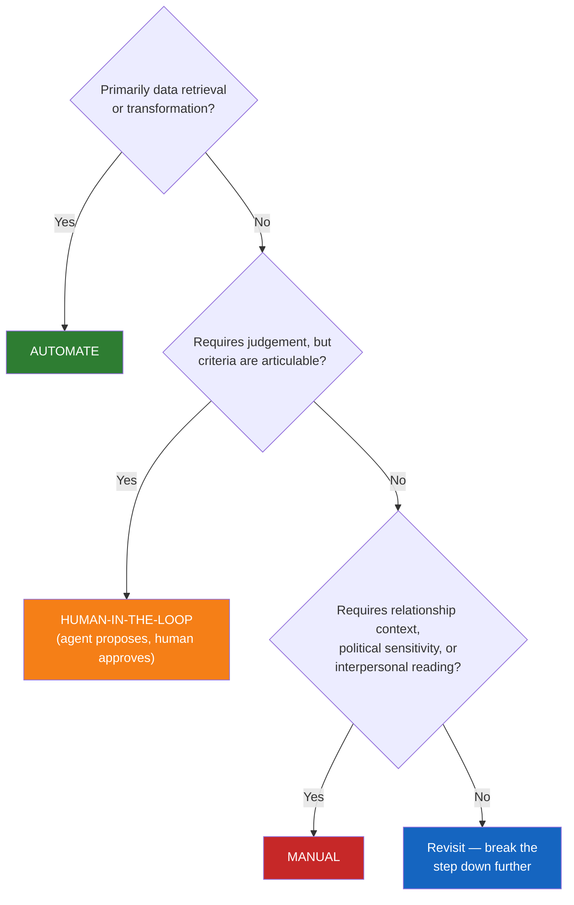
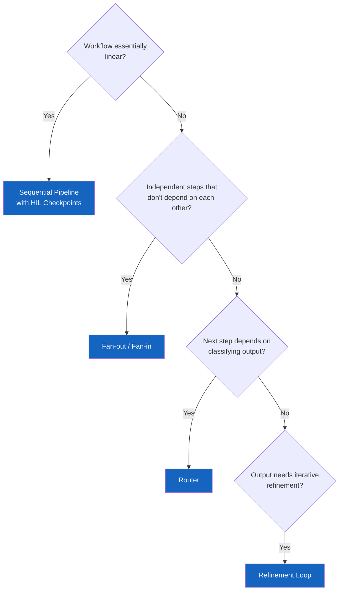

# Decision Trees

Two decision trees for the most common design questions when applying the framework.

---

## Should I Automate This Step?

Use this when tagging each step in your workflow map with an automation boundary (Stage 3).

---

!!! info "For engineers"
    This decision tree is for the engineer designing the agent flow in [Stage 4: Design](../stages/04-design.md). If you are a workflow owner (CSM, BA, DM), the first tree above is the one you will use.

## What Design Pattern Should I Use?

Use this when choosing a design pattern in Stage 4.

**→ Pattern details:** [Sequential Pipeline](../stages/04-design.md#pattern-1-sequential-pipeline-with-hil-checkpoints) · [Fan-out / Fan-in](../stages/04-design.md#pattern-2-parallel-fan-out-fan-in) · [Router](../stages/04-design.md#pattern-3-router) · [Refinement Loop](../stages/04-design.md#pattern-4-iterative-refinement-loop)

!!! note
    Most real workflows combine patterns. For example: fan-out for data gathering, sequential for analysis, router for handling different health scores differently.
