# Stage 3: Scope

You have picked a workflow. Now you need to understand it deeply enough to hand it off — not to a colleague, but to an AI agent that has no context, no institutional knowledge, and no ability to improvise when something is unclear.

This stage is about writing down how you actually do the work today, step by step, in enough detail that someone who has never done it before could follow your instructions. Then you draw a line: which steps should the agent handle, which steps need a human in the loop to review or approve, and which steps stay entirely manual. Getting this boundary right is the single most important decision in the entire framework. A well-scoped workflow is straightforward to design and build. A poorly scoped one produces an agent that either does too little to be useful or too much to be trustworthy.

This is where your domain expertise matters most. You are the person who knows the real workflow — the shortcuts, the judgement calls, the things nobody writes down. This stage captures that knowledge in a structured format that the rest of the framework can operate on.

---

## Inputs

!!! info "What You Need"

    - Selection Decision Record from [Stage 2: Select](02-select.md)
    - Your own knowledge of how you currently execute the workflow

## Output Artifact

!!! info "Key Output"

    A **Workflow Scope Document** containing:

    1. **Step-by-step workflow map** — Every action a human currently takes, in sequence
    2. **Error path register** — Failure conditions, their downstream impact, and fallback behaviour
    3. **Data inventory** — Every input the workflow consumes, with source, format, and access method
    4. **Decision point register** — Every point where judgement is applied, with the criteria used
    5. **Automation boundary** — Each step tagged as AUTOMATE, HUMAN-IN-THE-LOOP, or MANUAL
    6. **Future-state summary** *(optional)* — What the human's workflow looks like after the agent is in place
    7. **Integration requirements** — APIs, credentials, libraries, and permissions needed
    8. **Downstream integration** — Processes and systems the workflow's output feeds into
    9. **Constraints and assumptions** — What must be true for this workflow to work as designed

!!! abstract "Template"

    Use the [Scope Document template](../blank-templates/scope-document.md) as you work through this stage. It includes the Workflow Map table, Error Path Register, Data Inventory, Integration Requirements checklist, and Constraints and Assumptions sections.

!!! info "Download Templates"
    [:material-download: Download Spreadsheet](../downloads/Stage 3 - Scope.xlsx){ .md-button }
    [:material-download: Download Document Template](../downloads/Stage 3 - Scope - Template.docx){ .md-button }

    **Spreadsheet:** Import into Google Sheets for structured tables with example rows.
    **Document:** Word template with instructions, fill-in sections, and completion checklist.

---

## Method

### How to Map the Workflow

Walk through the workflow as if you were writing instructions for a new hire who has never done it before. Be absurdly specific. The most common failure mode is abstracting away the messy details — "assess account health" is not a step, it's a black box hiding ten steps.

For each step, record:

| Field | What to Capture |
|---|---|
| **Action** | What you physically do (open a tab, run a query, write a paragraph) |
| **Input** | What information you consume to do it |
| **Output** | What the step produces |
| **Decision Logic** | If there's a choice point, what criteria do you use? |
| **Time** | Rough time per step |
| **Actor** *(recommended for multi-actor workflows)* | Who performs this step — role or job title |

The **Actor** column can be omitted for single-actor workflows where one person executes every step. For workflows that involve handoffs between roles, include it — it is essential for drawing accurate automation boundaries. An agent replacing one actor's steps may still need to coordinate with another actor's manual steps, and you cannot see those interaction points without tracking who does what. If your workflow crosses role boundaries, the Actor column also reveals where approval gates, notification triggers, and data handoff formats need to be specified.

#### Handoff Mapping

When the Actor changes between consecutive steps, that transition is a **handoff** — and handoffs are where multi-actor workflows break down. For each actor transition in your workflow map, document three things:

| Field | What to Capture |
|---|---|
| **Trigger** | What event tells the next actor it is their turn? (e.g., status change in a tracker, email notification, Slack message, meeting agenda item) |
| **Information transferred** | What does the next actor need from the previous step's output to begin their work? Be specific — "the report" is not enough; "the drafted health summary with flagged metrics and the raw ticket data for context" is. |
| **Handoff mode** | Is this **synchronous** (the next actor must act immediately — the workflow blocks until they do) or **asynchronous** (the work queues and the next actor picks it up in their own cadence)? |

This matters for automation boundary decisions. When the agent handles steps on one side of a handoff and a different human actor handles the other side, the agent may need to send a notification, wait for a response, or package its output in a format the next actor expects. Synchronous handoffs become blocking checkpoints in your agent design. Asynchronous handoffs require the agent to save its progress and pick up later.

??? example "Handoff mapping for a multi-actor workflow"

    **Change Request Processing (BA → Dev Lead → Product Owner):**

    | From → To | Trigger | Information Transferred | Mode |
    |---|---|---|---|
    | BA → Dev Lead | BA sets ticket status to "Impact Assessed" and assigns to Dev Lead | Impact assessment document: scope rating, affected components, estimated effort range, risk flags | Asynchronous — Dev Lead reviews in next triage cycle |
    | Dev Lead → Product Owner | Dev Lead adds technical feasibility note and sets status to "Ready for Decision" | Original impact assessment + technical feasibility note: implementation approach, dependency risks, capacity impact on current sprint | Asynchronous — Product Owner reviews in weekly prioritisation meeting |
    | Product Owner → BA | Product Owner sets status to "Approved" or "Rejected" with decision rationale | Approval decision + priority assignment + any scope modifications requested | Asynchronous — BA picks up in next working session |

    In this workflow, every handoff is asynchronous — no one blocks waiting for the next actor. If you were automating the BA's steps, the agent would need to: (1) package the impact assessment in the format the Dev Lead expects, (2) trigger the status change that notifies them, and (3) save its progress so it can pick up later when the Product Owner's decision arrives — potentially days later.

    Contrast with a synchronous handoff: in an incident response workflow, the on-call engineer's "escalate to team lead" handoff is synchronous — the team lead must respond immediately. An agent in that workflow would need to block and wait for human input rather than queuing work.

Add handoff entries adjacent to your workflow map — either as additional rows, a separate small table, or annotations. They feed directly into how the agent coordinates with human reviewers and how it saves its progress between handoffs in [Stage 4: Design](04-design.md).

Target a **minimum of 8 steps**. If you have fewer, you are almost certainly hiding complexity inside abstract step descriptions. Break them down further.

??? example "Mapping steps at the right level of detail"

    Getting the right granularity is the most common struggle. Too abstract and you hide complexity the agent needs to understand. Too granular and you drown in micro-steps that obscure the workflow's structure. The right level is: each step has one action, one input, and one output, and a new hire could execute it without asking you a follow-up question.

    **Customer Success Manager — Quarterly Health Review (Steps 2-4):**

    | # | Action | Input | Output | Decision Logic | Time |
    |---|---|---|---|---|---|
    | 2 | Query support platform API for all tickets associated with the account in the current quarter | Account ID, quarter date range | Ticket list with fields: status, severity, resolution time, CSAT score | None — data retrieval | 5 min |
    | 3 | Calculate ticket health metrics: volume trend vs prior quarter, average severity, SLA compliance rate, mean resolution time by severity tier | Ticket list from Step 2, SLA targets from config | Ticket health summary: trend direction, SLA compliance %, flagged SLA breaches | Compare resolution times against SLA targets by severity — P1: 4hr, P2: 24hr, P3: 72hr. Flag if compliance drops below 95%. Flag if volume is up >20% QoQ. | 10 min |
    | 4 | Assess ticket health narrative: interpret flagged metrics in account context, identify whether volume spikes are explained by known events | Ticket health summary from Step 3, account context from Step 1 | Annotated ticket assessment with context notes | Contextual judgement: was the volume spike caused by a planned migration or a real problem? Are the SLA breaches systemic or one-off? | 15 min |

    Notice Steps 3 and 4 were originally a single step: "Analyse ticket trends." Splitting it reveals that the quantitative calculation (Step 3) is fully automatable, while the contextual interpretation (Step 4) needs human involvement. That distinction is invisible when the step stays bundled.

    **Too abstract** (common mistake): "Review support tickets" — What do you review? What are you looking for? What does the output look like? A new hire cannot execute this.

    **Too granular** (opposite mistake): "Open browser → Navigate to Zendesk → Click search → Type account name → Click date filter → Select Q1 → Click export → Open CSV..." — This is a mouse-click log, not a workflow step. The meaningful unit is "query the support platform for account tickets."

    **Business Analyst — Sprint Planning Prep (Steps 2-4):**

    | # | Action | Input | Output | Decision Logic | Time |
    |---|---|---|---|---|---|
    | 2 | Pull velocity metrics for the last 3 sprints from the project tracker | Team ID, sprint date ranges | Velocity data: story points committed vs completed per sprint, carry-over count | None — data retrieval | 5 min |
    | 3 | Calculate capacity recommendation: average velocity, trend direction, adjustment for known absences or holidays | Velocity data from Step 2, team calendar | Recommended sprint capacity (story points) with confidence note | If velocity has been declining for 2+ sprints, recommend 85% of the 3-sprint average. If stable or improving, recommend 95% of the average. Adjust downward 15% per missing team member. | 10 min |
    | 4 | Review backlog priorities and flag dependency conflicts between candidate stories | Backlog items sorted by priority, dependency map | Prioritised candidate list with dependency warnings | For each candidate story in priority order: check if any dependency is unresolved or assigned to another team's current sprint. If so, flag the conflict and note the blocking item. | 20 min |

    The BA example shows a different pattern: Step 3 is criteria-based (clear rules for capacity calculation), while Step 4 requires checking a dependency graph that may have ambiguous cases. Both are specific enough that someone could follow them without asking "but how?"

    **Software Engineer — Bug Report Triage (Steps 2-4):**

    | # | Action | Input | Output | Decision Logic | Time |
    |---|---|---|---|---|---|
    | 2 | Attempt to reproduce the reported issue using the steps in the ticket | Bug ticket (reproduction steps, environment details) | Reproduction result: confirmed / not reproduced / partially reproduced, with environment details | None — execution and observation | 15 min |
    | 3 | If reproduced: check application logs, error tracking, and recent deploy history for the affected component | Error details from Step 2, logging dashboard, deploy log | Diagnostic summary: error trace, affected component, suspected commit range, related recent changes | None — data retrieval and correlation | 20 min |
    | 4 | Assess severity and assign priority based on impact scope and workaround availability | Diagnostic summary from Step 3, current incident state | Severity rating (P1-P4) with justification | P1: data loss or security vulnerability, or >25% of users affected with no workaround. P2: core functionality broken for a segment, workaround exists but is painful. P3: non-core functionality impacted, reasonable workaround exists. P4: cosmetic or minor UX issue. If uncertain between two levels, escalate to the higher severity. | 10 min |

    The SE example shows how even a workflow that feels inherently ad-hoc (bug triage) has structured steps when you break it down. Step 4's decision logic captures the severity rubric that experienced engineers apply intuitively — making it explicit is what allows an agent to propose a severity rating for human review.

### Capturing Decision Logic

The Decision Logic column is the most consequential field in your workflow map. It feeds directly into clear criteria for whoever designs the agent to work from in [Stage 4](04-design.md) and becomes the source material for the rules and reference data the agent uses at runtime in [Stage 5](05-build.md) (see *Externalising Domain Expertise as Config*). Get it wrong here and every downstream stage suffers — prompts lack grounding criteria, the agent's rules have nothing to translate from, and the agent's judgement becomes unanchored.

You will encounter three types of steps. What counts as adequate capture differs for each:

| Type | What It Looks Like | What to Capture |
|---|---|---|
| **No decision** | Pure data retrieval or transformation — the step has one correct action regardless of context | Write "None — [what the step does]" (e.g., "None — data retrieval"). No further detail needed. |
| **Criteria-based** | You apply thresholds, comparisons, scoring rules, or category mappings to reach a conclusion | Capture the **specific criteria**: what data you look at, what thresholds or tiers you compare against, and what each outcome means. These entries become the rules the agent follows in Stage 5. |
| **Contextual judgement** | You synthesise multiple signals, recognise patterns, or apply relationship/domain knowledge that resists reduction to simple rules | Capture the **factors you weigh**, the **patterns you look for**, and any **heuristics you fall back on** when the answer isn't obvious. These entries become prompt instructions that guide the LLM's reasoning. |

#### The Specificity Test

After writing a Decision Logic entry, ask: *Could someone write a prompt instruction or a config rule from this entry alone?* If the answer is no, push deeper with two questions:

1. **What data do I look at?**
2. **What would make me choose one outcome over another?**

**Before:** "Evaluate whether the ticket trend is concerning."

**After:** "Compare this quarter's ticket count and average severity against last quarter. Flag as concerning if ticket volume is up >20% OR average severity has shifted from Low to Medium/High. If both conditions are true, escalate to risk register."

The first entry sounds reasonable but gives a prompt nothing to work with. The second entry can be translated directly into a scoring rule in config and a clear instruction in a prompt template.

??? example "Decision Logic entries across all three types"

    **Type 1: No decision — pure data retrieval or transformation.**

    These are the simplest to capture. The step has exactly one correct action.

    | Role | Step | Decision Logic Entry |
    |---|---|---|
    | CSM | Pull CRM account data | None — data retrieval. Query CRM for account record using account ID. |
    | BA | Export backlog items from project tracker | None — data retrieval. Pull all items in "Ready" or "In Progress" status for the current sprint. |
    | SE | Pull merged PRs since last release tag | None — data retrieval. Query git log between the previous release tag and HEAD. |

    The common mistake here is writing "Review and extract data" — that word "review" smuggles in a decision. If you are just pulling data, say so. If you are reviewing it, that is a separate step with its own decision logic.

    **Type 2: Criteria-based — thresholds, rules, mappings.**

    These entries become the rules the agent follows in Stage 5. The test: could you express this logic as a spreadsheet lookup table?

    | Role | Step | Before (vague) | After (specific) |
    |---|---|---|---|
    | CSM | Assess ticket health | "Check if ticket trends are acceptable" | "Compare this quarter's ticket volume and average severity against last quarter. Flag as concerning if volume is up >20% OR average severity shifted from Low to Medium+. Compare resolution times against SLA targets by severity tier (P1: 4hr, P2: 24hr, P3: 72hr). Flag if SLA compliance drops below 95%." |
    | BA | Estimate story complexity | "Assess the complexity of the story" | "Map story to complexity tier using three factors: number of systems touched (1=Small, 2-3=Medium, 4+=Large), whether it requires schema changes (yes adds one tier), and whether it has external API dependencies (yes adds one tier). Cap at X-Large." |
    | SE | Categorise PR for release notes | "Decide what category the PR belongs in" | "Map PR to release notes category using conventional commit prefix: feat→'New Features', fix→'Bug Fixes', perf→'Performance', docs→'Documentation'. If no prefix, check PR labels. If neither exists, categorise as 'Other' and flag for manual review." |

    Notice each "after" entry names the specific data being evaluated, the thresholds or rules being applied, and what each outcome means. These are directly translatable to config.

    **Type 3: Contextual judgement — pattern recognition, domain knowledge, synthesis.**

    These entries become prompt instructions in Stage 5. They cannot be reduced to simple rules, but they *can* name the factors being weighed and the heuristics being applied.

    | Role | Step | Before (vague) | After (specific) |
    |---|---|---|---|
    | CSM | Interpret sentiment from Slack threads | "Assess customer sentiment" | "Read the Slack threads and assess overall sentiment as positive, neutral, or negative. Weigh these factors: (1) Are questions being asked with urgency or frustration markers ('still waiting', 'this is blocking us')? (2) Are responses to our messages engaged or perfunctory? (3) Are they raising new feature requests (positive engagement signal) or re-raising old unresolved issues (negative signal)? When signals conflict, weight recent messages more heavily. If sentiment is ambiguous, flag as 'mixed — needs human review' rather than guessing." |
    | BA | Assess change request impact | "Evaluate the impact of the change" | "Assess impact across three dimensions: (1) Scope — how many existing requirements does this change touch? Check the traceability matrix for affected items. (2) Risk — does this change affect a module that has had production incidents in the last 2 quarters? (3) Timeline — does this push any milestone past its deadline? Weigh scope impact highest when the change affects shared components. Weigh risk highest when the affected module is customer-facing. If you cannot confidently assess any dimension, flag for stakeholder discussion rather than estimating." |
    | SE | Evaluate whether a dependency update is safe to merge | "Review the dependency update" | "Assess the update across: (1) Changelog review — are there breaking changes listed? Check the major/minor/patch version bump. (2) Test signal — did CI pass? Are there test coverage gaps in the areas the dependency touches? (3) Community signal — check the GitHub issues for the new version for reported regressions. (4) Blast radius — how many internal modules import this dependency directly? If it is a major version bump or affects >3 modules, flag for manual review regardless of other signals." |

    The "after" entries for contextual judgement are longer than the other types — that is expected. They capture the *reasoning framework* that an experienced person applies, not a simple rule. The prompt needs this level of detail to produce useful output.

#### Decision Point Register

The Decision Logic column in your workflow map captures decision criteria inline — useful as a quick reference per step, but not sufficient for review, validation, or downstream traceability. Decision points determine automation boundaries, define the business rules the agent implements, and become the requirements your engineer translates into config and prompts. They need a consolidated view.

Extract every step that has a non-trivial Decision Logic entry (criteria-based or contextual judgement — skip the "None" entries) into a dedicated **Decision Point Register** table:

| Step | Decision Type | Criteria | Boundary Tag | Downstream Impact |
|---|---|---|---|---|
| *Step # and name* | *Criteria-based / Contextual judgement* | *The specific criteria, thresholds, or reasoning framework from the Decision Logic column* | *AUTOMATE / HUMAN-IN-THE-LOOP / MANUAL (added after boundary tagging)* | *Which downstream steps, design decisions, or config rules depend on this decision* |

**Step** and **Decision Type** identify what is being decided and how. **Criteria** consolidates the Decision Logic entry — the same content, pulled out of the workflow map where it can be reviewed in isolation. **Boundary Tag** links each decision to the automation boundary you assign in the next section (leave blank until you complete boundary tagging, then fill in). **Downstream Impact** traces where this decision's output is consumed — other workflow steps, Stage 4 design decisions, or Stage 5 config rules.

??? example "Decision Point Register for a CSM Health Review workflow"

    | Step | Decision Type | Criteria | Boundary Tag | Downstream Impact |
    |---|---|---|---|---|
    | 3 — Calculate ticket health metrics | Criteria-based | Compare this quarter's ticket volume and average severity against last quarter. Flag as concerning if volume is up >20% OR average severity shifted from Low to Medium+. Compare resolution times against SLA targets by severity tier (P1: 4hr, P2: 24hr, P3: 72hr). Flag if SLA compliance drops below 95%. | AUTOMATE | Feeds Step 6 (health score aggregation). Thresholds become scoring rules in Stage 5 config. |
    | 4 — Interpret ticket trends in context | Contextual judgement | Was the volume spike caused by a planned migration or a real problem? Are SLA breaches systemic or one-off? Weigh recent account events against statistical signals. When signals conflict, escalate rather than guess. | HUMAN-IN-THE-LOOP | Feeds Step 6 (health score aggregation). Reasoning framework becomes prompt instructions in Stage 5. |
    | 5 — Assess Slack sentiment | Contextual judgement | Read threads and assess sentiment as positive, neutral, or negative. Weigh: (1) urgency/frustration markers, (2) engagement quality in responses, (3) new requests vs re-raised unresolved issues. Weight recent messages more heavily. If ambiguous, flag as "mixed — needs human review." | HUMAN-IN-THE-LOOP | Feeds Step 6 (health score aggregation) and Step 7 (executive summary narrative). Factors become prompt instructions. |
    | 6 — Aggregate health score | Criteria-based | Combine ticket health, sentiment, and usage metrics into a composite Red/Yellow/Green rating. Weight dimensions equally unless a dimension has insufficient data (reduce weight to zero). | HUMAN-IN-THE-LOOP | Feeds Step 7 (executive summary) and downstream integration (Gainsight health score update). Scoring formula becomes Stage 5 config. |

    The register makes review efficient: a stakeholder can validate all decision criteria in one table without reading the full workflow map. It also makes boundary decisions auditable — you can see at a glance which decisions are automated versus human-reviewed, and trace each one forward to where it is consumed.

The Decision Logic column in your workflow map remains the inline capture mechanism — it is where you record criteria as you map each step. The Decision Point Register consolidates those entries for stakeholder review, boundary validation, and traceability into [Stage 4: Design](04-design.md) and [Stage 5: Build](05-build.md).

### Drawing the Automation Boundary

Tag every step in your workflow map using these three boundary labels:

```mermaid
graph TB
    subgraph AUTOMATE["AUTOMATE"]
        direction TB
        A1["Data retrieval"]
        A2["Data transformation"]
        A3["Template-based generation"]
    end

    subgraph HIL["HUMAN-IN-THE-LOOP"]
        direction TB
        H1["Agent does 80% of the work"]
        H2["Drafts summaries, flags anomalies"]
        H3["Proposes ratings or scores"]
        H4["Human reviews and approves"]
    end

    subgraph MANUAL["MANUAL"]
        direction TB
        M1["Relationship context required"]
        M2["Political sensitivity"]
        M3["Significant-consequence decisions"]
        M4["Agent cannot evaluate"]
    end

    style AUTOMATE fill:#2e7d32,color:#fff
    style HIL fill:#f57f17,color:#fff
    style MANUAL fill:#c62828,color:#fff
```



#### Boundary Principles

**AUTOMATE** steps that are data retrieval, data transformation, or template-based generation.

**HUMAN-IN-THE-LOOP** steps that require judgement but where the agent can do 80% of the work (draft a summary, flag anomalies, propose a risk rating).

**MANUAL** steps that involve relationship context, political sensitivity, or decisions with significant consequences that the agent cannot evaluate.

The boundary should err toward more human involvement in early versions. You can push the boundary outward as trust builds.

#### When a Step Spans Two Boundaries

Some steps contain both automatable work and judgement-dependent work. The automatable component — calculation, data retrieval, template-based generation — always produces the same correct result. The judgement component — interpretation, edge-case review, tone assessment — is where the human adds value. When you can cleanly separate these two concerns within a single step, tag both using the format **AUTOMATE (what) / HUMAN-IN-THE-LOOP (what)** — e.g., "AUTOMATE (quantitative) / HUMAN-IN-THE-LOOP (edge cases)."

The decision criterion: if you can identify a computational component that produces a deterministic result *and* a judgement component where human review changes the outcome, tag the step with both boundaries. If you cannot separate them — if the judgement is embedded in every part of the step — the step is wholly HUMAN-IN-THE-LOOP.

Three common split patterns in knowledge work:

- **Quantitative analysis + qualitative interpretation.** The agent calculates trends, scores, and comparisons; the human interprets what the numbers mean in context.
- **Draft generation + tone/appropriateness review.** The agent produces a first draft from structured data; the human adjusts tone, emphasis, and political sensitivity.
- **Automated scoring + edge-case validation.** The agent applies a rubric mechanically; the human reviews cases where the score doesn't match their domain intuition.

If you use the [decision tree](../reference/decision-trees.md), run it separately for each concern within the step — the quantitative component and the judgement component may route to different labels, and that is the signal to use a split boundary.

In [Stage 4](04-design.md), split-boundary steps are decomposed before the agent is designed: the AUTOMATE component becomes what the agent does on its own, and the HUMAN-IN-THE-LOOP component becomes a candidate for consolidation with other HUMAN-IN-THE-LOOP checkpoints.

??? example "Boundary tagging walkthrough — reasoning through four steps"

    Here is the reasoning process for tagging steps. For each one, walk through the decision: is this data retrieval or transformation (AUTOMATE), does it require judgement but the agent can do most of the work (HUMAN-IN-THE-LOOP), or does it require context the agent fundamentally cannot have (MANUAL)?

    **Step: Pull velocity metrics from Jira for the last 3 sprints (BA — Sprint Planning Prep)**

    - *Is there a decision involved?* No. This is a query with known parameters (team ID, date range).
    - *Could the agent get this wrong in a way that matters?* Only if the query is malformed — and that is a bug, not a judgement failure.
    - *Does context change what you would pull?* No. Same query every sprint.
    - **Tag: AUTOMATE.** Pure data retrieval. No ambiguity, no interpretation.

    **Step: Assess customer sentiment from Slack threads (CSM — Health Review)**

    - *Is there a decision involved?* Yes — interpreting tone, urgency, and satisfaction from unstructured conversation.
    - *Could the agent do useful work here?* Yes. An LLM can summarise threads, identify frustration markers, and propose a sentiment reading.
    - *Could the agent get this wrong in a way that matters?* Yes. Sarcasm, relationship history, and political context can flip the meaning of a message. "We love the new feature" might be genuine or might be sarcastic.
    - *Is the consequence of an error recoverable?* Yes — the sentiment assessment is reviewed before it feeds into the health score.
    - **Tag: HUMAN-IN-THE-LOOP.** The agent does the heavy lifting (summarise, flag signals, propose sentiment). The human validates against relationship context the agent does not have.

    **Step: Categorise merged PRs for release notes (SE — Release Notes Compilation)**

    This is a split-boundary case — it looks like one step but contains two distinct concerns.

    - *Concern 1: Map PRs to categories using commit prefixes and labels.* This is rule-based: `feat→New Features`, `fix→Bug Fixes`, and so on. Given the same PR metadata, any two people would produce the same categorisation. **AUTOMATE.**
    - *Concern 2: Write the user-facing description for each entry.* This requires judgement about what the change means to users (not developers), which details matter, and how to phrase it. Two engineers might emphasise different aspects. **HUMAN-IN-THE-LOOP.**
    - **Tag: AUTOMATE (categorisation) / HUMAN-IN-THE-LOOP (user-facing descriptions).** The split is clean — categorisation finishes before description writing begins, so these can be treated as separate concerns in Stage 4.

    **Step: Send the final health report to stakeholders (CSM — Health Review)**

    - *Is there a decision involved?* Yes — choosing the distribution list, deciding whether to add a personal note, assessing whether anything needs to be redacted or softened.
    - *Could the agent do useful work here?* Marginally — it could draft a distribution email. But the real value is the CSM's judgement about *who* sees *what*.
    - *Is the consequence of an error recoverable?* No. Once the report is sent, it is sent. A report sent to the wrong person, or with a politically sensitive finding left unredacted, cannot be unsent.
    - *Does context change what you would do?* Significantly. The distribution list varies by account, by quarter, and by what the report contains.
    - **Tag: MANUAL.** The irreversibility of the action plus the dependence on relationship and political context makes this a clear MANUAL step. This is not a limitation of the agent — it is a deliberate safety boundary.

    The reasoning pattern: start with whether a decision exists, then assess whether the agent can do useful partial work, then check whether errors are recoverable. Irreversible actions with judgement dependencies are MANUAL. Judgement-dependent actions with recoverable outputs are HUMAN-IN-THE-LOOP. Everything else is AUTOMATE.

#### Regulatory Boundary Variants

If your organisation operates across multiple regulatory jurisdictions, the same workflow step may require different automation boundaries depending on which regulator governs the client, entity, or market. A step that is safely AUTOMATE under one regime may require HUMAN-IN-THE-LOOP under another — because the regulator mandates human oversight for that decision type, because local data residency rules change what the agent can access, or because the evidential standard for audit differs.

This is common in vendor-model FinTechs deploying agents across client implementations, in global financial services firms operating under multiple prudential regulators, and in any organisation where the same workflow serves markets with different regulatory expectations.

**Single document with conditional tags vs. separate scope documents:**

Not every multi-jurisdiction workflow needs a separate scope document per market. Use this heuristic:

| Condition | Approach |
|---|---|
| **Fewer than 3 steps** differ in boundary tag across jurisdictions | Single scope document with **jurisdiction-conditional boundary tags** on the differing steps |
| **3 or more steps** differ, or the workflow structure itself diverges (different step sequences, different data sources, different approval chains) | **Separate scope documents** per jurisdiction or regulatory group |

The threshold is about cognitive load: a reader can track two conditional tags in a single document without confusion. At three or more, the document becomes a matrix of branching paths that is harder to review, harder to validate with compliance, and harder to translate into a clean agent design in [Stage 4](04-design.md).

**Jurisdiction-conditional boundary tags:**

When using conditional tags, extend the standard boundary format with the jurisdiction and the reason for the difference:

```
AUTOMATE (UK-FCA) / HUMAN-IN-THE-LOOP (SG-MAS: regulatory requirement for human review of client-facing risk outputs)
```

The format is: **TAG (jurisdiction)** for each variant, with a brief rationale after the more restrictive tag. The rationale matters — it tells the person reviewing the scope document *why* the boundary differs, which determines whether the constraint is permanent (regulatory mandate) or negotiable (conservative interpretation that could be revisited).

Add a **Regulatory Boundary Variants** row to your workflow map for any step with jurisdiction-conditional tags. This sits alongside the standard Boundary Tag and documents:

| Field | What to Capture |
|---|---|
| **Jurisdictions** | Which regulatory regimes apply (e.g., FCA, PRA, MAS, APRA, SEC) |
| **Boundary per jurisdiction** | The tag for each jurisdiction where it differs from the default |
| **Regulatory basis** | The specific regulation, guidance, or organisational policy that drives the difference |

??? example "Jurisdiction-conditional boundary for a client reporting step"

    **Workflow: Quarterly Client Risk Report Generation (FinTech — multi-jurisdiction deployment)**

    A vendor-model FinTech deploys the same reporting workflow for clients across the UK and Singapore. Most steps are identical, but one step — generating the risk commentary that accompanies the quantitative report — has a different boundary in each jurisdiction.

    | # | Action | Boundary Tag (UK — FCA) | Boundary Tag (SG — MAS) | Rationale |
    |---|---|---|---|---|
    | 5 | Generate risk commentary from scored metrics | AUTOMATE | HUMAN-IN-THE-LOOP | MAS Technology Risk Management Guidelines require documented human review of automated outputs used in client-facing risk communications. FCA has no equivalent prescriptive requirement for this output type — the firm's own model risk framework permits full automation with post-hoc audit sampling. |
    | 8 | Distribute report to client stakeholders | MANUAL | MANUAL | Both jurisdictions — no difference. Distribution decisions involve client relationship context. |

    In this workflow, only Step 5 differs. The rest of the workflow map is identical across jurisdictions. A single scope document with a conditional tag on Step 5 is the right approach — the reader sees one workflow with one clearly marked regulatory fork.

    **How this flows into Stage 4:** The agent design includes a jurisdiction parameter (set per client configuration) that determines whether Step 5 routes to an automatic output or to a human review checkpoint. The agent does the same analytical work in both cases — the difference is whether the output is released directly or queued for human approval. This is a routing decision in the agent flow, not a fundamentally different workflow.

    **When you would need separate documents instead:** If the Singapore deployment also required a different data source for Step 2 (local data residency), a different scoring methodology for Step 4 (MAS-specific risk categories), and an additional approval step between Steps 6 and 7 (local compliance sign-off) — that is four structural differences. At that point, a single document with conditional annotations becomes harder to follow than two clean, jurisdiction-specific scope documents that share a common base and clearly note where they diverge.

### Future-State Summary

Once you have tagged every step with an automation boundary, you have implicitly defined what the human's workflow looks like after the agent is deployed — but that future state is buried in the tags. Stakeholders who need to understand what changes for them should not have to reverse-engineer it from a step-by-step map.

Add a **Future-State Summary** table to your scope document. It is a two-column comparison derived mechanically from your boundary tags:

| What the human does today | What the human does with the agent |
|---|---|
| *One row per step or group of steps, written from the human's perspective* | *What changes — removed, reduced to review, or unchanged* |

The rules for deriving each row:

- **AUTOMATE** steps disappear from the human's workflow entirely. The row should say what the agent handles and that the human no longer does it.
- **HUMAN-IN-THE-LOOP** steps become review checkpoints. The row should say what the agent prepares and what the human reviews or approves.
- **MANUAL** steps are unchanged. The row should confirm the human still owns this step.

!!! tip
    Include a time estimate in the "with the agent" column where possible. Stakeholders care less about which steps changed and more about how their time allocation shifts. "Review agent-drafted summary (5 min)" versus the original "Write summary from scratch (30 min)" communicates the value immediately.

??? example "Future-State Summary for a CSM Quarterly Health Review"

    | What the human does today | What the human does with the agent |
    |---|---|
    | Pull account data from CRM, query support tickets, export Slack threads (15 min) | **Agent handles.** Data retrieval runs automatically. |
    | Calculate ticket health metrics — volume trends, SLA compliance, mean resolution time (10 min) | **Agent handles.** Metrics calculated and formatted automatically. |
    | Interpret ticket trends in account context — assess whether spikes are explained by known events (15 min) | **Review checkpoint.** Agent drafts a contextual assessment with flagged anomalies. Human validates against relationship knowledge (~5 min). |
    | Read Slack threads and assess customer sentiment (20 min) | **Review checkpoint.** Agent summarises threads and proposes a sentiment rating. Human confirms or adjusts (~5 min). |
    | Aggregate scores into an overall health rating (10 min) | **Review checkpoint.** Agent proposes a composite score. Human approves or overrides (~3 min). |
    | Draft the executive summary narrative (30 min) | **Review checkpoint.** Agent drafts the narrative from scored components. Human edits tone and emphasis (~10 min). |
    | Choose distribution list and send the report to stakeholders (10 min) | **Human owns.** Unchanged — distribution decisions stay manual. |

    **Net effect:** The human's active time drops from ~110 min to ~23 min. The role shifts from data gathering and drafting to reviewing, validating, and deciding. Three new review checkpoints replace five execution steps.

This table is optional — it adds no information that isn't already in your boundary tags. Its value is communication: it gives stakeholders a clear picture of what changes for them without requiring them to read the full workflow map. If your scope document will be reviewed by people affected by the workflow change, include it.

### Mapping Error and Edge Case Paths

Your workflow map captures the happy path — the sequence when everything works. But "everything works" is not the default state. Data sources fail, APIs return empty results, outputs fail validation, and humans reject agent proposals. These paths need to be visible in the scope document, not discovered during build.

For each step in your workflow map, check these four failure categories:

- **Data unavailable:** What if the input for this step is missing or the data source is down?
- **Data malformed:** What if the data arrives but is in an unexpected format, stale, or contradictory?
- **Output fails validation:** What if this step produces output that downstream steps cannot use?
- **Human rejects:** (For HIL steps) What happens when the human disagrees with the agent's proposal — rework, skip, or escalate?

You do not need a separate error workflow map. Add a brief **Error Path** annotation to each step in your existing table — a one-line note describing what happens when the step fails. For example:

| # | Step | Action | Error Path |
|---|---|---|---|
| 2 | Pull support tickets | Query support API for account tickets | If API unavailable: flag gap in report, continue with other sources. If empty result: verify date range, note "no tickets" (do not infer from absence). |
| 5 | Review Slack sentiment | Read threads, assess tone | If no relevant threads found: mark sentiment as "insufficient data" rather than guessing. |

!!! tip
    If a step's error path is "the entire workflow cannot proceed," that is a **critical dependency**. Flag it in your [Constraints and Assumptions](#constraints-and-assumptions) section. These dependencies become the highest-priority error handling targets in [Stage 4: Design](04-design.md).

#### Error Path Register

The inline annotations above give you a quick-reference view per step. For workflows with non-trivial failure modes — where a failure in one step changes the behaviour of steps downstream — you also need a dedicated **Error Path Register** that makes cascading impacts visible.

Add this as a separate table in your scope document. One row per failure condition, not per step — a single step may have multiple failure modes worth tracking.

| Step | Failure Category | Error Condition | Downstream Impact | Fallback Behaviour |
|---|---|---|---|---|
| *Step # and name* | *Data unavailable / Data malformed / Output fails validation / Human rejects* | *Specific condition that triggers the failure* | *Which downstream steps are affected, and how* | *What the workflow does instead — degrade, retry, skip, escalate* |

**Step** and **Failure Category** identify what went wrong. **Error Condition** captures the specific trigger — "API returns 503" is actionable; "something goes wrong" is not. **Downstream Impact** is the column that solves for cascading failures: it forces you to trace the blast radius forward through the workflow. **Fallback Behaviour** documents the recovery path.

??? example "Error Path Register for a CSM Health Review workflow"

    | Step | Failure Category | Error Condition | Downstream Impact | Fallback Behaviour |
    |---|---|---|---|---|
    | 2 — Pull support tickets | Data unavailable | Zendesk API returns 503 or times out after 3 retries | Step 3 (ticket health metrics) cannot calculate; Step 7 (executive summary) will have an incomplete health picture | Flag gap in report. Continue with other data sources. Insert "Support data unavailable — manual review recommended" in the ticket health section. |
    | 2 — Pull support tickets | Data malformed | API returns tickets but CSAT scores are null for >80% of results | Step 3 produces a CSAT metric with insufficient sample size; Step 6 (health score aggregation) weights CSAT equally with other metrics, skewing the overall score | Calculate CSAT from available responses but append sample size warning. Step 6 should reduce CSAT weight to zero if sample is <10 responses. |
    | 3 — Calculate ticket metrics | Output fails validation | SLA compliance percentage returns a value >100% or negative | Step 6 (health score aggregation) ingests an impossible value; Step 7 (executive summary) reports a nonsensical metric to stakeholders | Reject the calculation. Log the anomaly. Fall back to prior quarter's SLA compliance with a "stale data" flag. |
    | 5 — Review Slack sentiment | Data unavailable | No Slack threads found for the account in the target period | Step 7 (executive summary) lacks a sentiment signal, which the CSM uses to contextualise the quantitative scores | Mark sentiment as "insufficient data" rather than inferring from absence. Step 7 should note that the sentiment dimension is missing and recommend the CSM add a manual assessment. |
    | 6 — Aggregate health score | Human rejects | CSM disagrees with the proposed health rating after reviewing the component scores | Step 7 (executive summary) was drafted using the original rating; narrative framing may be inconsistent with the revised score | Return to Step 6 with the CSM's revised rating. Regenerate Step 7's executive summary using the updated score to ensure narrative consistency. |

    Notice how the Downstream Impact column reveals chains: a failure in Step 2 does not just affect Step 3 — it propagates to Steps 6 and 7 through the data dependency chain. Without this table, you would discover these cascades during build or, worse, in production.

Not every step needs an entry. Steps with no meaningful failure mode beyond "retry" — such as a pure data transformation with validated inputs — can be omitted. Focus on steps where failure changes what downstream steps see, skip, or produce. If your workflow map has 10 steps, expect 5–8 rows in the Error Path Register — some steps contribute multiple failure modes, and some contribute none.

The inline annotations remain your at-a-glance reference on the workflow map. The Error Path Register is the authoritative record — it is what [Stage 4: Design](04-design.md) consumes when deciding how to build error handling into the agent.

### Data Inventory

For each data source your workflow touches, document:

| Field | What to Capture |
|---|---|
| **Data Source** | Name of the system (e.g., Salesforce, Zendesk, Slack) |
| **Access Method** | REST API, database query, file export, manual lookup |
| **Format** | JSON, CSV, structured text, unstructured |
| **Auth Required** | OAuth, API key, database credentials, none |
| **Notes** | Rate limits, pagination, data quality issues, field completeness, access restrictions. Consider data quality and completeness alongside access method and format — a clean API is not useful if the data behind it is stale, incomplete, or inconsistent |

??? example "Data Inventory entries with real-world complexity"

    Clean documentation rarely survives contact with reality. Here are entries that reflect what you actually encounter when you start documenting data sources.

    **CSM systems:**

    | Data Source | Access Method | Format | Auth Required | Notes |
    |---|---|---|---|---|
    | Salesforce (CRM) | REST API (v58.0) | JSON | OAuth 2.0 (connected app) | Rate limit: 100 requests/15 min for standard edition. Pagination required for accounts with >200 related records. The `AccountHealth__c` custom field was added in 2024 and is only populated for ~60% of accounts — do not treat empty values as "healthy." |
    | Zendesk (support) | REST API | JSON | API key (per-agent) | Ticket export endpoint rate-limited to 100 results/request with cursor pagination. CSAT scores only available on tickets where survey was completed (~40% response rate) — calculate CSAT from responded tickets only, but note the sample size. Archived tickets (>12 months) require a separate API endpoint. |
    | Slack | Web API (search.messages) | JSON | Bot token (search:read scope) | Rate limit: 20 requests/min (Tier 2). Results are relevance-ranked, not chronological — you need to sort by timestamp after retrieval. DM channels are not searchable with a bot token. Max 100 results per query; for active accounts, you may need multiple queries with different search terms. |

    Notice the Notes column is doing real work. "REST API, JSON, API key" looks simple until you discover the rate limit will throttle you mid-workflow, the CSAT data has a 40% response rate that skews your metrics, and Slack's search ranking will return results in the wrong order if you do not re-sort them.

    **BA systems:**

    | Data Source | Access Method | Format | Auth Required | Notes |
    |---|---|---|---|---|
    | Jira (project tracker) | REST API (v3) | JSON | API token (personal) | Board-level queries require `browse_project` permission. JQL queries have a 100-character limit in GET requests — use POST for complex filters. Custom fields (story points, epic link) have system-generated IDs like `customfield_10016` that vary per Jira instance — you will need to discover these via the field metadata endpoint before building queries. |
    | Confluence (documentation) | REST API | JSON (storage format is XHTML) | Same API token as Jira | Content is returned in Confluence storage format (XHTML), not plain text. You will need to strip HTML tags or parse the structure to extract readable content. Page version history is available but adds significant response size — request only the latest version unless you need change tracking. |

    **SE systems:**

    | Data Source | Access Method | Format | Auth Required | Notes |
    |---|---|---|---|---|
    | GitHub | REST API v3 or GraphQL v4 | JSON | Personal access token or GitHub App | REST API rate limit: 5,000 requests/hr (authenticated). GraphQL is more efficient for complex queries (one request instead of many) but has a point-based rate limit that is harder to predict. PR review comments require a separate endpoint from PR comments — they are different objects. Draft PRs are excluded from default list queries unless you explicitly include them. |
    | Datadog (monitoring) | REST API | JSON | API key + application key (both required) | Metric queries have a maximum time range of 30 days — for quarterly data, you need multiple queries. Log queries are limited to 1,000 results per request and require pagination via a cursor. Historical data retention depends on the plan tier — verify that the data you need has not aged out before building queries against it. |

    The pattern: every "simple" API turns out to have quirks that affect how the agent needs to interact with it. Capturing these now — in Stage 3 — saves you from discovering them mid-build in Stage 5 when they are more expensive to handle.

### Integration Requirements

List everything the agent will need to connect to the outside world. You may need input from your technical team to complete this section.

- **Agent framework or platform:** whichever you've chosen (see [Choose a Platform](../getting-started/choose-a-platform.md))
- **Tool wrappers for each data source** in the Data Inventory above (clean REST calls, database queries, file readers — whatever your sources need)
- **Language model provider:** the model(s) your platform uses for reasoning steps
- **Credentials management:** environment variables, a secrets manager, or your cloud's IAM system
- **Output format** (Markdown report, HTML page, PDF, structured JSON, etc.)

The point of this section is not to pick a specific platform — it's to surface the integration plumbing you'll need **regardless** of which platform you pick. If this list reveals a dependency you don't yet have access to (a credential, a system, an API), surface it now so it doesn't block you in Stage 5.

### Downstream Integration

Your workflow's output is rarely the end of the process. A health report triggers an escalation playbook. An upsell signal triggers an expansion play. A risk score updates a dashboard that drives a renewal strategy. If you treat the output as a terminal artifact — a document that gets emailed and filed — you are designing an agent that produces work nobody acts on systematically.

For each output your workflow produces, ask two questions:

1. **What processes does this output feed into?** Playbooks, CTAs, escalation workflows, renewal plays, triage queues, approval chains.
2. **What systems need to be updated with the results?** CS platforms, CRMs, project trackers, alerting systems, dashboards.

Document these as a table in your scope document:

| Workflow Output | Downstream Process | Target System | Integration Method | Trigger Condition |
|---|---|---|---|---|
| *What the workflow produces* | *What process consumes it* | *Where the update needs to land* | *API call, webhook, manual entry* | *What condition activates this integration* |

This is not aspirational — scope only the downstream integrations that exist today and that the agent's output should feed into. If the process is currently manual (CSM reads the report and creates a CTA by hand), that is still worth documenting. It tells you whether the agent should automate the handoff or whether it remains a manual step.

??? example "Downstream integration for a CSM Quarterly Health Review"

    The health review workflow produces three outputs that feed into existing CS processes: the overall health score, the action items, and the executive summary. Each connects to a different downstream system.

    | Workflow Output | Downstream Process | Target System | Integration Method | Trigger Condition |
    |---|---|---|---|---|
    | Overall health score (Red/Yellow/Green) | Risk escalation playbook | Gainsight (CS platform) | API — update `healthScore` field on Company object, which triggers the platform's playbook rules | Health score is Red, or score dropped two levels since last quarter |
    | Action items from health assessment | CTA creation | Gainsight (CS platform) | API — create one CTA per action item, assigned to the account's CSM, with priority mapped from the action item's urgency | Always — every action item becomes a trackable CTA |
    | Executive summary narrative | Renewal preparation | Salesforce (CRM) | API — attach as a note on the Opportunity record for the upcoming renewal | Account is within 90 days of renewal date |

    **How this changes the agent's design:**

    Without downstream integration, the agent's final step is "generate the health report." With it, the agent has additional steps after human approval:

    - **Write-back health score:** After the CSM approves the composite health score (Step 6), the agent updates the CS platform via API. If the score is Red, the platform's existing escalation playbook fires automatically — the agent does not need to implement escalation logic, just update the field that triggers it.

    - **Create CTAs from action items:** Each action item from the health assessment maps to a CTA in the CS platform: the action item's title becomes the CTA name, its urgency maps to priority, and the target date becomes the CTA due date.

    - **Attach summary to renewal opportunity:** If the account is approaching renewal, the executive summary is attached to the Salesforce opportunity record so the renewal team has context without reading the full report.

    The key insight: the agent does not need to *implement* the escalation playbook or the renewal play. Those processes already exist in the CS platform. The agent needs to *update the right fields and create the right objects* so that existing platform automation takes over. Your scope document captures where the handoff happens — your agent's output boundary becomes the downstream system's input boundary.

### Constraints and Assumptions

Document what must be true for this scoped workflow to work as designed. Be explicit about assumptions you are making — these are the things that will break your agent if they turn out to be wrong.

#### Surfacing Invisible Assumptions

The assumptions you write down are rarely the ones that break you — it's the ones you don't notice. Walk your workflow map against these six categories. For each, ask the diagnostic question and check whether your workflow silently depends on the answer being a specific value.

| Category | Diagnostic Question |
|---|---|
| **Entity cardinality** | Does any step operate on a single entity that could, in production, be multiple? (One product per account, one contact per deal, one config per environment.) |
| **Temporal / frequency** | Does any step assume data is current as of a specific window, or that the workflow runs at a specific cadence? |
| **Access / permissions** | Does any step assume the agent can read or write data that might require elevated permissions, user consent, or manual export? |
| **Stability / change rate** | Does any step depend on a schema, scoring framework, or business rule that could change mid-quarter? |
| **Processing model** | Does any step assume sequential processing that could encounter parallel, batched, or out-of-order inputs? |
| **Data sensitivity / governance** | Does any step send client data, PII, or commercially sensitive information to an external service — including the LLM provider? Has the organisation's AI data processing policy been reviewed and approved for this data category? |

If a diagnostic question reveals a dependency, add it to your constraints list and state the specific value you are assuming — not just the category.

**Before:** "The agent operates per-account."

**After:** "The agent operates per-account, processing one account at a time. Each account has exactly one active product — if an account has multiple products, the health scoring step would need to evaluate and weight each product separately, which this workflow does not handle."

The first version states a processing-model constraint but hides an entity-cardinality assumption inside it. The second version surfaces both, giving [Stage 4](04-design.md) the information it needs to design the agent correctly.

**Before:** "The agent uses an external LLM API for analysis."

**After:** "The agent sends verbatim client support tickets, Slack conversations (which may contain deal terms, pricing, and contract discussions), and CRM account data (ARR, contract dates, contact names) to an external LLM API. The organisation must have an approved AI data processing policy that permits sending this data category to the LLM provider. Client contracts must be reviewed for third-party processing restrictions. If either is not in place, the agent cannot move to production regardless of technical readiness."

The first version acknowledges the LLM dependency but hides the data governance assumption. The second version forces the question *before* you build — because in regulated industries, this is the most common reason a technically complete agent never ships. [Stage 5](05-build.md) addresses data at rest in the checkpoint store, but the upstream decision — is this data cleared for external LLM calls — must be surfaced here.

#### Compliance Readiness: Start Early

In regulated industries — financial services, healthcare, insurance — getting approval to send data to an external LLM provider is often the longest lead-time item in the entire project. Legal review, third-party risk assessment, and data classification can take 8–12 weeks. If you wait until Stage 3 to surface these questions, you will have a fully scoped workflow and no permission to run it.

Start the compliance process in parallel with [Stage 1: Decompose](01-decompose.md). You do not need a finished scope document to begin — you need enough context to tell your compliance and legal teams what you are planning so they can start their review cycles.

**Pre-flight checklist — conversations to initiate early:**

- [ ] **AI usage policy.** Does the organisation have an approved policy for using external LLM services? If not, who owns creating one, and what is their timeline?
- [ ] **Data classification for LLM processing.** What data categories will the agent send to the LLM provider? Map each to your organisation's data classification scheme (e.g., public, internal, confidential, restricted). Know which classifications are permitted for external processing *before* you finalise your data inventory.
- [ ] **Third-party risk assessment for the model provider.** Most regulated organisations require a vendor risk assessment before sending data to a new third-party service. Initiate this for the LLM provider (e.g., Anthropic, OpenAI) as early as possible — it typically requires security questionnaires, data processing agreements, and procurement review.
- [ ] **Model risk management (MRM) applicability.** Determine whether your organisation's MRM framework applies to agentic workflows. If the agent produces outputs that inform business decisions — risk scores, health ratings, recommendations — it may fall under model governance even though it is not a traditional statistical model. Engage your model risk team early to clarify scope.
- [ ] **Data processing impact assessment (DPIA).** If the workflow processes personal data or PII, determine whether a DPIA is required under your regulatory framework (GDPR, CCPA, or sector-specific rules). Start the assessment process before the agent design is finalised.
- [ ] **Regulator notification.** In some jurisdictions and sectors, deploying AI in customer-facing or decision-supporting processes requires notifying the regulator. Check whether this applies and what the lead time is.

**Artifacts compliance will want — mapped to framework stages:**

| Compliance Artifact | What They Need | Which Stage Produces It |
|---|---|---|
| Data inventory with classification | Every data element the agent processes, its source, and its sensitivity classification | Stage 3 — [Data Inventory](#data-inventory) |
| Automation boundary documentation | Which decisions are automated vs. human-reviewed, and the criteria for each | Stage 3 — [Drawing the Automation Boundary](#drawing-the-automation-boundary) and [Decision Point Register](#decision-point-register) |
| Error handling and fallback behaviour | How the agent degrades gracefully and when it escalates to a human | Stage 3 — [Error Path Register](#mapping-error-and-edge-case-paths), refined in Stage 4 |
| Agent architecture and data flow | How data moves through the system, where it is stored, and what is sent externally | [Stage 4: Design](04-design.md) |
| Testing results against real scenarios | Evidence that the agent produces accurate, safe outputs across representative cases | [Stage 6: Evaluate](06-evaluate.md) |
| Human oversight design | How human reviewers interact with the agent and what approval gates exist | [Stage 4: Design](04-design.md) — checkpoint design |

This mapping lets you tell your compliance team: "The artifact you need will be ready at Stage X — here is the timeline." It also lets them provide feedback early. If compliance flags a data category as restricted before you reach Stage 3, you can adjust your scope rather than redesigning after the fact.

**Model risk management for agentic workflows:** If your organisation has an MRM framework (common in financial services under SR 11-7 or equivalent), the question is not whether the agent is a "model" in the traditional sense — it is whether the agent's outputs influence decisions that MRM is designed to govern. An agent that proposes a customer health score, flags a risk, or recommends an action is functionally equivalent to a model for governance purposes. Engage your MRM team with a clear description of what the agent produces and how its outputs are used. They will tell you what validation and ongoing monitoring they require — and that requirement will shape your [Stage 6: Evaluate](06-evaluate.md) approach.

!!! example "See it in practice"
    - [Customer Success Manager — Quarterly Account Health Review](../worked-example/scope.md)
    - [Business Analyst — New Feature Request Intake](../worked-example-ba/scope.md)
    - [Software Engineer — Release Notes Compilation](../worked-example-se/scope.md)

---

## Guiding Questions

??? question "Guiding Questions"

    - If you were writing this as instructions for a new hire, what steps would you include that you currently do on autopilot?
    - At which steps do you apply judgement? What criteria do you use — and could you write those criteria down?
    - Which steps could you skip entirely if you trusted the preceding step's output?
    - Where do you currently go back and redo work? Those loops need to be in the map.
    - What data do you actually look at, versus what data is theoretically available? Start with what you actually use.

---

## Common Mistakes

!!! warning "Common Mistakes"

    - **Abstract step descriptions.** "Analyse the data" is not a step. What data? What analysis? What are you looking for? If you can't explain it to a new hire, you can't explain it to an agent.
    - **Setting the automation boundary too aggressively.** Resist the urge to automate everything in the first version. Start with more human involvement and push the boundary outward as you build trust in the agent's output.
    - **Forgetting about edge cases and error paths.** Your workflow map should cover what happens when data is missing, when a system is down, or when the output doesn't look right. These aren't rare events — they're Tuesday. See [Mapping Error and Edge Case Paths](#mapping-error-and-edge-case-paths) for how to capture them systematically.

---

## Next Step

With your workflow fully mapped and the automation boundary drawn, move to [Stage 4: Design](04-design.md) to translate the scope into a platform-neutral agent design.
