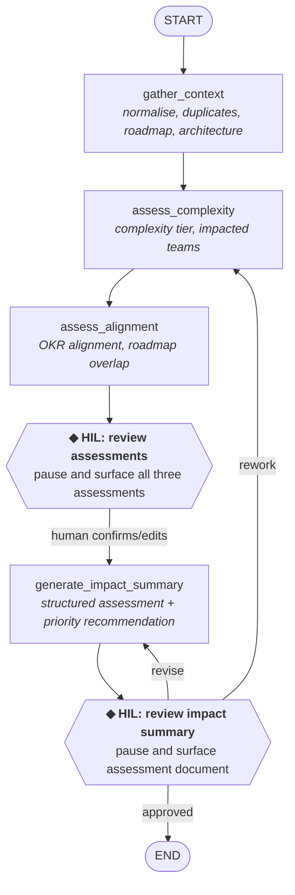

# Worked Example: Stage 4 — Design

!!! example "Worked Example"
    We're applying Stage 4 to: **New Feature Request Intake & Impact Assessment**. The goal is to translate the scoped workflow into a platform-neutral agent design — actions, flow, memory, checkpoints, and error handling — that a team can implement on whichever framework or platform they choose.

## Completed Artifact: Design Document

### Mapping Scope Steps to Actions

The [scope document](scope.md) defines 11 steps with individual boundary tags. Three steps have HIL elements (Step 7's alignment interpretation, Step 9's draft review, and Step 10's assessment review). Applying the consolidation principles from Stage 4 reduces these to 2 checkpoints. Here is how the 11 steps were consolidated into 6 actions (4 processing actions and 2 HIL checkpoints), and why.

| Scope Step | Boundary | Action | Consolidation Rationale |
|---|---|---|---|
| 1. Receive feature request | AUTOMATE | `gather_context` | Trigger detection; initiates the data-gathering pipeline |
| 2. Normalise and log in Jira | AUTOMATE | `gather_context` | Same logic pattern: parse input, create or validate Jira ticket |
| 3. Search backlog for duplicates | AUTOMATE | `gather_context` | Data retrieval: requires the normalised ticket from Step 2; results stored for downstream assessment |
| 4. Pull roadmap and planning context | AUTOMATE | `gather_context` | Independent data retrieval; parallelisable internally with Steps 3, 5 |
| 5. Pull architecture and dependency docs | AUTOMATE | `gather_context` | Independent data retrieval; parallelisable internally with Steps 3, 4 |
| 6. Estimate complexity | AUTOMATE | `assess_complexity` | Criteria-based structural assessment; tightly coupled with Step 8 (see Pattern 1 below) |
| 7. Assess strategic alignment | AUTOMATE / HIL | `assess_alignment` | AUTOMATE scoring component automated; HIL interpretation consolidated into `hil_review_assessment` (Pattern 1) |
| 8. Identify impacted teams and systems | AUTOMATE | `assess_complexity` | Both steps operate on architecture and dependency data to produce structural assessments reviewed as a unit |
| — | — | **`hil_review_assessment`** | **Single checkpoint reviewing complexity, alignment, and team impact together** |
| 9. Draft impact assessment | AUTOMATE / HIL | `generate_impact_summary` | Template-based draft automated; HIL review consolidated into `hil_review_summary` (Pattern 2) |
| 10. Review and refine assessment | HIL | **`hil_review_summary`** | **Single checkpoint reviewing the complete impact assessment document** |
| 11. Submit to prioritisation committee | MANUAL | *Outside the agent* | MANUAL step sits outside the agent boundary (Pattern 3) |

Three scope steps had HIL elements, but the design has only 2 checkpoints. This mirrors the CSM example's consolidation logic — applied to a different workflow structure with fewer initial HIL-tagged steps but the same design principles.

**Pattern 1: Consolidate related assessment reviews into a single checkpoint.** Steps 6, 7, and 8 produce three assessment outputs — a complexity estimate, a strategic alignment score, and a team impact footprint. Step 7's boundary includes an HIL element for alignment interpretation. But the BA reviews all three assessments as a unit: a "Medium" complexity tier means something different when three teams are impacted versus one, and a "High" alignment score with a conflicting OKR changes how the BA reads the team impact. Presenting all three assessments together in one checkpoint produces better feedback than three separate pauses — the reviewer can cross-reference findings across dimensions. Stage 4's grouping rule applies to HIL steps too — the coupling here is that the assessments are evaluated as a coherent picture of the request's impact, not as independent scores.

**Pattern 2: An upstream checkpoint can convert downstream HIL steps to automated.** Step 9 is tagged AUTOMATE (draft) / HIL (review) in the scope document because the draft assessment might contain errors in interpretation. But after `hil_review_assessment`, the human has already validated every assessment input that feeds Step 9's template population. With confirmed inputs and a well-defined template, the draft generation becomes deterministic enough to automate. The human's corrections flow forward via `assessment_human_feedback` in memory, so `generate_impact_summary` operates on vetted data. Step 9's HIL review component is absorbed into Step 10's review — both examine the same document, so a single checkpoint (`hil_review_summary`) handles both.

**Pattern 3: MANUAL steps define the agent boundary, not an edge case to handle.** Step 11 does not become an action. The agent ends when `hil_review_summary` approves the output. Everything after — choosing the prioritisation forum, drafting a cover note, pre-briefing stakeholders — happens outside the agent. Design the agent to end at the last point where it adds value, not at the last step of the human workflow.

### Agent Flow

The flow follows the **Sequential Pipeline with HIL Checkpoints** pattern from [Stage 4: Design](../stages/04-design.md#pattern-1-sequential-pipeline-with-hil-checkpoints). It's linear, with two checkpoints where the human reviews and can redirect.

!!! note "Why `assess_complexity` and `assess_alignment` are separate actions, not consolidated"
    The scope document notes that Steps 6, 7, and 8 are independent and could execute in parallel. The CSM example consolidates its three analysis dimensions into a single `analyse_health` action because they follow the same logic pattern: "take raw data, apply scoring rubric, return structured score." The BA's assessments are structurally different. Steps 6 and 8 are criteria-based structural analysis: count components, trace dependencies, look up historical medians, apply tier mappings. Step 7 is semantic comparison against OKR text with conflict detection. Different logic patterns warrant different actions — each can be tested, debugged, and iterated independently. The two actions run sequentially for simplicity; if latency becomes a concern, they could be refactored into a fan-out without changing the memory schema.

!!! note "Why there are two HIL checkpoints, not one"
    The first checkpoint (after assessment) catches errors in structural and strategic analysis before they propagate into the impact summary. The second checkpoint (after summary generation) catches issues in the final document — formatting, narrative framing, priority recommendation. If you only had one checkpoint at the end, a wrong complexity estimate would produce the wrong priority recommendation, and the BA would need to trace the error back through the entire chain. Two checkpoints keep each review focused: the first validates the *inputs* to the summary, the second validates the *output*.

### Memory Fields

The agent remembers the following fields between actions. Field types are described in plain language so that any platform's memory/state model can represent them.

| Field | Type | Purpose | Written by | Read by |
|---|---|---|---|---|
| `request_id` | string | Ticket key or temporary ID before ticket creation | (input) | all actions |
| `request_details` | structured object `{summary, description, requester, source_channel, component, date_received}` | Raw request metadata | (input) | `gather_context`, `assess_complexity`, `generate_impact_summary` |
| `jira_ticket` | structured object with standard ticket fields | Normalised ticket after creation or validation | `gather_context` | `assess_complexity`, `generate_impact_summary` |
| `backlog_duplicates` | list of `{ticket_key, summary, similarity_score, similarity_class}` | Potential duplicates from backlog search | `gather_context` | `hil_review_assessment`, `generate_impact_summary` |
| `roadmap_context` | structured object `{planned_items, recent_decisions, overlapping_epics}` | Roadmap and planning context | `gather_context` | `assess_alignment` |
| `architecture_context` | structured object `{service_ownership, dependencies, upstream, downstream, adrs}` | Architecture and dependency map | `gather_context` | `assess_complexity` |
| `historical_estimates` | list of completed-ticket records with story points | Historical complexity baseline | `gather_context` | `assess_complexity` |
| `okr_data` | list of `{objective, key_results, status, quarter}` | Active OKRs | `gather_context` | `assess_alignment` |
| `complexity_estimate` | structured object `{tier, story_point_baseline, adjustment_factors, confidence}` | Step 6 output | `assess_complexity` | `hil_review_assessment`, `generate_impact_summary` |
| `alignment_score` | structured object `{score, okr_mappings, roadmap_overlap, conflicts}` | Step 7 output | `assess_alignment` | `hil_review_assessment`, `generate_impact_summary` |
| `impacted_teams` | structured object `{directly_impacted, indirectly_impacted, dependency_paths, coordination_requirements}` | Step 8 output | `assess_complexity` | `hil_review_assessment`, `generate_impact_summary` |
| `assessment_human_feedback` | optional string | Reviewer corrections from the first HIL checkpoint | `hil_review_assessment` | `generate_impact_summary` |
| `summary_human_feedback` | optional string | Revision instructions from the second HIL checkpoint (revise path) | `hil_review_summary` | `generate_impact_summary` |
| `rework_instructions` | optional string | Rework instructions from the second HIL checkpoint (rework path) | `hil_review_summary` | `assess_complexity` |
| `summary_review_decision` | optional string ("approved" / "revise" / "rework") | Final review outcome | `hil_review_summary` | (routing) |
| `impact_summary` | string | Full impact assessment document (Markdown) | `generate_impact_summary` | `hil_review_summary` |
| `recommended_priority` | string ("P1"–"P4" with rationale) | Priority recommendation | `generate_impact_summary` | `hil_review_summary` |

!!! tip "Why `alignment_score` stores conflicts as a separate field"
    The scope document's Step 7 decision logic states: "When a request aligns with one OKR but conflicts with another, surface the tension explicitly rather than averaging." The `conflicts` list in `alignment_score` preserves this. A blended score of "Medium" hides the fact that the request directly advances one OKR while competing for resources with another initiative. The prioritisation committee needs to see the conflict, not a compromise — that is a business decision the agent should not make. The `generate_impact_summary` action renders conflicts as a separate section in the assessment document rather than folding them into the alignment score narrative.

### Action Specifications

#### Action: `gather_context`

- **Purpose:** Detect the incoming request, normalise it into a structured ticket, and retrieve all contextual data needed for downstream assessment
- **Tools:** `create_or_validate_ticket`, `search_backlog_duplicates`, `get_roadmap_context`, `get_architecture_context`, `get_historical_estimates`, `get_okr_data`, plus an embedding model for semantic duplicate matching. Each tool wraps whatever system your organisation uses for that data — a ticketing platform, a wiki, a roadmap tool, an OKR tracker. The action calls them by capability, not by vendor.
- **Logic:**
    - Detect the trigger event (Jira webhook for new ticket, or incoming Slack/email message).
    - If the request arrived via Slack or email, create a new Jira ticket with normalised fields (summary, description, requester, source channel, component). If via Jira, validate that required fields are populated.
    - With the normalised ticket, execute data retrieval queries in parallel:
        - Search the backlog for duplicates using three methods: keyword match (JQL), component match, and semantic similarity (embedding model). Classify matches: ≥0.80 similarity = "likely duplicate," 0.65–0.80 = "possibly related," <0.65 = no match.
        - Query the roadmap tool for current quarter items matching the request's feature area. Search Confluence for related decision records and planning pages from the last two quarters.
        - Query Confluence and the service registry for architecture docs, service ownership, dependency maps, and ADRs for the affected component(s).
        - Query Jira for completed tickets tagged with the same component(s) from the last 4 sprints (historical estimates for complexity baseline).
        - Query the OKR tracker for all active OKRs with objectives, key results, and status.
    - Store each result in the corresponding state field.
- **Parallelism:** Step 2 (normalise/create ticket) must complete first to identify the component. After that, the five retrieval queries are independent and can run concurrently.
- **Error handling:** If any data source fails, store an error marker in that memory field (e.g., `{"error": "Confluence API timeout", "timestamp": ...}`) and continue with available data. Downstream actions check for error markers before operating on the data. If Jira ticket creation itself fails (Steps 1-2), the flow cannot proceed — abort with a clear error message, since there is no request to assess without a normalised ticket.

#### Action: `assess_complexity`

- **Purpose:** Estimate the request's complexity tier and identify all impacted teams and systems
- **Tools:** LLM for interpreting request description against architecture context
- **Logic:**
    - Complexity estimation (from Step 6): apply the four-factor tier mapping — (1) count affected components from `architecture_context`, (2) calculate median story points from `historical_estimates`, (3) use LLM to assess whether the request requires a schema or data model change, (4) use LLM to assess whether the request involves external integration dependencies. Apply tier adjustments and cap at X-Large. If fewer than 5 historical tickets exist for the component, flag as "low-confidence estimate."
    - Team impact identification (from Step 8): for each affected component, look up the owning team from `architecture_context`. Trace upstream and downstream dependencies. Classify teams as "directly impacted" (own a component that must change) or "indirectly impacted" (own a dependent service that may need integration testing or contract updates). Flag shared database or message queue dependencies as coordination complexity.
- **Prompt pattern:** Two prompts within this action, one per assessment dimension.
    - Complexity prompt: Provide `request_details` (summary, description, component), `architecture_context` (dependencies, component metadata), and `historical_estimates` (completed tickets with story points). Load the complexity tier mapping rules from config (component count thresholds, tier adjustment rules for schema change and external dependencies). Ask for structured JSON: `{"tier": "Small"|"Medium"|"Large"|"X-Large", "story_point_baseline": int|null, "adjustment_factors": [str], "confidence": "high"|"low", "reasoning": str}`.
    - Team impact prompt: Provide `request_details` (component), `architecture_context` (service ownership, dependency map). Ask for structured JSON: `{"directly_impacted": [{"team": str, "component": str, "change_required": str}], "indirectly_impacted": [{"team": str, "service": str, "dependency_type": str}], "dependency_paths": [str], "coordination_requirements": str}`.

    On rework passes (when `rework_instructions` is present from the `hil_review_summary` rework path), both prompts include the reviewer's instructions as a focus-area section.
- **Error handling:** If `architecture_context` or `historical_estimates` contain error markers, degrade gracefully. Missing architecture data → skip dependency tracing, flag "impact footprint may be incomplete." Missing historical data → flag "low-confidence estimate," use component count alone. If the LLM returns malformed JSON for either prompt, retry with a stricter format instruction (up to 2 retries). Each prompt fails independently — a parse failure in complexity estimation does not block team impact identification.

#### Action: `assess_alignment`

- **Purpose:** Score the request's strategic alignment against current OKRs and roadmap priorities
- **Tools:** LLM for semantic comparison between request description and OKR text
- **Logic:** For each active OKR, classify the request's relationship: Direct (request explicitly advances a measurable key result), Indirect (request supports the objective's direction but not a specific KR), Neutral (no relationship), or Conflicting (request competes for resources with an active initiative or contradicts the objective's direction). Assign overall alignment score: Direct to any OKR = High, Indirect to 2+ OKRs = Medium, Indirect to 1 or all Neutral = Low, Conflicting with any OKR = Flag as "Conflicting." Cross-check against the roadmap: if a similar capability is already planned, classify the request as subset, superset, or alternative approach and note the related roadmap item.
- **Prompt pattern:** Provide `request_details` (summary, description), `okr_data` (active OKRs with key results and status), and `roadmap_context` (planned items, recent decisions). Load the alignment classification criteria from config (Direct/Indirect/Neutral/Conflicting definitions with examples). Ask for structured JSON: `{"score": "High"|"Medium"|"Low"|"Conflicting", "okr_mappings": [{"okr": str, "classification": "Direct"|"Indirect"|"Neutral"|"Conflicting", "reasoning": str}], "roadmap_overlap": {"status": "none"|"subset"|"superset"|"alternative", "related_item": str|null, "details": str}, "conflicts": [{"okr": str, "competing_initiative": str, "tension": str}]}`.

    On rework passes, include `rework_instructions` as a focus-area section.
- **Error handling:** If `okr_data` contains an error marker, skip OKR alignment and record `alignment_score.score` as `"Unknown"` with a note explaining the data gap — do not attempt alignment without OKR data, as the result would be meaningless. If `roadmap_context` contains an error marker, skip roadmap overlap analysis but still attempt OKR alignment (these are independent). If the model returns malformed JSON, retry with a stricter format instruction (up to 2 retries). If retries are exhausted, escalate via an ad-hoc HIL checkpoint with the raw OKR data and request details so the human can provide the alignment assessment manually.

#### Action: `hil_review_assessment`

- **Purpose:** Pause execution and present all three assessments to the human for validation
- **Surfaced data:** A formatted summary of the complexity estimate (tier, confidence, adjustment factors), the alignment score (OKR mappings, conflicts, roadmap overlap), and the team impact footprint (directly/indirectly impacted teams, coordination requirements). Also surface `backlog_duplicates` if any strong candidates were found (similarity ≥0.80), so the BA can confirm or dismiss them during review.
- **Expected input:** Freeform text feedback using the feedback-as-context pattern. An empty response is treated as approval.
- **Resume:** The freeform input is stored in `assessment_human_feedback`. The `generate_impact_summary` action's prompt injects this as additional context when present. The raw assessments remain unchanged in memory, preserving the audit trail.
- **Error handling:** State must persist across the pause so an unresponsive reviewer does not cause the run to fail — execution resumes when the reviewer provides input, even hours or days later. Your platform's persistence model determines how this is implemented.

#### Action: `generate_impact_summary`

- **Purpose:** Compile all assessment outputs into a structured impact assessment document with a priority recommendation
- **Tools:** LLM
- **Logic:** Populate the standard impact assessment template with seven sections: (1) Request Summary — restate the request in standardised language with requester and source. (2) Duplicate Analysis — findings from duplicate search; if strong duplicates found, recommend linking or closing. (3) Complexity Estimate — tier, story point baseline, and adjustment factors. (4) Strategic Alignment — score, OKR mappings, and roadmap overlap; render conflicts as a distinct subsection. (5) Impact Footprint — impacted teams, dependency paths, and coordination requirements. (6) Risks and Open Questions — cross-team dependencies, data migration needs, timeline conflicts, flags from prior steps. (7) Recommended Priority — P1–P4 classification based on alignment score × urgency indicators (P1 if High alignment + urgent or blocking, P2 if High without urgency or Medium + urgent, P3 if Medium without urgency, P4 if Low alignment).
- **Prompt pattern:** Provide all assessment outputs (`complexity_estimate`, `alignment_score`, `impacted_teams`), `backlog_duplicates`, `request_details`, and `assessment_human_feedback` (if present). Load the impact assessment template structure and priority classification rules (P1–P4 criteria) from config. On revision passes, include `summary_human_feedback`. For the assessment document, ask for structured Markdown with the seven template sections. For the priority recommendation, ask for JSON: `{"priority": "P1"|"P2"|"P3"|"P4", "rationale": str}`.
- **Output format:** Markdown (the impact assessment document the BA submits to the prioritisation committee)
- **Error handling:** The primary output is free-form Markdown, so structured parse failures do not apply for the main document. The priority recommendation is a small JSON object — if it fails to parse, retry (up to 2). The downstream HIL checkpoint (`hil_review_summary`) catches content-quality issues — the human can send the document back for revision via the `revise` path or back to assessment via the `rework` path.

#### Action: `hil_review_summary`

- **Purpose:** Present the complete impact assessment to the human for final review before submission
- **Surfaced data:** The full impact assessment markdown, the recommended priority, and a reminder of any flags from prior steps (low-confidence estimates, data gaps, strong duplicate candidates, OKR conflicts).
- **Expected input:** Structured response using the feedback-as-control-flow pattern: `{decision: approve | revise | rework, instructions: str}`.
- **Routing:**
    - `decision == "approved"` → end
    - `decision == "revise"` → back to `generate_impact_summary` with `instructions` written to `summary_human_feedback`
    - `decision == "rework"` → back to `assess_complexity` with `instructions` written to `rework_instructions`
- **Error handling:** State persists across the pause, so an unresponsive reviewer does not crash the agent — execution resumes when they respond. The routing logic validates that the decision is one of `"approved"`, `"revise"`, or `"rework"` and raises an error on an unrecognised value, preventing silent misrouting.

### Error Handling Design

| Failure Mode | Detection | Response |
|---|---|---|
| Jira API failure (ticket creation) | HTTP error / timeout | Abort — no ticket means no request to assess; surface error with diagnostic context |
| Jira API failure (backlog search) | HTTP error / timeout | Store error marker; continue without duplicate analysis; flag gap in impact summary |
| Confluence / roadmap / OKR tracker failure | HTTP error / timeout | Store error marker in relevant state field; continue with available data; flag missing context |
| Backlog search returns empty | Empty result set | Record "no duplicates found" — do not infer uniqueness; note that results may be limited by service account access |
| Historical tickets insufficient (<5) | Count check on `historical_estimates` | Flag as "low-confidence estimate"; fall back to component count alone; note in `complexity_estimate.confidence` |
| Model produces malformed output | JSON parse failure | Retry with stricter format instruction (up to 2 retries); on persistent failure, escalate via an ad-hoc HIL checkpoint |
| Model hallucination risk | (mitigated by design) | All model outputs grounded in provided data via prompt design; HIL checkpoints catch errors |
| Human doesn't respond to a checkpoint | Timeout (configurable) | State persists; the run can be resumed later when the reviewer returns |

!!! note "Why Jira ticket creation is the only abort trigger"
    Every other data source failure uses error markers and graceful degradation — the agent produces a partial assessment with flagged gaps, which is more useful than crashing. Jira ticket creation is different: without a normalised ticket, there is no `request_details.component` to drive duplicate detection, no component to look up in the service catalogue, and no historical data to query. Every downstream action depends on the ticket. An error marker here would propagate through the entire flow, producing an impact assessment about nothing. Aborting early with a clear error message is more useful than a cascading chain of "data unavailable" flags.

!!! note "Why 'no duplicates found' is not 'the request is unique'"
    When the backlog search returns empty, the agent reports "no duplicates found in the searched projects" — not "this request is unique." The service account may lack `browse_project` permission on some Jira projects. A team might track similar work under a different label or component name. An existing request might use different terminology for the same capability. Empty results are the absence of evidence, not evidence of absence. The BA validates duplicate findings (or their absence) at the `hil_review_assessment` checkpoint — this is one reason that checkpoint surfaces duplicate results alongside the assessments.

---

[:octicons-arrow-left-24: Back to Stage 4: Design](../stages/04-design.md){ .md-button }
