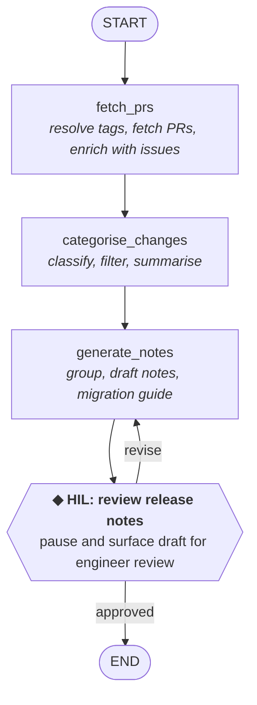

# Worked Example: Stage 4 — Design

!!! example "Worked Example"
    We're applying Stage 4 to: **Release Notes Compilation & Publishing**. The goal is to translate the scoped workflow into a platform-neutral agent design — actions, flow, memory, checkpoints, and error handling — that a team can implement on whichever framework or platform they choose.

## Completed Artifact: Design Document

### Mapping Scope Steps to Actions

The [scope document](scope.md) defines 11 steps with individual boundary tags. Steps 1–9 are AUTOMATE, Step 10 is HIL, and Step 11 is MANUAL. With only one HIL-tagged step and one MANUAL step, the consolidation challenge here is different from the CSM and BA examples: instead of merging many HIL checkpoints down to a few, the task is consolidating nine consecutive AUTOMATE steps into a manageable number of actions. Here is how the 11 steps were consolidated into 4 actions (3 processing actions and 1 HIL checkpoint), and why.

| Scope Step | Boundary | Action | Consolidation Rationale |
|---|---|---|---|
| 1. Identify release scope | AUTOMATE | `fetch_prs` | Trigger detection provides the tag pair that parameterises the PR query; inseparable from Step 2 |
| 2. Fetch merged PRs since last release | AUTOMATE | `fetch_prs` | Data retrieval: GitHub Compare API + PR resolution. Consumes the tag pair from Step 1 directly |
| 3. Fetch linked issues for each PR | AUTOMATE | `fetch_prs` | Data retrieval: enriches PR list with issue tracker metadata. Same API-call-and-store pattern; depends on Step 2's output |
| 4. Categorise changes by type | AUTOMATE | `categorise_changes` | Classification logic: label matching → conventional commit parsing → model fallback. Different logic pattern from data retrieval; see Pattern 1 below |
| 5. Filter to user-facing changes | AUTOMATE | `categorise_changes` | Filtering is the second half of classification: apply exclusion rules to the categorised list. Same data, same action |
| 6. Extract change summaries | AUTOMATE | `categorise_changes` | Summary extraction operates on the same PR metadata as categorisation and produces a field on each PR record; tightly coupled |
| 7. Group changes by category and sort by impact | AUTOMATE | `generate_notes` | Structural formatting: ordering and grouping are presentation logic, not classification logic. Belongs with the action that produces the document |
| 8. Generate release notes draft | AUTOMATE | `generate_notes` | Document generation: template population + model-generated narrative. Consumes the categorised, summarised, grouped changes |
| 9. Generate upgrade/migration notes | AUTOMATE | `generate_notes` | Conditional generation (only if breaking changes exist). Produces a section of the same document; same output target |
| 10. Review and refine | HIL | **`hil_review_notes`** | **Single checkpoint: engineer reviews complete draft before publishing** |
| 11. Publish to release page and changelog | MANUAL | *Outside the agent* | MANUAL step sits outside the agent boundary |

Nine AUTOMATE steps consolidate into 3 processing actions. The consolidation follows two patterns and a boundary rule.

**Pattern 1: Split at the logic-pattern boundary, not the data boundary.** Steps 1–3 are pure data retrieval: API calls with deterministic parameters that produce raw data. Steps 4–6 are classification and transformation: applying rules, fallback chains, and model assistance to that raw data. Both groups operate on PR metadata, but the *logic* is fundamentally different. Data retrieval either succeeds or fails; classification involves a priority chain of strategies and produces judgements that the reviewer validates. Grouping data retrieval into one action and classification into another makes each action independently testable and debuggable. If categorisation accuracy is poor, you iterate on `categorise_changes` without touching `fetch_prs`. If the source-control integration breaks, you fix `fetch_prs` without re-testing classification logic.

**Pattern 2: Group by output target.** Steps 7–9 all contribute to the same output: the release notes document. Step 7 structures the data, Step 8 generates the main document, and Step 9 generates an optional section of that document. All three are presentation logic that consumes the categorised changes and produces formatted Markdown. A single `generate_notes` action handles grouping, document generation, and conditional migration note generation internally. This mirrors the CSM example's `generate_report` action, which combines the main report and executive summary into one action because they share the same output target.

**Pattern 3: MANUAL steps define the agent boundary, not an edge case to handle.** Step 11 does not become an action. The agent ends when `hil_review_notes` approves the output. Everything after — choosing when to publish, which channels to post to, how to frame the announcement — happens outside the agent. This is the same boundary rule applied in the CSM example (Step 12: distribution) and the BA example (Step 11: submission to prioritisation committee). Design the agent to end at the last point where it adds value, not at the last step of the human workflow.

!!! note "Why only one HIL checkpoint, not two"
    The CSM and BA examples both have two HIL checkpoints. This example has one. That is not a simplification -- it reflects the workflow's error characteristics. In the CSM workflow, a misinterpreted sentiment signal in the analysis phase propagates into the synthesis, health score, and report -- compounding errors across four dependent steps. An early checkpoint catches interpretation errors before they cascade. In the BA workflow, a wrong complexity estimate feeds into the priority recommendation, so an intermediate checkpoint validates the inputs before the summary is generated.

    In the release notes workflow, errors do not compound. A miscategorised PR appears in the wrong section but does not cause other PRs to be miscategorised. A vague summary on one PR does not affect the summaries of other PRs. Each PR's classification, summary, and position in the document are independent. This means all errors are catchable in a single pass during the review step -- the engineer reads through the draft, spots the miscategorised PR, moves it, fixes vague summaries, and approves. One focused review is more efficient than two scattered checkpoints for this workflow's error profile.

    If the team's PR labelling discipline is poor and the model classification fallback produces frequent errors, review fatigue at Step 10 may warrant adding a checkpoint after `categorise_changes` — "review categorisation before the agent generates notes from it." The single-checkpoint design assumes reasonable labelling. If that assumption breaks, add a checkpoint rather than tolerating review fatigue.

### Agent Flow

The flow follows the **Sequential Pipeline with HIL Checkpoints** pattern from [Stage 4: Design](../stages/04-design.md#pattern-1-sequential-pipeline-with-hil-checkpoints). It's linear with a single checkpoint where the engineer reviews and can redirect.

!!! note "Why this is a sequential pipeline, not a fan-out"
    Steps 1–3 (data retrieval) could fan out: PR fetching and issue enrichment could run in parallel per PR. In the design, `fetch_prs` handles this as internal concurrency — parallel tool calls within a single action. The flow stays sequential. Use fan-out at the flow level only when parallel branches have different *logic*, not just different *data sources*. All three steps here follow the same pattern: call a source, store the result.

!!! note "Why the revise loop targets `generate_notes`, not `categorise_changes`"
    The most common revision feedback is about presentation: "move this PR to a different section," "rewrite this summary," "add more context to the migration guide." These are changes to how the notes are *formatted*, not how the changes are *classified*. The engineer can correct categorisation in the review feedback, and `generate_notes` can re-sort entries based on that feedback. If the engineer needs to re-run classification itself (e.g., "re-categorise all PRs from the `payments` team"), that is a rare enough case to handle by restarting the agent, not by adding a second revise target. Keeping the revise loop tight (one target action) simplifies the flow and matches the common case.

### Memory Fields

The agent remembers the following fields between actions. Field types are described in plain language so that any platform's memory/state model can represent them.

| Field | Type | Purpose | Written by | Read by |
|---|---|---|---|---|
| `release_tag` | string (e.g., "v2.4.0") | Target release | (input) | `fetch_prs`, `generate_notes` |
| `previous_tag` | string | Previous release for comparison (resolved from version control if not provided) | (input) or resolved by `fetch_prs` | `fetch_prs`, `generate_notes` |
| `repo_owner` | string | Source-control org or user | (input) | `fetch_prs` |
| `repo_name` | string | Source-control repository name | (input) | `fetch_prs` |
| `merged_prs` | list of structured PR records with fields `{number, title, author, labels, description, merge_sha, merge_timestamp, linked_issues}` | Enriched PR list for the release range | `fetch_prs` | `categorise_changes` |
| `categorised_changes` | structured object keyed by category name, each containing a list of PRs with summaries | Classified, filtered, summarised changes | `categorise_changes` | `generate_notes` |
| `excluded_changes` | list of `{pr, exclusion_reason}` | PRs filtered out and why | `categorise_changes` | `hil_review_notes` |
| `llm_classified_prs` | list of PR numbers | PRs that required model fallback classification (for labelling feedback) | `categorise_changes` | `hil_review_notes` |
| `draft_notes` | string | Formatted Markdown release notes | `generate_notes` | `hil_review_notes` |
| `migration_notes` | optional string | Upgrade guide section (null if no breaking changes) | `generate_notes` | `hil_review_notes` |
| `review_feedback` | optional string | Engineer's revision instructions | `hil_review_notes` | `generate_notes` |
| `review_decision` | optional string ("approved" / "revise") | Final review outcome | `hil_review_notes` | (routing) |

!!! tip "Why `llm_classified_prs` is in memory"
    This field serves no downstream action — no other action reads it. It exists for observability: after the run completes, the team can review which PRs required model fallback classification and improve their labelling discipline. The scope document explicitly calls for logging fallback cases as a feedback loop for process improvement. Memory is the right place for this because it persists across the run and is accessible after completion.

### Action Specifications

#### Action: `fetch_prs`

- **Purpose:** Resolve the release tag pair and retrieve all merged PRs with their linked issue metadata
- **Tools:** `resolve_release_tags`, `compare_tag_range`, `get_pull_request`, `get_linked_issues`. Each tool wraps whatever source-control and issue-tracking systems your organisation uses — the action calls them by capability, not by vendor.
- **Logic:**
    - Validate the `release_tag` exists. If `previous_tag` is not provided, resolve it as the most recent prior release tag from version control. If multiple tags exist on the same commit (e.g., `v2.4.0` and `v2.4.0-rc1`), use the tag without a pre-release suffix.
    - Compare the tag range to get the commit range, then resolve each merge commit to its PR. For squash-merged PRs, the merge commit maps directly. For rebase-merged PRs, resolve each individual commit and deduplicate by PR number. Paginate if more than 100 PRs.
    - For each PR, parse the description body and commit messages for issue references (`#123`, `Fixes #456`, `PROJ-\d+`). Query the issue tracker for each matched key to retrieve metadata (key, title, type, priority, status). If a PR has no linked issues, carry it forward with an empty issues list.
    - Store the enriched PR list in `merged_prs`.
- **Parallelism:** Tag resolution must complete first to establish the commit range. After that, PR resolution and issue enrichment calls are independent per-PR and can run concurrently (batch requests where the API supports it).
- **Error handling:** If the source-control API returns a rate limit error, wait for the reset window and retry. If tag/compare resolution fails (tag not found, 500-class error), abort the agent — without a valid commit range, there are no PRs to process. If the issue tracker fails for a specific PR's linked issues, store an error marker in that PR's `linked_issues` field and continue — missing issue metadata degrades enrichment but does not block categorisation. If a rebase-merged PR's individual commits cannot all be resolved, include the PR with whatever metadata is available and flag it for manual review.

#### Action: `categorise_changes`

- **Purpose:** Classify each PR into a release notes category, filter out internal changes, and generate user-facing summaries
- **Tools:** A language model for ambiguous classification and summary generation — no external data calls at this point, just reasoning over what `fetch_prs` produced.
- **Logic:**
    - **Categorisation** (from Step 4): Apply the three-strategy priority chain per PR. **(1) Label match** — map PR labels to categories using a configurable lookup loaded from config: `feature`/`enhancement` → New Features, `bug`/`bugfix` → Bug Fixes, `security` → Security, `breaking-change`/`breaking` → Breaking Changes, `performance` → Performance, `dependencies`/`dependency` → Dependency Updates, `documentation`/`docs` → Documentation, `internal`/`chore`/`ci` → Internal. If multiple category labels are present, prefer the highest-severity category (Security > Breaking Changes > Bug Fixes > New Features > Performance > others). **(2) Conventional commit prefix** — if no label matched, parse the PR title for a prefix: `feat:` → New Features, `fix:` → Bug Fixes, `perf:` → Performance, `docs:` → Documentation, `chore:`/`ci:`/`build:` → Internal, `deps:` → Dependency Updates. **(3) Model classification** — if neither matched, send the PR title, description (first 500 characters), and linked issue types to the model. Log the PR number to `llm_classified_prs`. **(4) Breaking change override** — regardless of primary category, if any commit message contains `BREAKING:` or `BREAKING CHANGE:`, add the PR to Breaking Changes as well.
    - **Filtering** (from Step 5): Exclude PRs whose category is Internal. Also exclude PRs carrying labels `internal`, `ci`, `chore`, `no-release-notes`, or `skip-changelog` regardless of category. Store excluded PRs with exclusion reasons in `excluded_changes`. If a PR is in both a user-facing category and Internal (e.g., a CI change that fixes a user-facing bug), flag it as "ambiguous exclusion" and include it in the user-facing list with a review flag.
    - **Summary extraction** (from Step 6): For each user-facing PR: **(1)** Check the PR description for a "Release Notes" or "Changelog" section — if present, use that text verbatim. **(2)** Otherwise, use the PR title stripped of conventional commit prefixes, ticket references, and scope annotations. **(3)** If the normalised title is too vague (fewer than 4 words or generic like "Fix bug"), send the PR title, description, and linked issue titles to the model for a one-sentence user-facing summary (under 120 characters).
    - Store the categorised, summarised, filtered changes in `categorised_changes`.
- **Prompt pattern:** Two model call types within this action.
    - Classification prompt: Provide the PR title, first 500 characters of the description, and linked issue types from `merged_prs`. Load the category definitions from config. Ask for structured JSON: `{"category": str, "confidence": "high"|"low", "reasoning": str}`.
    - Summary prompt: Provide the PR title, full description, and linked issue titles. Ask for a single sentence under 120 characters written for end users, focusing on what changed, not how.

    On revision passes (when `review_feedback` is present from the `hil_review_notes` revise path), the `generate_notes` action handles corrections — `categorise_changes` does not re-run on revisions, since the revise loop targets `generate_notes`.
- **Error handling:** If a PR's description is empty or null, proceed with label-based and commit-prefix classification only — escalate to the model only if both fail, using the PR title alone. If the model returns malformed JSON for a classification, retry with a stricter format instruction (up to 2 retries). If retries are exhausted, classify the PR as "Other" and flag it for manual review at the HIL checkpoint. Each PR is classified independently — a parse failure on one PR does not block classification of others.

#### Action: `generate_notes`

- **Purpose:** Assemble the categorised changes into a formatted release notes document with optional migration guide
- **Tools:** A language model for narrative introduction and migration note generation
- **Logic:**
    - **Grouping and sorting** (from Step 7): Arrange categorised changes into sections in a fixed order: Breaking Changes → Security → New Features → Bug Fixes → Performance → Dependency Updates → Documentation. Omit empty categories. Within each section, sort by impact: PRs linked to issues with priority P1/P2 or label `critical`/`high-priority` first, then PRs with >10 files changed, then by merge date (most recent first).
    - **Release notes draft** (from Step 8): Generate formatted Markdown. **(1) Header** — `## [version] - YYYY-MM-DD` matching the project's existing changelog convention (detected by parsing the most recent CHANGELOG.md entry, falling back to Keep a Changelog format). **(2) Category sections** — one `### Category Name` heading per non-empty category, with bulleted change summaries. Each bullet includes the PR number as a link (`[#123](url)`). **(3) Contributor acknowledgements** — deduplicate PR authors; list first-time contributors separately under a "New Contributors" section. **(4) Full changelog link** — append a link to the source-control compare view for the tag range. **(5) Narrative introduction** (optional, model-generated) — if the release contains 3+ new features or any breaking changes, generate a 2–3 sentence introduction summarising the release's theme.
    - **Migration notes** (from Step 9): If `categorised_changes` contains Breaking Changes entries, generate an Upgrade Guide section. For each breaking change PR: extract migration instructions from the PR description (look for "Migration", "Upgrade Guide", "Breaking Change Notes" sections). If no explicit migration section exists, send the PR title and description to the model for a structured migration entry: **What changed** / **Before** / **After** / **Migration steps**. Order entries by severity: API-breaking first, configuration changes second, deprecation removals third. If no breaking changes exist, set `migration_notes` to null.
    - On revision passes (when `review_feedback` is present), include the engineer's instructions. The model regenerates the notes incorporating the feedback — for example, moving a PR to a different section, rewriting a vague summary, or adding context to the migration guide.
    - Store the formatted document in `draft_notes` and the migration section in `migration_notes`.
- **Prompt pattern:** Two model call types within this action.
    - Narrative introduction prompt: Provide the full categorised change list from `categorised_changes`. Ask for a 2-3 sentence plain text introduction summarising the release's theme and key highlights.
    - Migration note prompt (per breaking change without explicit migration docs): Provide the PR title, description, and diff summary. Ask for structured Markdown: `**What changed:** / **Before:** / **After:** / **Migration steps:**`.

    On revision passes, both prompts include `review_feedback` as a focus-area section with the instruction: "The engineer has provided revision feedback. Incorporate these corrections into the regenerated output."
- **Error handling:** The primary output is free-form Markdown, so structured parse failures do not apply for the main document. If the model fails to generate a narrative introduction, omit the introduction and proceed — it is optional content. If migration note generation fails for a specific PR, include a placeholder (`"Migration instructions not auto-generated — see PR #N for details"`) and flag it for the reviewer. The downstream HIL checkpoint catches content-quality issues.

#### Action: `hil_review_notes`

- **Purpose:** Present the complete release notes draft to the engineer for review before publishing
- **Surfaced data:** The full `draft_notes` markdown, `migration_notes` (if present), the `excluded_changes` list (so the engineer can check for false exclusions), and the `llm_classified_prs` list (so the engineer knows which classifications to scrutinise). The engineer reviews categorisation accuracy, summary quality, migration note correctness, section ordering, and tone.
- **Expected input:** Structured response using the feedback-as-control-flow pattern: `{decision: approve | revise, instructions: str}`.
- **Routing:**
    - `decision == "approved"` → end
    - `decision == "revise"` → back to `generate_notes` with `instructions` written to `review_feedback`
- **Error handling:** State persists across the pause, so an unresponsive engineer does not crash the agent — execution resumes when they respond. The routing logic validates that the decision is one of `"approved"` or `"revise"` and raises an error on an unrecognised value, preventing silent misrouting.

!!! note "Why the HIL checkpoint uses feedback-as-control-flow, not feedback-as-context"
    Even though there is only one revision target (`generate_notes`), the checkpoint still uses feedback-as-control-flow because the engineer's response determines whether the agent *ends* or *loops*. "Approved" terminates the run; "revise" sends it back to regenerate notes. This is a genuine routing decision, not an enrichment. If the checkpoint used feedback-as-context with an unconditional edge, every review would require regeneration — even approvals. The decision field prevents unnecessary model calls and gives the engineer a clear "done" signal.

!!! note "Why there is no `rework` path back to `fetch_prs` or `categorise_changes`"
    The CSM and BA examples both offer a three-way decision at the final checkpoint: approve, revise (regenerate the document), or rework (go back to analysis). In this workflow, the `rework` path would target `categorise_changes` — "re-classify these PRs." But re-classification requires re-running the model fallback on the same data, which is unlikely to produce different results unless the config changes. If the engineer identifies a systemic categorisation problem (e.g., the label mapping is wrong), the fix is a config change and a restart, not a rework loop. Keeping the decision space to two options (approve/revise) simplifies the flow and matches the common case where revision feedback is about presentation, not classification.

### Error Handling Design

| Failure Mode | Detection | Response |
|---|---|---|
| Source-control API rate limit | Rate limit error with a reset window | Wait for reset window, then retry the request. If reset is >5 minutes away, escalate via an ad-hoc HIL checkpoint with rate limit context so the engineer can decide whether to wait or provide a cached PR list |
| Source-control API failure (tag/compare) | Tag not found or 500-class error | Abort — without a valid commit range, there are no PRs to process. Surface the error with diagnostic context (tag names, API response) |
| Issue tracker API failure | Error or timeout on individual issue lookup | Store error marker in that PR's `linked_issues` field; continue with available data. Note missing issue metadata in the review output so the engineer can enrich manually |
| PR with no description | Empty or null description field | Proceed with label-based and commit-prefix classification. If both miss, model classifies from title alone. Flag for reviewer attention |
| PR with no labels and no conventional commit prefix | Neither strategy 1 nor strategy 2 matches | Model classification (strategy 3). Log PR number to `llm_classified_prs` for reviewer scrutiny |
| Ambiguous categorisation (model low confidence) | Model returns `confidence: "low"` | Accept the classification but flag it in the review output so the engineer prioritises checking it |
| Model produces malformed output | JSON parse failure | Retry with stricter format instruction (up to 2 retries). On persistent failure: for classification, assign "Other" and flag; for summaries, use the normalised PR title as fallback |
| Breaking change missed by automation | Not detectable by the agent | The engineer's review (Step 10) is the safety net. The `excluded_changes` list is surfaced at the checkpoint so the engineer can spot internal-labelled PRs that have user-facing implications |
| Squash-merged vs rebase-merged PR resolution | API returns multiple commits per PR (rebase) | Deduplicate by PR number. If resolution fails for individual commits, include the PR with available metadata and flag |
| Empty release (no PRs in range) | `merged_prs` is empty after fetch | Generate minimal release notes ("No changes in this release") and proceed to HIL review. The engineer decides whether to publish or abort |

!!! note "Why 'abort' is reserved for tag resolution failures only"
    Every other failure mode uses error markers, fallbacks, or flagging -- the agent produces a partial draft with flagged gaps, which is more useful than crashing. Tag resolution is the exception: without a valid commit range between `previous_tag` and `release_tag`, there is no set of PRs to process. An error marker here would cascade through every downstream action, producing release notes about nothing. Aborting early with a clear error is more useful than a document full of "data unavailable" placeholders. This follows the same principle as the BA example's Jira ticket creation: the one input that everything else depends on is the one failure that warrants an abort.

---

[:octicons-arrow-left-24: Back to Stage 4: Design](../stages/04-design.md){ .md-button }
