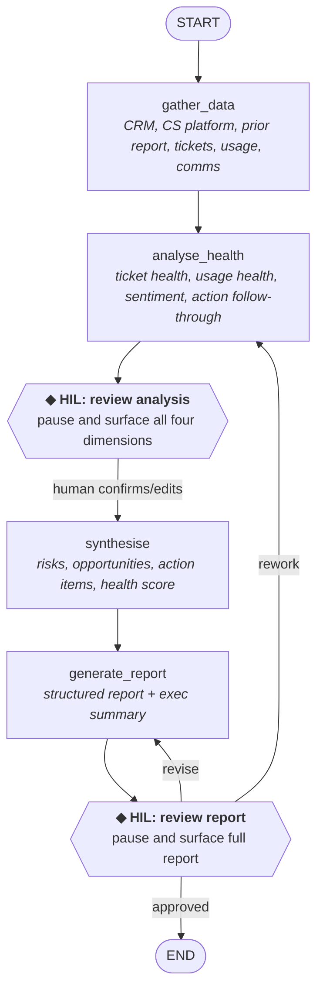

# Worked Example: Stage 4 — Design

!!! example "Worked Example"
    We're applying Stage 4 to: **Quarterly Account Health Review**. The goal is to translate the scoped workflow into a platform-neutral agent design — actions, flow, memory, checkpoints, and error handling — that a team can implement on whichever framework or platform they choose.

This worked example is deliberately platform-agnostic. The scoping decisions, consolidation rationale, HIL placement, memory design, and error handling apply whether you build on a code-first framework or a low-code builder. See [Getting Started: Choose a Platform](../getting-started/choose-a-platform.md) for some current options if you haven't picked one; then follow your platform's documentation to translate the design in this page into a working implementation.

## Completed Artifact: Design Document

### Mapping Scope Steps to Agent Actions

The [scope document](scope.md) defines 17 steps with individual boundary tags. Applying Stage 4's mapping rules naively — especially "each HIL step is a candidate for its own checkpoint" — would produce a design with 10 checkpoints. The actual design has 2. Here is how the 17 steps were consolidated into 6 actions (4 processing actions and 2 HIL checkpoints), and why.

| Scope Step | Boundary | Action | Consolidation Rationale |
|---|---|---|---|
| 1. Pull CRM data | AUTOMATE | `gather_data` | Same logic pattern: call the CRM with the account ID and quarter |
| 1b. Pull CS platform health score | AUTOMATE | `gather_data` | Same logic pattern. Results feed into Step 9's platform reconciliation |
| 1c. Pull prior quarter's health report | AUTOMATE | `gather_data` | Same data retrieval pattern. Returns prior health score, action items, and completion status for longitudinal analysis in Step 7b |
| 2. Pull support tickets | AUTOMATE | `gather_data` | Same as above |
| 3. Pull usage metrics | AUTOMATE | `gather_data` | Same as above |
| 4. Pull communications context | AUTOMATE | `gather_data` | Same as above |
| 5. Review comms sentiment | HIL | `analyse_health` | Consolidated with Steps 6–7; see Pattern 1 below |
| 6. Assess ticket health | AUTOMATE / HIL | `analyse_health` | Quantitative parts automated; HIL review consolidated |
| 7. Assess product engagement | AUTOMATE / HIL | `analyse_health` | Same as above |
| 7b. Assess prior action follow-through | AUTOMATE / HIL | `analyse_health` | Tightly coupled with Steps 6–7 as a fourth analysis dimension; consumes `prior_report` from Step 1c. Quantitative assessment (completion rate, recurring gaps) is automated; the HIL element (context on *why* items were not completed) is absorbed into `hil_review_analysis` |
| — | — | **`hil_review_analysis`** | **Single checkpoint reviewing all four analyses together** |
| 8. Identify risks & opportunities | HIL | `synthesise` | Converted from HIL to automated; see Pattern 2 below |
| 8b. Generate prioritised action items | AUTOMATE (draft) / HIL (validation) | `synthesise` | Tightly coupled with Step 8 — action items are derived directly from the risk register and opportunity list using urgency rules from the scoring rubric config. The HIL validation is absorbed into `hil_review_report` |
| 9. Assign health score | HIL | `synthesise` | Same as above |
| 10. Generate health report | AUTOMATE / HIL | `generate_report` | Draft automated; HIL review consolidated into checkpoint |
| 11. Generate exec summary | AUTOMATE / HIL | `generate_report` | Same as above |
| — | — | **`hil_review_report`** | **Single checkpoint reviewing the complete report package** |
| 12. Final review & distribution | MANUAL | *Outside the agent* | MANUAL steps sit outside the agent boundary |
| 12b. Write back to CS platform | AUTOMATE / HIL | *Outside v1 — deferred to v2* | The scope defines this as a post-approval write-back. Deferral rationale: write-back requires org-specific CS platform configuration (field mappings, score format conversion, playbook trigger rules) that varies between Gainsight, Totango, ChurnZero, etc. V1 produces the approved report package; the CSM performs the write-back manually as part of Step 12. V2 should implement this as a post-approval action with configurable platform adapters. The scope's constraint — "never update the system of record with an unapproved score" — is satisfied by design: the agent ends at `hil_review_report` approval, so no automated write-back can occur without human sign-off |

Ten scope steps had HIL tags, but the design has only 2 checkpoints. This is not a mistake — it is the result of two consolidation patterns and a boundary rule you should apply when designing your own agents.

**Pattern 1: Consolidate related HIL reviews into a single checkpoint.** Steps 5, 6, and 7 each have HIL elements — sentiment validation, ticket interpretation, and usage context. But the human is reviewing related dimensions of the same account. Presenting all three analyses together in one checkpoint is faster and produces better feedback (the reviewer can cross-reference findings across dimensions) than three separate pauses. When multiple HIL-tagged steps produce outputs that a reviewer would naturally evaluate together, merge their review into one checkpoint that surfaces all outputs at once.

**Pattern 2: An upstream checkpoint can convert downstream HIL steps to automated.** Steps 8 and 9 were tagged HIL in the scope document because they require judgement — synthesising risks and assigning a health score. But look at what happens after `hil_review_analysis`: the human has already validated (and potentially corrected) every analysis input that feeds Steps 8–9. With confirmed inputs and a well-defined scoring framework, the synthesis becomes deterministic enough to automate. The human's corrections flow forward via `analysis_human_feedback` in memory, so the `synthesise` action operates on vetted data. The second checkpoint (`hil_review_report`) still catches any synthesis errors in the final output. When a checkpoint validates the inputs to a downstream HIL step, ask whether the downstream step still needs its own interrupt — often it doesn't.

!!! warning "Pattern 2 is weaker for steps that depend on tacit knowledge"
    This consolidation works well when the downstream step's judgement is fully derivable from the data the upstream checkpoint already validated. Step 9 (health scoring) fits that profile — the scoring rubric and the vetted analyses are sufficient. Step 8 (risk identification) is a harder case. The most consequential risks in strategic accounts often come from signals no data source can surface: the VP who mentioned a competitor at last week's dinner, the champion who is interviewing elsewhere, the internal reorg that hasn't hit the CRM yet. The `hil_review_report` checkpoint catches this in theory, but by that point the reviewer is evaluating a fully-formed report with a health score already assigned — psychologically harder to rework the underlying risk register than to validate risks directly.

    For high-touch strategic accounts, consider keeping Step 8 as a separate HIL checkpoint for the first 2–3 evaluation cycles. This is consistent with the framework's own principle of starting conservative and automating once you have evidence the agent's synthesis matches what the human would have produced. If the reviewer consistently confirms the agent's risks without adding tacit-knowledge items, automate it. If they regularly inject risks the agent could not have known, keep the checkpoint.

**Pattern 3: MANUAL steps define the agent boundary, not an edge case to handle.** Step 12 does not become an action. The agent ends when `hil_review_report` approves the output. Everything after that — final edits, distribution list decisions, the actual send — happens outside the agent. Design your agent to end at the last point where it adds value, not at the last step of the human workflow.

### Agent Flow

The flow follows the **Sequential Pipeline with HIL Checkpoints** pattern from [Stage 4: Design](../stages/04-design.md#pattern-1-sequential-pipeline-with-hil-checkpoints). It's linear with two checkpoint points where the human reviews and can redirect.



!!! note "Why this is a sequential pipeline, not a fan-out"
    The scope document shows that Steps 1–4 (data retrieval) are independent and *could* run in parallel using a fan-out pattern. In the design, we consolidate them into a single `gather_data` action that makes parallel calls to its tools internally. This keeps the agent flow simple while still getting the concurrency benefit — whichever platform you build on will let you parallelise independent tool calls inside an action. Use fan-out at the flow level only when parallel branches have different *logic*, not just different *data sources*.

!!! note "Why there are two HIL checkpoints, not one"
    The first checkpoint (after analysis) catches errors in data interpretation before they propagate into the synthesis and report. The second checkpoint (after report generation) catches issues in the final output. If you only had one checkpoint at the end, a misinterpreted usage trend would produce a wrong health score, wrong risk assessment, *and* a wrong report — and the human would need to unravel the entire chain. Two checkpoints make each review smaller and more focused.

### Memory Fields

The agent remembers the following fields between actions. Field types are described in plain language so that any platform's memory/state model can represent them.

| Field | Type | Purpose | Written by | Read by |
|---|---|---|---|---|
| `account_id` | string | The account under review | (input) | all actions |
| `account_name` | string | Human-readable account name | (input) | `analyse_health`, `generate_report` |
| `quarter` | string (e.g., "2026-Q1") | Period under review | (input) | `gather_data`, `analyse_health` |
| `crm_data` | structured object with `{arr, tier, contract_start, contract_end, primary_contact, ...}` | Account metadata | `gather_data` | `analyse_health`, `synthesise`, `generate_report` |
| `tickets` | list of structured ticket records | Support tickets for the quarter | `gather_data` | `analyse_health` |
| `usage_data` | structured object with `{dau_mau_ratio, feature_adoption, api_call_volume, error_rate, qoq_trend}` | Product usage metrics | `gather_data` | `analyse_health` |
| `comms` | structured object with per-source arrays | Communications context | `gather_data` | `analyse_health` |
| `cs_platform_data` | structured object with health score and lifecycle metadata | CS platform snapshot, if available | `gather_data` | `synthesise` |
| `prior_report` | optional structured object | Prior quarter's report and action items (null if first review cycle) | `gather_data` | `analyse_health` (Step 7b) |
| `ticket_analysis` | structured object with `{score, trend, key_issues, details}` | First analysis dimension | `analyse_health` | `synthesise`, `generate_report` |
| `usage_analysis` | structured object with `{score, trend, feature_adoption, details}` | Second analysis dimension | `analyse_health` | `synthesise`, `generate_report` |
| `sentiment_analysis` | structured object with `{score, summary, key_threads}` | Third analysis dimension | `analyse_health` | `synthesise`, `generate_report` |
| `action_followthrough` | optional structured object with completion rate and unresolved items | Fourth analysis dimension (null if first review cycle) | `analyse_health` | `synthesise`, `generate_report` |
| `analysis_human_feedback` | optional string | Reviewer corrections from the first HIL checkpoint | `hil_review_analysis` | `synthesise` |
| `risks` | list of `{risk, severity, evidence, mitigation}` | Risk register | `synthesise` | `generate_report` |
| `opportunities` | list of `{opportunity, evidence, next_step}` | Opportunity list | `synthesise` | `generate_report` |
| `health_score` | string ("Green" / "Amber" / "Red") | Overall health rating | `synthesise` | `generate_report` |
| `health_justification` | string | Rationale for the score | `synthesise` | `generate_report` |
| `action_items` | list of `{description, owner_role, deadline, success_criterion, urgency}` | Prioritised action items | `synthesise` | `generate_report` |
| `platform_reconciliation` | optional structured object | Agent-vs-platform score comparison when scores diverge | `synthesise` | `generate_report` |
| `report_markdown` | string | Full report | `generate_report` | `hil_review_report` |
| `exec_summary` | string | Executive summary paragraph | `generate_report` | `hil_review_report` |
| `report_human_feedback` | optional string | Revision instructions from the second HIL checkpoint (revise path) | `hil_review_report` | `generate_report` |
| `rework_instructions` | optional string | Rework instructions from the second HIL checkpoint (rework path) | `hil_review_report` | `analyse_health` |
| `report_review_decision` | optional string ("approved" / "revise" / "rework") | Final review outcome | `hil_review_report` | (routing) |

!!! tip "Why design memory this explicitly"
    Being explicit about which action writes which field and which reads it makes the design self-checking. If an action reads a field, some earlier action must have written it — walk the table and verify this for every row. It also makes debugging tractable: when something goes wrong, you can inspect the memory state at each action boundary and see exactly what the action received. If you collapsed these fields into local variables inside each action, only inputs and final outputs would be inspectable — everything in the middle would be a black box.

### Action Specifications

#### Action: `gather_data`

- **Purpose:** Retrieve all raw data for the account.
- **Tools:** `get_crm_data`, `get_support_tickets`, `get_usage_metrics`, `search_comms`. Each tool is a thin wrapper around a single external system call — whichever system your org uses for that data. See the scope document's Data Inventory for the specific systems and endpoints.
- **Logic:** Call each tool with `account_id` and the quarter's date range (except the CS platform call and prior report retrieval, which take only `account_id`). Store results in memory. The prior report call returns null gracefully if no prior report exists (first review cycle for this account).
- **Parallelism:** The data retrieval calls are independent and can be parallelised. Your platform will have its own pattern for this (async tool calls, fan-out actions, concurrent tool nodes — whichever applies).
- **Error handling:** If a data source fails, store an error marker in the relevant memory field and continue. The analysis action handles partial data gracefully by scoring the affected dimension as "Not Assessed".

**Pseudocode:**

```
action gather_data(memory):
    memory.crm_data = get_crm_data(memory.account_id)
    memory.tickets = get_support_tickets(memory.account_id, memory.quarter)
    memory.usage_data = get_usage_metrics(memory.account_id, memory.quarter)
    memory.comms = search_comms(memory.account_id, memory.quarter)
    memory.cs_platform_data = get_cs_platform_score(memory.account_id)
    memory.prior_report = get_prior_report(memory.account_id)

    memory.data_gaps = [name for (name, value) in memory.items()
                        if isinstance(value, ErrorMarker)]
```

#### Action: `analyse_health`

- **Purpose:** Perform quantitative analysis on gathered data, including longitudinal action follow-through assessment.
- **Tools:** A language model for interpretation — no external data calls at this point, just reasoning over what `gather_data` produced.
- **Logic:**
    - **Ticket analysis:** Calculate volume trends, severity distribution, MTTR vs SLA, CSAT trends. The model interprets patterns and assigns a score.
    - **Usage analysis:** Calculate DAU/MAU trends, feature adoption rates, API error rates. The model compares against benchmarks and assigns a score.
    - **Sentiment analysis:** The model reads the comms data, identifies key themes, assesses overall sentiment. Flags specific threads for human attention.
    - **Action follow-through (Step 7b):** If `prior_report` is present, review prior quarter's action items against their completion status. Calculate overall completion rate, flag unresolved items with age, identify recurring gap patterns across consecutive quarters. If `prior_report` is null, skip this dimension and set `action_followthrough` to null.
- **Prompt pattern:** Four separate prompts, one per analysis dimension (three if first review cycle — action follow-through is skipped when no prior report exists). Each receives `account_name` and `quarter` as account context.
    - **Ticket analysis:** Provide the raw ticket data from `tickets` and the SLA thresholds from the `sla_benchmarks` section of the scoring rubric config. Include `tier` from `crm_data` for tier-contextualised evaluation. Ask for structured JSON: `{score, trend, volume_vs_previous_quarter, key_issues, sla_compliance, details}`.
    - **Usage analysis:** Provide the usage metrics from `usage_data` and the adoption thresholds from the `adoption_benchmarks` section of the scoring rubric config. Ask for structured JSON: `{score, trend, feature_adoption, details}`.
    - **Sentiment analysis:** Provide the communications from `comms`. No config section — sentiment is assessed qualitatively from thread content. Ask for structured JSON: `{score, summary, key_threads}`.
    - **Action follow-through** (when `prior_report` is present): Provide the prior quarter's action items and completion data from `prior_report`, plus current-quarter data context from `crm_data`, `tickets`, and `usage_data` for validating claimed completions. Ask for structured JSON: `{completion_rate, unresolved_items, recurring_patterns}`. Completion rate below 50% is flagged as a risk signal independent of current metrics.

    On rework passes (when `rework_instructions` is present from the `hil_review_report` rework path), all four prompts include the reviewer's instructions as a focus-area section.
- **Error handling:** If an upstream data field contains an error marker, skip that dimension and record a gap (`score: "Unknown"`) rather than sending bad data to the model. If the model returns malformed JSON for any dimension, retry with a stricter format instruction (up to 2 retries). If retries are exhausted, escalate via an ad-hoc HIL checkpoint with the failure context and raw data so the human can intervene. Each dimension fails independently — a parse failure in one analysis does not block the other three.

#### Action: `hil_review_analysis`

- **Purpose:** Pause execution and present the analysis to the human for validation.
- **Surfaced data:** A formatted summary of all four analyses (three if first review cycle), with scores, trends, evidence, and flagged items. The reviewer can see each dimension's score and the specific data that drove it.
- **Expected input:** Freeform text feedback using the feedback-as-context pattern. The reviewer can confirm, correct scores, add context, or flag missing information. An empty response is treated as approval.
- **Resume:** The freeform input is stored in `analysis_human_feedback`. The `synthesise` action's prompt injects this as additional context when present. The raw analyses remain unchanged in memory, preserving the audit trail.
- **Error handling:** State must persist across the pause so an unresponsive reviewer does not cause the run to fail — execution resumes when the reviewer provides input, even hours or days later. The platform's persistence model determines how this is implemented.

#### Action: `synthesise`

- **Purpose:** Combine analysis outputs (potentially corrected by the reviewer) into risks, opportunities, action items, and an overall health score.
- **Tools:** A language model for synthesis — no external data calls.
- **Logic:** Feed all analysis outputs plus human feedback into a synthesis prompt. Ask for structured output: risk register, opportunity list, overall health score with justification, and a prioritised action plan. Cross-reference with contract renewal timeline from CRM data. Apply urgency rules from the `action_urgency` section of the scoring rubric config to map each risk and opportunity to a time-bound action item (Red risk + renewal within 60 days = action this week; Red risk + no near-term renewal = action within 30 days; Amber risk + renewal within 90 days = action this month; Amber risk + no renewal pressure = action this quarter; Green opportunity = next QBR agenda item). Cap the action list at 5–7 items; if more surface, force-rank by severity × proximity and move the rest to a watch list in `health_justification`.
- **Prompt pattern:** Provide the four analysis outputs (`ticket_analysis`, `usage_analysis`, `sentiment_analysis`, and `action_followthrough` when present), the reviewer's corrections from `analysis_human_feedback` (if present), and CRM contract context (`arr`, `contract_end`, `renewal_date` from `crm_data`). Load the `health_scoring` and `action_urgency` sections from the scoring rubric config as the evaluation framework. When `action_followthrough` is present, instruct the model that carried-forward items from prior quarters inherit elevated priority: an action that failed to execute last quarter should not appear at the same priority level — either escalate it or acknowledge the blocker explicitly. Recurring unresolved items should surface as systemic risks, not be re-listed as new findings. Ask for structured JSON with `health_score`, `health_justification`, `risks`, `opportunities`, and `action_items`. Each action item must use a concrete verb (schedule, escalate, propose, investigate) — not a passive observation (monitor, track, be aware of). Items with `carried_forward: true` must address *why* the prior action was not completed rather than restating the original item.
- **Error handling:** If the model returns malformed JSON, retry with a stricter format instruction (up to 2 retries). If retries are exhausted, escalate via an ad-hoc HIL checkpoint with the available analysis data so the human can produce the synthesis manually. If upstream dimensions have `"Unknown"` scores (from data gaps the human did not override at the analysis checkpoint), include them as-is — the model is instructed to flag gaps rather than infer from absence.

#### Action: `generate_report`

- **Purpose:** Produce the final report document and executive summary.
- **Tools:** A language model for generation.
- **Logic:** Use a report template (sections: Account Overview, Ticket Health, Product Engagement, Sentiment, Action Follow-Through, Risks & Opportunities, Health Score, Recommended Actions). The model fills each section based on memory state. The Action Follow-Through section is included only when `action_followthrough` is present (omitted for first-cycle accounts with no prior report). Separately generate a 3–5 sentence exec summary.
- **Prompt pattern:** Provide all analysis outputs, all synthesis outputs, and CRM contract context. On revision passes, include `report_human_feedback`. For the report, ask for structured Markdown with the eight template sections (seven for first-cycle accounts) — the Recommended Actions section renders `action_items` from memory, with each item's description, owner role, deadline, and success criterion. For the exec summary, provide the completed `report_markdown` and ask for a 3–5 sentence plain text summary.
- **Output format:** Markdown (can be converted to other formats downstream).
- **Error handling:** The model output is free-form Markdown, not structured JSON, so parse failures do not apply. The downstream HIL checkpoint (`hil_review_report`) catches content-quality issues — the human can send the report back for revision via the `revise` path or back to analysis via the `rework` path.

#### Action: `hil_review_report`

- **Purpose:** Present the complete report to the human for final review.
- **Surfaced data:** The full `report_markdown` and `exec_summary`. The reviewer sees the final artefact they would send to a stakeholder.
- **Expected input:** Structured response using the feedback-as-control-flow pattern: `{decision: approve | revise | rework, instructions: str}`. Three distinct downstream paths, so a structured response lets the action route deterministically.
- **Routing:**
    - `decision == "approved"` → end (the agent's work is done, distribution is the CSM's manual step)
    - `decision == "revise"` → back to `generate_report` with `instructions` written to `report_human_feedback`
    - `decision == "rework"` → back to `analyse_health` with `instructions` written to `rework_instructions`
- **Error handling:** State persists across the pause, so an unresponsive reviewer does not crash the agent — execution resumes when they respond. The routing logic validates that the decision is one of `"approved"`, `"revise"`, or `"rework"` and raises an error on an unrecognised value, preventing silent misrouting.

### Error Handling Design

| Failure Mode | Detection | Response |
|---|---|---|
| Data source API failure | Error or timeout from the tool | Store error marker in memory; continue with available data; flag gap in report |
| Data source returns empty | Empty result set | Note "no data available" for that dimension; don't infer from absence |
| Model produces malformed output | JSON parse failure | Retry with a stricter prompt (up to 2 retries); on persistent failure, escalate via ad-hoc HIL checkpoint |
| Model hallucination risk | (mitigated by design) | All model outputs are grounded in provided data via prompt design; HIL checkpoints catch errors |
| Human doesn't respond to a checkpoint | Timeout (configurable) | State persists; the run can be resumed later when the reviewer returns |
| Prior report unavailable (Step 1c) | Null return from the prior-report tool | Set `prior_report` to null; skip action follow-through dimension in `analyse_health`; omit Action Follow-Through section from report. First-cycle accounts are expected to have no prior report |
| CS platform write-back failure (Step 12b — deferred to v2) | Error or timeout when writing back | V2 design should: retry with backoff (up to 3 attempts), notify CSM on persistent failure with the data payload so they can update manually, never silently drop the write-back. The scope's Error Path Register defines two failure modes: API failure (retry + notification) and data mapping failure (config validation + manual fallback) |

!!! note "Why 'don't infer from absence' matters"
    When a data source returns empty (e.g., no support tickets for the quarter), the agent should report "no ticket data available for this period" — not "the account had no support issues." Absence of data is not evidence of absence of problems. The data source might be misconfigured, the account might use a different support channel, or tickets might be logged under a different identifier. Explicitly flagging gaps forces the human reviewer to investigate rather than accepting a false positive.

---

## What You Have Now

At this point you have a complete design document containing:

- [x] Scope-to-action mapping with consolidation rationale
- [x] Agent flow (sequential pipeline with two HIL checkpoints)
- [x] Memory fields with read/write traceability
- [x] Action specifications for all six actions
- [x] Error handling strategy per failure mode
- [x] Scoping of what's in the agent boundary vs what stays manual

Your next step is [Stage 5: Build](../stages/05-build.md) — translating this design into a working agent on whichever platform you've chosen.

---

[:octicons-arrow-left-24: Stage 4: Design](../stages/04-design.md){ .md-button }
[:octicons-arrow-right-24: Next: Stage 5 Build](../stages/05-build.md){ .md-button .md-button--primary }
